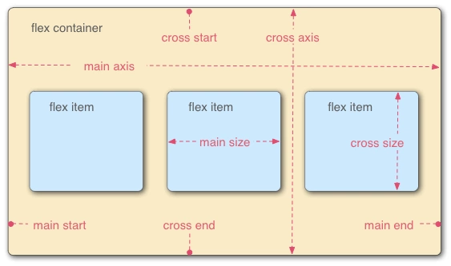
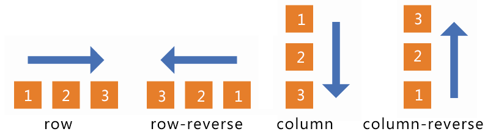

# CSS


# 盒模型

## 标准盒模型
width = content-width 
height = content-height

## 怪异盒模型:
width = content-width + padding-width + border-width
height = content-height + padding-height + border-height

## CSS 设置这两个模型
box-sizing: content-box；//标准盒模型 
box-sizing: border-box；//怪异盒模型 

# flex弹性布局
它之所以被称为 Flexbox ，是因为它能够扩展和收缩 flex 容器内的元素，以最大限度地填充可用空间。与以前布局方式（如 table 布局和浮动元素内嵌块元素）相比，Flexbox 是一个更强大的方式：

- 在不同方向排列元素
- 重新排列元素的显示顺序
- 更改元素的对齐方式
- 动态地将元素装入容器


## 一、基本概念
采用 Flex 布局的元素，称为 Flex 容器（flex container），简称"容器"。它的所有子元素自动成为容器成员，称为 Flex 项目（flex item），简称"项目"。

在 Flexbox 模型中，有三个核心概念：
– flex 项（注：也称 flex 子元素），需要布局的元素
– flex 容器，其包含 flex 项
– 排列方向（direction），这决定了 flex 项的布局方向

### 属性总结表


## 二、容器属性


### 2.1  flex-direction:
row（默认值）：主轴为水平方向，起点在左端。
row-reverse：主轴为水平方向，起点在右端。
column：主轴为垂直方向，起点在上沿。
column-reverse：主轴为垂直方向，起点在下沿。



### 2.2   flex-wrap:
nowrap（默认）：不换行。
wrap：换行，第一行在上方。
wrap-reverse：换行，第一行在下方。


### 2.3  justify-content:
flex-start（默认值）：左对齐
flex-end：右对齐
center： 居中
space-between：两端对齐，项目之间的间隔都相等。
space-around：每个项目两侧的间隔相等。所以，项目之间的间隔比项目与边框的间隔大一倍。


### 2.4  align-items:
flex-start：交叉轴的起点对齐。
flex-end：交叉轴的终点对齐。
center：交叉轴的中点对齐。
baseline: 项目的第一行文字的基线对齐。
stretch（默认值）：如果项目未设置高度或设为auto，将占满整个容器的高度。


### 2.5  align-content:
定义了多根轴线的对齐方式，如果项目只有一根轴线，那么该属性将不起作用
flex-start：与交叉轴的起点对齐。
flex-end：与交叉轴的终点对齐。
center：与交叉轴的中点对齐。
space-between：与交叉轴两端对齐，轴线之间的间隔平均分布。
space-around：每根轴线两侧的间隔都相等。所以，轴线之间的间隔比轴线与边框的间隔大一倍。
stretch（默认值）：轴线占满整个交叉轴。


结合 justify-content和align-items，看看在 flex-direction 两个不同属性值的作用下，轴心有什么不同：


## 三、项目属性


### 3.1 order属性


### 3.2 flex-grow属性
flex-grow属性定义项目的**放大比例**，默认为0，即如果存在剩余空间，也不放大。

如果所有项目的flex-grow属性都为1，则它们将等分剩余空间（如果有的话）。如果一个项目的flex-grow属性为2，其他项目都为1，则前者占据的剩余空间将比其他项多一倍。


### 3.3 flex-shrink属性
flex-shrink属性定义了项目的**缩小比例**，默认为1，即如果空间不足，该项目将缩小。
.item {   flex-shrink: <number>; /* default 1 */ }


如果所有项目的flex-shrink属性都为1，当空间不足时，都将等比例缩小。如果一个项目的flex-shrink属性为0，其他项目都为1，则空间不足时，前者不缩小。
负值对该属性无效。

### 3.4 flex-basis
表示项目在**主轴上**占据的空间，默认值为auto。如下代码
```
<div class="wrap">    
<div class="div" style="flex-basis:80px"><h2>item 1</h2></div>   
<div class="div" style="flex-basis:160px"><h2>item 2</h2></div>   
<div class="div" style="flex-basis:240px"><h2>item 3</h2></div>
</div>
```

其效果图为


### 3.5 align-self属性
align-self属性允许单个项目有与其他项目不一样的对齐方式，可覆盖align-items属性。默认值为auto，表示继承父元素的align-items属性，如果没有父元素，则等同于stretch。
.item {   align-self: auto | flex-start | flex-end | center | baseline | stretch; }


### 3.6 flex
flex属性是**flex-grow、flex-shrink和flex-basis**三属性的简写总和。

**弹性布局默认不改变项目的宽度，但是它默认改变项目的高度。如果项目没有显式指定高度，就将占据容器的所有高度。**

# css3的新特征

## 基本
新增选择器 p:nth-child（n）{color: rgba（255, 0, 0, 0.75）}
弹性盒模型 display: flex;
多列布局 column-count: 5;
媒体查询 @media （max-width: 480px） {.box: {column-count: 1;}}
个性化字体 @font-face{font-family:BorderWeb;src:url（BORDERW0.eot）；}
颜色透明度 color: rgba（255, 0, 0, 0.75）；
圆角 border-radius: 5px;
渐变 background:linear-gradient（red, green, blue）；
阴影 box-shadow:3px 3px 3px rgba（0, 64, 128, 0.3）；
倒影 box-reflect: below 2px;
文字装饰 text-stroke-color: red;
文字溢出 text-overflow:ellipsis;
背景效果 background-size: 100px 100px;
边框效果 border-image:url（bt_blue.png） 0 10;
语音

## 转换
旋转 transform: rotate（20deg）；
倾斜 transform: skew（150deg, -10deg）；
位移 transform:translate（20px, 20px）；
缩放 transform: scale（。5）；
平滑过渡 transition: all .3s ease-in .1s;
动画 @keyframes anim-1 {50% {border-radius: 50%;}} animation: anim-1 1s;

# 垂直水平居中

## 一、绝对定位元素的居中实现
这一种工作中用的应该是最多的，兼容性也是很好。
```
 1 <!DOCTYPE html>  
 2 <html lang="en">  
 3 <head>  
 4     <meta charset="UTF-8">  
 5     <meta name="viewport" content="width=device-width, initial-scale=1.0">  
 6     <meta http-equiv="X-UA-Compatible" content="ie=edge">  
 7     <title>绝对定位元素的居中实现margin</title>  
 8     <style>  
 9         .center-vertical{ 
 10             width: 100px; 
 11             height: 100px; 
 12             background: orange; 
 13             position: absolute; 
 14             top: 50%; 
 15             left: 50%; 
 16             margin-top: -50px; /*高度的一半*/ 
 17             margin-left: -50px; /宽度的一半*/ 
 18         } 
 19     </style> 
 20 </head> 
 21 <body> 
 22     <div class="center-vertical"></div> 
 23 </body> 24 </html>
```
**缺点**：需要提前知道元素的尺寸。如果不知道元素尺寸，这个时候就需要JS获取了。
CSS3.0的兴起，使这个问题有了更好的解决方法，就是使用 transform 代替 margin 。
transform 中 translate 偏移的百分比是相对于自身大小而说的。
```
 1 <!DOCTYPE html>  
 2 <html lang="en">  
 3 <head>  
 4     <meta charset="UTF-8">  
 5     <meta name="viewport" content="width=device-width, initial-scale=1.0">  
 6     <meta http-equiv="X-UA-Compatible" content="ie=edge">  
 7     <title>未知宽高的元素水平垂直居中transform</title>  
 8     <style>  
 9     .content{ 
 10         background: orange; 
 11         position: absolute; 
 12         top: 50%; 
 13         left: 50%; 
 14         transform: translate( -50%, -50%); 
 15     } 
 16     </style>  
 17 </head> 
 18 <body> 
 19     <div class="content">你复合1233肥反反复复</div> 
 20 </body> 
 21 </html>
```
**优点**：无论绝对定位元素的尺寸是多少，它都是水平垂直居中显示的。
**缺点**：就是兼容性问题。

## 二、margin: auto;实现绝对定位元素的居中
```
1 <!DOCTYPE html>  
2 <html lang="en">  
3 <head>  
4     <meta charset="UTF-8">   
5     <meta name="viewport" content="width=device-width, initial-scale=1.0">  
6     <meta http-equiv="X-UA-Compatible" content="ie=edge">  
7     <title>margin:auto实现绝对定位元素的居中</title>  
8     <style>  
9     .center-vertical{ 
10         width: 100px; 
11         height: 100px; 
12         background: orange; 
13         position: absolute; 
14         top: 0; 
15         left: 0; 
16         right: 0; 
17         bottom: 0; 
18         margin: auto; 
19     } 
20     </style> 
21 </head> 
22 <body> 
23     <div class="center-vertical"></div> 
24 </body> 
25 </html>
```
注意： 位置绝对定位,上下左右均为 0。margin: auto;

## 三、CSS3.0弹性布局
```
 1 <!DOCTYPE html>  
 2 <html lang="en">  
 3 <head>  
 4     <meta charset="UTF-8">  
 5     <meta name="viewport" content="width=device-width, initial-scale=1.0">   
 6     <meta http-equiv="X-UA-Compatible" content="ie=edge">  
 7     <title>水平垂直居中==弹性布局</title>  
 8     <style>  
 9     html,body{ 
 10         width: 100%; 
 11         height: 100%; 
 12         margin: 0; 
 13         padding: 0; 
 14     } 
 15     body{ 
 16         display: flex; 
 17         align-items: center;/*定义body的元素垂直居中*/ 
 18         justify-content: center;/*定义body的元素水平居中*/ 
 19     } 
 20     .content{ 
 21         width: 300px; 
 22         height: 300px; 
 23         background: orange; 
 24     } 
 25     </style> 
 26 </head> 
 27 <body> 
 28     <div class="content"></div> 
 29 </body> 
 30 </html>
```

## 四、vertical-align:middle;垂直方向居中
verical-align 定义**行内元素的基线**相对于**该元素所在行的基线**的垂直对齐。
允许指定负长度值和百分比值。这会是元素降低而不是升高。
在表单元格中，这个属性会设置单元格框中的单元格内容的对齐方式。
```
 1 <!DOCTYPE html>  
 2 <html lang="en">  
 3 <head>  
 4     <meta charset="UTF-8">  
 5     <meta name="viewport" content="width=device-width, initial-scale=1.0"> 
 6     <meta http-equiv="X-UA-Compatible" content="ie=edge">  
 7     <title>vertical-align:middle;</title>  
 8     <style>  
 9     .big-box{ 
 10         width: 500px; 
 11         height: 400px; 
 12         background: green; 
 13         text-align: center; 
 14     } 
 15     .box{ 
 16         line-height: 400px; 
 17     } 
 18     img{ 
 19         vertical-align: middle; 
 20     } 
 21     </style> 
 22 </head> 
 23 <body> 
 24     <div class="big-box"> 
 25         <span class="box"> 
 26              
 27         </span> 
 28     </div> 
 29 </body> 
 30 </html>
```

## 五、display:table实现
```
 1 <!DOCTYPE html>  
 2 <html lang="en">  
 3 <head>  
 4     <meta charset="UTF-8">  
 5     <meta name="viewport" content="width=device-width, initial-scale=1.0">  
 6     <meta http-equiv="X-UA-Compatible" content="ie=edge">  
 7     <title>display: table-cell;</title>  
 8     <style>  
 9     .parent{ 
 10         width: 300px; 
 11         height: 300px; 
 12         background: orange; 
 13         text-align: center; 
 14         display: table; 
 15     } 
 16     .son{ 
 17         display: table-cell; 
 18         background-color: yellow; 
 19         vertical-align: middle; 
 20     } 
 21     </style> 
 22 </head> 
 23 <body> 
 24     <div class="parent"> 
 25         <div class="son">nihaosssss</div> 
 26     </div> 
 27 </body> 
 28 </html>
```

## 六、相对定位
```
 1 <!DOCTYPE html>  
 2 <html lang="en">  
 3 <head>  
 4     <meta charset="UTF-8">  
 5     <meta name="viewport" content="width=device-width, initial-scale=1.0">  
 6     <meta http-equiv="X-UA-Compatible" content="ie=edge">  
 7     <title>实现水平垂直居中==相对定位实现</title>  
 8     <style>  
 9     html,body{ 
 10         width: 100%; 
 11         height: 100%; 
 12         margin: 0; 
 13         padding: 0; 
 14     } 
 15     .content{ 
 16         width: 300px; 
 17         height: 300px; 
 18         background: orange; 
 19         margin: 0 auto;/*水平居中*/ 
 20         position: relative;/*设置position*/ 
 21         top: 50%; /*偏移*/ 
 22         /*margin-top: -150px;*/    /*第一种：margin-top*/ 
 23         transform: translateY(-50%);/*第二种：transform：转换*/ 
 24     } 
 25     </style> 
 26 </head> 
 27 <body> 
 28     <div class="content"></div> 
 29 </body> 
 30 </html>
```

# 兼容问题

# [媒体查询](https://www.w3school.com.cn/css/css_rwd_mediaqueries.asp)
媒体查询由媒体类型和一个或多个检测媒体特性的条件表达式组成。媒体查询中可用于检测的媒体特性有：width、height和color（等）。使用媒体查询可以在不改变页面内容的情况下，为特性的一些输出设备定制显示效果。

## 响应式布局
**概念**：借助CSS3媒体查询技术，响应式设计的目标是确保一个页面在所有终端上（各种尺寸的PC、手机、手表、冰箱的Web浏览器等等）都能显示出令人满意的效果，通常是结合了流式布局+弹性布局，再搭配媒体查询技术使用。——分别为不同的屏幕分辨率定义布局，同时，在每个布局中，应用流式布局的理念，即页面元素宽度随着窗口调整而自动适配。即：创建多个流体式布局，分别对应一个屏幕分辨率范围。可以把响应式布局看作是流式布局和自适应布局设计理念的融合。
媒介查询的使用：

**媒介类型**：screen（用于电脑屏幕，平板电脑，智能手机等）
**媒体功能：**
device-height：定义输出设备的屏幕可见高度
device-width：定义输出设备的屏幕可见宽度
height：定义输出设备中的页面可见区域高度
max-device-height：定义输出设备的屏幕可见的最大高度
max-device-width：定义输出设备的屏幕最大可见宽度
min-device-width：定义输出设备的屏幕最小可见宽度
max-height：定义输出设备中的页面最大可见区域高度
max-width：定义输出设备中的页面最大可见区域宽度
min-height：定义输出设备中的页面最小可见区域高度。
```
@media screen and (max-width: 1000px) {
  body {
    background-color: lightblue;
  }
}

<link rel="stylesheet" media="screen and (max-width: 1000px)" href="./test.css">
```

## 典型的设备断点
高度和宽度不同的屏幕和设备不计其数，因此很难为每个设备创建精确的断点。为了简单起见，您可以瞄准这五组：
```
/* 超小型设备（电话，600px 及以下） */
@media only screen and (max-width: 600px) {...} 

/* 小型设备（纵向平板电脑和大型手机，600 像素及以上） */
@media only screen and (min-width: 600px) {...} 

/* 中型设备（横向平板电脑，768 像素及以上） */
@media only screen and (min-width: 768px) {...} 

/* 大型设备（笔记本电脑/台式机，992px 及以上） */
@media only screen and (min-width: 992px) {...} 

/* 超大型设备（大型笔记本电脑和台式机，1200px 及以上） */
@media only screen and (min-width: 1200px) {...}
```

# 动画

## (一) 过渡(transition)
CSS3的过渡功能就像是一种黄油，可以让CSS的一些变化变得平滑。因为原生的CSS过渡在客户端需要处理的资源要比用JavaScript和Flash少的多，所以才会更平滑。

### 过渡相关属性：
transition-property:要过渡的 CSS 属性名称(比如 background-color、 text-shadow 或者 all，使用 all 则过渡会被应用到每一个可能的 CSS 属性上);
transition-duration:定义过渡效果持续的时间(时间单位为秒，比如.3s、2s 或 1.5s);
transition-timing-function:定义过渡期间速度如何变化(比如 ease、linear、 ease-in、ease-out、ease-in-out 或 cubic-bezier);
transition-delay:可选，用于定义过渡开始前的延迟时间。相反，将该值设置为一个负数，可以让过渡效果立即开始，但过渡旅程则会从半路开始。
特点：
（1）transition需要事件触发，所以没法在网页加载时自动发生。
（2）transition是一次性的，不能重复发生，除非一再触发。
（3）transition只能定义开始状态和结束状态，不能定义中间状态，也就是说只有两个状态。
（4）一条transition规则，只能定义一个属性的变化，不能涉及多个属性。
```
.testcss{
  color:red;
  transition: all 3s ease 0s;
}
.testcss:hover{
  color:yellow;
}
```

## (二) 变形(transform)
在CSS3中，可以利用transform功能来实现文字或图像的旋转、缩放、倾斜、移动这四种类型的变形处理；

### 旋转 rotate
用法：transform: rotate(45deg);
共一个参数“角度”，单位deg为度的意思，正数为顺时针旋转，负数为逆时针旋转，上述代码作用是顺时针旋转45度。

### 缩放 scale
用法：transform: scale(0.5)  或者  transform: scale(0.5, 2);
参数表示缩放倍数；
一个参数时：表示水平和垂直同时缩放该倍率
两个参数时：第一个参数指定水平方向的缩放倍率，第二个参数指定垂直方向的缩放倍率。

### 倾斜 skew
用法：transform: skew(30deg)  或者 transform: skew(30deg, 30deg);
参数表示倾斜角度，单位deg
一个参数时：表示水平方向的倾斜角度；
两个参数时：第一个参数表示水平方向的倾斜角度，第二个参数表示垂直方向的倾斜角度。
关于skew倾斜角度的计算方式表面上看并不是那么直观

### 移动 translate
用法：transform: translate(45px)  或者 transform: skew(45px, 150px);
参数表示移动距离，单位px，
一个参数时：表示水平方向的移动距离；
两个参数时：第一个参数表示水平方向的移动距离，第二个参数表示垂直方向的移动距离。

基准点 transform-origin
在使用transform方法进行文字或图像的变形时，是以元素的中心点为基准点进行的。使用transform-origin属性，可以改变变形的基准点。
用法：transform-origin: 10px 10px;
共两个参数，表示相对左上角原点的距离，单位px，第一个参数表示相对左上角原点水平方向的距离，第二个参数表示相对左上角原点垂直方向的距离；
两个参数除了可以设置为具体的像素值，其中第一个参数可以指定为left、center、right，第二个参数可以指定为top、center、bottom。

多方法组合变形
上面我们介绍了使用transform对元素进行旋转、缩放、倾斜、移动的方法，这里讲介绍综合使用这几个方法来对一个元素进行多重变形。
用法：transform: rotate(45deg) scale(0.5) skew(30deg, 30deg) translate(100px, 100px);
这四种变形方法顺序可以随意，但不同的顺序导致变形结果不同，原因是变形的顺序是从左到右依次进行，这个用法中的执行顺序为1.rotate  2.scalse  3.skew  4.translate

## (三) Transiform（3d）

### 1. 熟悉x轴，y轴，z轴的概念


### 2. 相比transiform2d的基础增加如下几个属性：
· transform-style: preserve-3d; 3d空间
· perspective: 800px; 它被成为视距或者紧身.（眼睛距离物体的距离）
· perspective-origin 属性定义 3D 元素所基于的 X 轴和 Y 轴。该属性允许您改变 3D 元素的底部位 置，眼睛的位置	 

### 3. 深化的transiform2d属性
rotateX/rotateY/rotateZ可以帮助理解三维坐标
translateZ则可以帮你理解透视位置。
transform-origin我们成为基点 在水平方向改变观看div的位置
scale 缩放 rotate 旋转 translate移动 skew倾斜 通过这些来进行3d效果

## (四) 动画(animation)

### @keyframes 规则
如果您在 @keyframes 规则中指定了 CSS 样式，动画将在特定时间逐渐从当前样式更改为新样式。
要使动画生效，必须将动画绑定到某个元素。
下面的例子将 "example" 动画绑定到 <div> 元素。动画将持续 4 秒钟，同时将 <div> 元素的背景颜色从 "red" 逐渐改为 "yellow"：
```
/* 动画代码 */
@keyframes example {
  from {background-color: red;}
  to {background-color: yellow;}
}

/* 向此元素应用动画效果 */
div {
  width: 100px;
  height: 100px;
  background-color: red;
  animation-name: example;
  animation-duration: 4s;
}
```
下面的例子将在动画完成 25％，完成 50％ 以及动画完成 100％ 时更改背景颜色和 <div> 元素的位置：
```
/* 动画代码 */
@keyframes example {
  0%   {background-color:red; left:0px; top:0px;}
  25%  {background-color:yellow; left:200px; top:0px;}
  50%  {background-color:blue; left:200px; top:200px;}
  75%  {background-color:green; left:0px; top:200px;}
  100% {background-color:red; left:0px; top:0px;}
}

/* 应用动画的元素 */
div {
  width: 100px;
  height: 100px;
  position: relative;
  background-color: red;
  animation-name: example;
  animation-duration: 4s;
}
```

### A. 关键帧:
关键帧(keyframes) - 定义动画在不同阶段的状态。
动画属性(properties) - 决定动画的播放时长，播放次数，以及用何种函数式去播放动画等。（可以类比音视频播放器）
css属性 - 就是css元素不同关键帧下的状态。
如：
```
@keyframes dropdown {
  0% { margin-top: 0px;}
  /** 暂停效果 */
  10% { margin-top: 0px;}
  50% { margin-top: -100px;}
  60% { margin-top: -100px;}
  90% { margin-top: -200px;}
  100% { margin-top: -200px;}
}
```

### B. 动画属性
动画属性可以理解为播放器的相关功能，一个最基本的播放器应该具有：播放/暂停、播放时长、播放顺序(逆序/正序/交替播放)、循环次数等。 
主要也分为两大点：
指定播放的元素
定义播放信息的配置

相应的配置有:
[animation-name](http://www.w3school.com.cn/cssref/pr_animation-name.asp)规定需要绑定到选择器的 keyframe 名称
[animation-duration](http://www.w3school.com.cn/cssref/pr_animation-duration.asp)规定完成动画所花费的时间，以秒或毫秒计。
[animation-timing-function](http://www.w3school.com.cn/cssref/pr_animation-timing-function.asp)规定动画的速度曲线。如：
linear  动画从头到尾的速度是相同的。 
ease    默认。动画以低速开始，然后加快，在结束前变慢。 
ease-in 动画以低速开始。    
ease-out    动画以低速结束。    
ease-in-out 动画以低速开始和结束。 
[animation-delay](http://www.w3school.com.cn/cssref/pr_animation-delay.asp)规定在动画开始之前的延迟。
[animation-iteration-count](http://www.w3school.com.cn/cssref/pr_animation-iteration-count.asp)规定动画应该播放的次数。
[animation-direction](http://www.w3school.com.cn/cssref/pr_animation-direction.asp)规定是否应该轮流反向播放动画。
normal  默认值。动画应该正常播放。   
alternate   动画应该轮流反向播放。

# [grid布局](https://www.w3school.com.cn/css/css_grid.asp)

## 网格布局
CSS 网格布局模块（CSS Grid Layout Module）提供了带有行和列的基于网格的布局系统，它使网页设计变得更加容易，而无需使用浮动和定位。


> 原文: <https://www.yuque.com/guxinbo/ps8gra/ot9022>