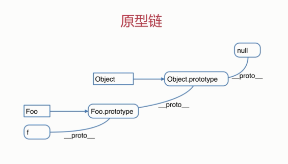
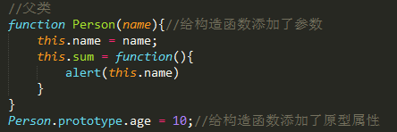
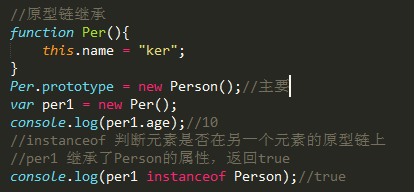
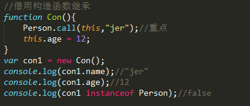
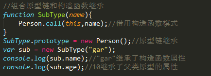
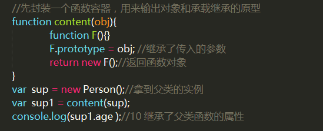
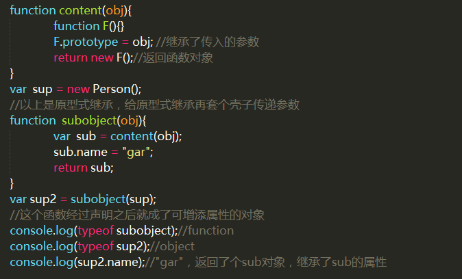
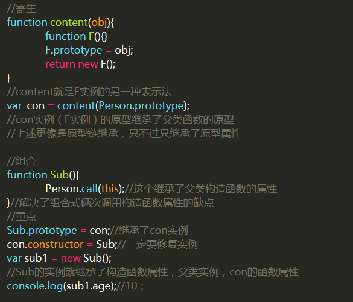
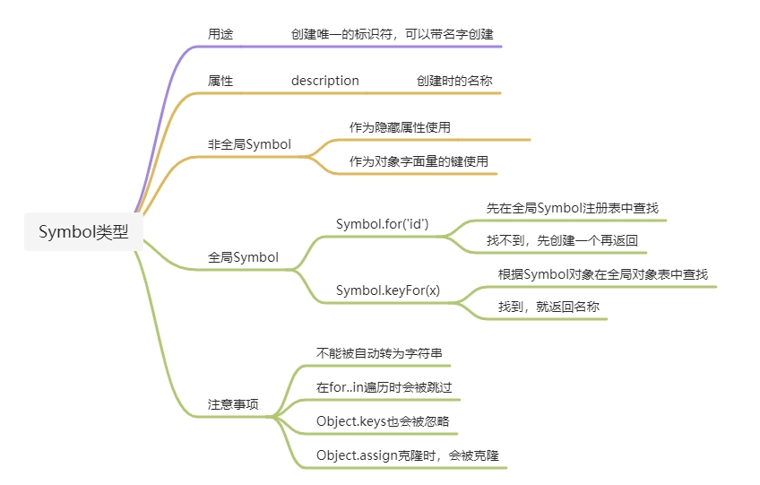

# JS


# 数据类型

## 基本数据类型

### Null
表示一个空对象指针

### Undefined
表示变量不含有值

### Number
**整数和浮点数**：
 **整数**：1,2,3; **浮点数**：.1,0.4;**极大数字**：123e5 //12300000 科学计数法**;极小数字**：123e-5 //0.00123 
 注意：保存浮点型的数值需要的内存空间比整形大两倍，因此ECMAScript,会讲能转化为整型的浮点数值自动转化为整型，如12.0
 说明：浮点型的数值最高精度为17位小数，而我们口算中，可能不会精确，
 所以在判断时要注意考虑到这个问题** eg**[**:**0.1+0.2!==0.3](https://blog.csdn.net/sunnnnh/article/details/118060361?spm=1001.2101.3001.6650.1&utm_medium=distribute.pc_relevant.none-task-blog-2%7Edefault%7ECTRLIST%7ERate-1.pc_relevant_default&depth_1-utm_source=distribute.pc_relevant.none-task-blog-2%7Edefault%7ECTRLIST%7ERate-1.pc_relevant_default&utm_relevant_index=2)
> 并不是所有小数都可以用「完整」的二进制来表示的，比如十进制 0.1 在转换成二进制小数的时候，是一串无限循环的二进制数，**计算机是无法表达无限循环的二进制数的，毕竟计算机的资源是有限**。因此，**计算机只能用「近似值」来表示该二进制**，那么意味着计算机存放的小数可能不是一个真实值。

**NaN：**即非数值（Not a Number）是一个特殊的数值。这个数值用于表示一个本来要返回数值的操作数未返回数值的情况。 例如，在其他编程语言中，任何数值除以 0都会导致错误，从而停止代码执行。但在 ECMAScript中，任何数值除以 0会返回 NaN ，因此不会影响其他代码的执行。
说明： 1）NaN不是一个数值，但他是一个number
	     2）任何涉及NaN的操作（例如NaN/10）都会返回NaN。
	     3）NaN与任何值都不相等，包括NaN本身。
 NaN + 1 //NaN   NaN == NaN//false;

### String
用 " ''包含的内容," '' 具有对称性 成对出现
 var str= "1610B"
 也可以在字符串中使用引号，只要不匹配包围字符串的引号即可
 var str = '<div class = 'box'>123</div>'
 字符串的属性：length 表示长度
 变量名.length 返回变量的长度，类型是一个数值类型,空字符 "" '' 的长度为0；

### Boolean
 布尔类型 用于表示真假的类型，即true表示真，false表示假

### Symbol(es6)
表示独一无二的值，最大的用法是用来定义对象的唯一属性名。

- Symbol 函数栈不能用 new 命令，因为 Symbol 是原始数据类型，不是对象。可以接受一个字符串作为参数，为新创建的 Symbol 提供描述，用来显示在控制台或者作为字符串的时候使用，便于区分。
```
let sy = Symbol("KK");
console.log(sy);   // Symbol(KK)
typeof(sy);        // "symbol"
 
// 相同参数 Symbol() 返回的值不相等
let sy1 = Symbol("kk"); 
sy === sy1;       // false
```

- 由于每一个 Symbol 的值都是不相等的，所以 Symbol 作为对象的属性名，可以保证属性不重名。

## 复杂数据类型
对象（Object）

# 数据类型转换

## 转换为布尔类型：
 Boolean(变量)
 转换布尔类型为false的只有6种：0、-0、 NaN 、""、 undefined、 null

## 转换为number类型：

### Number（）
 有3个函数可以把非数值转换为数值：Number()、parseInt()和parseFloat()
 Number()可以用于任何数据类型，
 而parseInt()和parseFloat()则专门用于把字符串转换成数值。
 字符串转换为number的规则：
 1.只包含数值的字符串，会直接转数值，如果包含前导0，即自动去掉。
 alert(Number('456')); //456
 alert(Number('070')); //70
 2.只包含浮点数值的字符串，会直接转成浮点数值，如果包含前导和后导0，即自动去 掉。
 alert(Number('08.90')); //8.9
 3.如果字符串是空，那么直接转成成0。
 alert(Number('')); //0
 4.如果不是以上三种字符串类型，则返回NaN。
 alert(Number('Lee123'); //NaN
 Number("123sfsda"); //NaN
 布尔转换为number true:1 false:0
 undefined ：NaN (易错)
 null : 0;

### parseInt()、 parseFloat()
 parseInt(字符串)	转化为整数 
 parseFloat(字符串)	转化为浮点数
 从第一位开始截取到符合条件的数字
 截取：截取不到结果是NaN.
 parseInt('') NaN
 parseFloat('') NaN
 Number('') 0

### isNaN（）
 isNaN(变量) 返回值是布尔值 true false 
** 功能**：用来检测是否是非数字， 非数字返回true，数字返回false
 Number(变量)如果结果是NaN 就true， 转化为数字 false .
 true: NaN undefined "abdee" 

## 转换为字符串类型
 var a = 123
 String(); //String(a)
 toString() //a.toString();

# 运算符：

##  算术运算符：
 **加法：**
 数字+数字 = 数字
 数字+NaN = NaN
 数字+字符串=字符串； //字符串拼接
 数字+null=数字 //null转换为数字是0；
 数字+undefined= NaN //undefined 转换为数字是NaN
 数字+true/false=数字 
 字符串+任何=字符串
 **说明**：+它既是算术运算符有事字符串运算符，即，它即可做加法运算，又可以做拼接
 减法-、 乘法*、除法/，求模%： 求余数
** 总结：**
 加法： a.只要一端是字符串 ，就拼接字符串 b.一端是数字 ，另外一端是true,false,NaN ,null,undefined,则Number()之后，做加法。加不出来就是NaN
 - * / % ：无论何时都是转化为数字，做减法，减不出来NaN.
** 累加（递增）：++**
 ++a与a++都是对a进行递增的过程
 区别：
	 ++a先返回递增之后的a的值（即先加再运算）
	 a++先返回a的原值，再返回递增之后的值（先运算后加）
 **递减：-- 同理**

## 逻辑运算符：
** && || ！**
 **逻辑与 &&**：都为真才能为真
 '123' && 'abc' && 4==5
 逻辑与：遇到第一个假，就停下啦，返回第一个假值；
 如果都为真，则返回最后一个
 逻辑或 ||：都为假才能为假
** 逻辑或**：遇到第一个真，就停下啦，
 如果都是假，则返回最后一个假值
** 逻辑非 ！**：返回值布尔值
 	!5 首先把5转boolean(5) 在取反
 	!4<=0 false<=0

## 关系运算符（比较运算符）
**> >= < <= == === ！= ！== **
 返回值都是boolean类型。
 1)两端都是数字直接比较 。
 2)一端是数字，另外一端不是数字，把不是数字的转化为数字进行比较。
 3)如果一端是布尔值，另一端不管是什么，先把布尔转数字。 
 4)如果两端都是字符串.则按照Ascii码值比较。

 == != === !==也叫作相等运算符：
 == 相等 != 不等 **先转化为相同类型**，再比较
 === 全等 !== 不全等	** 不转化**，直接比较
 返回值都是boolean类型。
  1）两端都是数字或者字符串，直接比较。 "abc"=='bcd' 4==5
  2）一端是布尔值，先把**布尔转为数字**。 
  3) 一端是数字，一端是字符串，把字符串转化数值。
  4) undefined null NaN 不转化直接比较。
 	undefiend 不等任何值 
 	null 不等任何值
 	NaN 不等任何值
 	**null==undefined true**
 	NaN==NaN false

# 字符串方法

## 字符串的查找

### charAt() 
方法可返回指定位置的字符。
 语法：str.charAt(index)
 index:表示字符在字符串中的位置。
 eg:var str = "hello word";
 console.log(str.charAt(str.length-1)) //d
 ----------------------------------------------------

###  indexOf() 
方法可返回某个指定的字符串值在字符串中首次出现的位置。返回数值
 如果找到返回下标，如果没有找到匹配的字符串则返回 -1。
 语法：str.indexOf(子字符串,开始查找的下标（可以省略）)
 eg:var str = "hello word,";
 console.log(str.indexOf("o"))//4
 console.log(str.indexOf("0",5)) //7
 -----------------------------------------------------

###  lastIndexOf() 
方法可返回一个指定的字符串值最后出现的位置，（即从后往前找），返回数值
 语法：str.lastIndexOf(子字符串，start(开始位置，可以省略，))
 如果指定第二个参数 start，则在一个字符串中的指定位置从后向前搜索。
 eg:var str = "I am find,yes,I can";
 console.log(str.lastIndexOf("I")) //14
 console.log(str.lastIndexOf("I",10)) //
 ----------------------------------------------------------

###  match() 
方法可在字符串内检索指定的值，或找到一个或多个正则表达式的匹配
**返回值：**存放匹配结果的**数组**。该数组的内容依赖于 regexp 是否具有全局标志 g。
**说明：**
match() 方法将检索字符串 stringObject，以找到一个或多个与 regexp 匹配的文本。这个方法的行为在很大程度上有赖于 regexp 是否具有标志 g。
**如果 regexp 没有标志 g**，那么 match() 方法就只能在 stringObject 中执行一次匹配。如果没有找到任何匹配的文本， match() 将返回 null。否则，它将返回一个**数组**，其中存放了与它找到的匹配文本有关的信息。该数组的第** 0 个**元素存放的是**匹配文本**，而其余的元素存放的是与正则表达式的子表达式匹配的文本。除了这些常规的数组元素之外，返回的数组还含有两个对象属性。index 属性声明的是匹配文本的起始字符在 stringObject 中的位置，input 属性声明的是对stringObject 的引用。
**如果 regexp 具有标志 g**，则 match() 方法将执行全局检索，找到 stringObject 中的所有匹配子字符串。若没有找到任何匹配的子串，则返回 null。如果找到了一个或多个匹配子串，则返回一个数组。不过全局匹配返回的数组的内容与前者大不相同，它的数组元素中存放的是 stringObject 中所有的匹配子串，而且也没有 index 属性或 input 属性。
**注意**：在全局检索模式下，match() 即不提供与子表达式匹配的文本的信息，也不声明每个匹配子串的位置。如果您需要这些全局检索的信息，可以使用 RegExp.exec()。
 语法：string.match(regexp)
 eg:var str= "The rain in SPAIN stays mainly in the plain"
 console.log(str.match(/ain/gi)) //全局匹配ain,且不区分大小写 
 --------------------------------------------------------------

##  字符串的操作方法；

###  replace() 
方法用于在字符串中用一些字符替换另一些字符，或替换一个与正则表达式匹配的子串。
 语法：str.replace(要被替换调掉的子字符串，新替换上的字符串) 返回替换后的字符串
 eg:var str = "hello word";
 console.log(str.replace("word","你好"))
 --------------------------------------------------------

###  toUpperCase()
 方法用于把字符串转换为大写
 语法：str.toUpperCase();
 eg:var str = "hello word"
 ----------------------------------------------------------

###  toLowerCase() 
方法用于把字符串转换为小写。
 语法：str.toLowerCase();
 eg:str = "HELLO WORD"
 console.log(str.toLowerCase())

##  字符串的截取方法：
 不改变原始字符串，生成新字符串。返回值都是子字符串.

###  slice()
方法可提取字符串的某个部分，并以新的字符串返回被提取的部分
 语法：str.slice(开始下标，结束下标) 包含开始下标，不包含结束下标
 	 字符串.slice(开始下标); 从开始下标到最后
 	 slice** 支持负值**，负值计数从后往前数；但是不可倒着截取
 eg:str = "hello word";
 console.log(str.slice(8,3);)
 console.log(str.slice(-7,8))
 var d = str.slice()//不传参数，则从头开始截取到尾部，
 ----------------------------------------------------------------

###  substring() 
方法用于提取字符串中介于两个指定下标之间的字符。包括 开始 处的字符，但不包括 结束 处的字符。
 语法：str.substring(start,end) 截取字符串， 包上不包下
 说明：自动将小数作为开始位置，大数作为结束位置
** 不识别负值**，会自动把负值转换为0
 如果没有结束下标，则一直截取到字符串最后
 ------------------------------------------------------------------------

###  substr()
方法可在字符串中抽取从 开始 下标开始的指定数目的字符。
 语法：str.substr(start,length) //注意**第二参数为截取长度**, 长度不支持负值
 说明：如果长度为负值则输出空;
 当长度省略时截取至字符串的末尾。
 第一个参数支持负值，
 --------------------------------------------------------------------------

##  连接多个字符串的方法：

###  concat()
 方法为字符串的拼接
 语法：str.concat(字符串1,字符串2....)
 生成一个新字符串，不影响原来的字符串。
 ------------------------------------------------------------------------

##  字符串转化为数组的方法

###  split()
 方法将字符串转换为数组
 语法：字符串.split('分隔符') 生成一个数组。
 说明：a)如果括号里面什么分隔符都没有，则把整个字符串作为整体一个数组输出
 eg:str = "hello word";console.log(str.split())
 b)以""为分隔符,将字符串的每一个字符当成数组每一项
 eg:var b= str.split("")

# [ES6：字符串常用方法](https://www.cnblogs.com/XF-eng/p/14011121.html)

## 1.for...of...遍历字符串

## 2.模板字符串
模板字符串（template string）是增强版的字符串，用反引号（`）标识。它可以当作普通字符串使用，也可以用来定义多行字符串，或者在字符串中嵌入变量。

## 3.includes(), startsWith(), endsWith()
传统上，JavaScript 只有indexOf方法，可以用来确定一个字符串是否包含在另一个字符串中。ES6 又提供了三种新方法。
**includes()**：返回布尔值，表示是否找到了参数字符串。
**startsWith()**：返回布尔值，表示参数字符串是否在原字符串的头部。
**endsWith()**：返回布尔值，表示参数字符串是否在原字符串的尾部。

## 4.repeat()
repeat方法返回一个新字符串，表示将原字符串重复n次.

## 5.padStart()，padEnd()
（这两个方法了解即好）
	ES2017 引入了字符串补全长度的功能。如果某个字符串不够指定长度，会在头部或尾部补全。padStart()用于头部补全，padEnd()用于尾部补全。

## 6.trimStart()，trimEnd()
ES2019 对字符串实例新增了trimStart()和trimEnd()这两个方法。它们的行为与trim()一致，
	**trimStart()**消除字符串头部的空格，
**trimEnd()**消除尾部的空格。
它们返回的都是新字符串，**不会修改原始字符串**。

## 7.replaceAll()
历史上，字符串的实例方法replace()只能替换第一个匹配。

#  数学对象Math
**属性**：Math.PI
**方法**：
**最大值 最小值方法**
Math.max(值1,值2....)
Math.min(值1,值2....)
三个**取整数**的方法：
四舍五入 Math.round(数值)
向上取整 Math.ceil(数值)
向下取整 Math.floor(数值)
常用的数学方法
求绝对值：Math.abs()
求平方根：Math.sqrt()
求幂：Math.pow(底数，指数)
 Math.random() 获取的是>=0到<1之间的随机数。
 求任意两个数之间的随机数公式：
Math.floor(Math.random()*(大值-小值+1))+小值）
Math.floor(Math.random()*(大值-小值+1)+小值)
 function Random(n,m){
 return Math.floor(Math.random()*(m-n+1)+n)
 }
 Math.random().toString().slice(2,6);

# 函数

## 定义
 函数是一段由事件驱动的或者当它被调用时执行的可重复使用的代码块（例如学校制度，例如工厂生产）。 函数的主要功能是将代码组织为可复用的单位，可以完成特定的任务并返回数据。 代码复用不仅减少了代码量，还便于后期的修改和维护

## 函数的命名
 标识符的命名规则，即为函数的命名规则

## 定义函数的方式

### 1.函数声明式：
 function 函数名（）{
 //函数体 ，功能块
 }
 注意：function ：定义函数的关键字（必须小写）
 函数名：自定义的一个名字（调用时必须与函数名称相同的大小写调用函数）
 函数体：要封装的某段代码，它可以完成某个特定的功能
 特点：函数声明提升，自动提升到顶端。 函数声明可以随时随地调用。
 函数表达式：var min =function(){
  //函数体
  }
特点：定义之后调用，定义之前调用，报错。

###  2.构造函数的方式声明：
 var fn = new Function()

## 函数调用：
直接调用：函数名();
元素.onclick = function(){ } //function(){} 这种函数叫做匿名函数
元素.onclick = 函数名 //注意：此时不能再函数名后加（），加上表示页面加载时自动执行,而不是点击时执行
元素.onclick = function(){
				函数名(); //此时的小括号不能省略，
			}
 元素["onclick"] = function(){}

##  函数的参数：
 在调用函数时，可以向其传递值，这些值被称为参数。
 这些参数可以在函数中使用。
 你可以发送任意多的参数，由逗号 (,) 分隔
```
 function fn(val1,val2){
   console.log(val1)
 }
 fn("hello","word")
```
 说明：
** 形参**：函数声明时小括号中的参数称为形参
** 实参**：函数调用时传递的参数称为实参
 在函数代码中，使用特殊对象** arguments**，开发者无需明确指出参数名，就能访问它们
 什么是arguments；
 1. arguments是收到的**实参副本**
 2. 并把所有收到实参收集起来,放到一个arguments对象里，组成一个由实参构成的类数组
 3. arguments 的索引 从 0, 1,2,....递增,与实参逐个对应，可以使用方括号语法访问它的每一个元素
 例如：arguments[0]可以取到传入的第一个实参。
 4.arguments.length 传入实参的个数（长度），arguments[arguments.length-1] 可以取到传入参数的最后一个实参;
  	** 说明：**
 1）arguments的长度是由传入的个数决定的，而不是由定义函数时的命名参数的个数决定的
 2）arguments队形是用来接受**实参**的，每一个函数都有arguments对象，没传参的时候arguments.length 为0.是[ ]
 例如：
 function add(n1, n2) {
 		console.log(arguments.length); //arguments.length是实参决定的 3
 	}
 add(1, 2, 3); console.log(add.length); //add是指函数，**函数的长度，有形参决定** 2
 arguments[99] = 0; console.log(arguments.length)//100
 5.arguments每个函数都会有,因此,arguemnts只会在内部找自身的arguments,无法引用到外层的arguments

##  函数的返回值：
 函数中的return语句是指定函数调用的返回值。
 return只能在函数整体中出现，如果不是的话会报语法错误
 在使用ruturn语句时，函数就会停止执行，并返回制定的值。
```
 function fn(){
   var x=5;
   return x;
   alter("不会被执行")
 } 
 fn() 
 function fn(a,b){
   return a*b
 }
```
 在我们希望退出函数时，也可以使用return语句
```
function fn(a,b){
   if(a>b){
     return;
   }
   return a+b;
 }
```
** 说明：**
 返回值；一个函数没有alert 没有console.log
		** 如果没有return 返回值是undefined**
 如果有reuturn ,但是没有return后没有值，则返回undefined
 如果有 return 就是return的值。
 return 函数的结束语句，return之后的语句不执行.

##  函数作用域：

###  全局变量：
不在任何函数内定义的变量就是全局变量。实际上，JavaScript默认有一个全局对象window，全局作用域的变量实际上被绑定到window的一个属性：因此，直接访问全局变量course和访问window.course是完全一样的。

###  局部变量：
(函数内var 声明的变量)只能被函数自身读取（该变量的作用域是局部的）。

###  变量的规则（变量的作用域）
 1)如果一个变量在函数体内部申明，则该变量的作用域为整个函数体，在函数体外不可引用该变量：
```
 function fn(){
   var x=1;
   x=x+1;
 }
 x = x+2; //无法在函数体外引用变量x
```
 2)如果两个不同的函数各自申明了同一个变量，那么该变量只在各自的函数体内起作用。换句话说，**不同函数**内部的同名变量**互相独立，互不影响**：
```
function fn1(){
   var x=1;
   x=x+1;
 }
 function fn2(){
   var x="A"
   x=x+"B"
 }
```
 3)函数外部的变量就算是和函数内部的变量名称相同，也是两个变量，没有任何关系，彼此不发生影响
```
 var a = 20
 function fn(){
   var a=5;
   console.log(a)//5
 }
 fn()
```
 4) 函数内部的变量，没有用var时，会逐层向上查找
 (如果把值赋给尚未声明的变量，是隐式声明，不会变量提升，直接为全局变量)
```
 var a = 20;
 function fn(){
   var b = 5;
   c=10;
   console.log(a)//20
   console.log(a+b+c)
 }
 fn();
 console.log(a)//20
 console.log(b)//b is not defined
 console.log(c)//10
```

###  变量的生存周期：
 JavaScript 变量的生命期从它们被声明的时间开始。
 局部变量会在函数运行以后被删除。
 全局变量会在页面关闭后被删除。

###  作用域链：
**变量**查找的范围，从函数自身的范围开始找，自身没有, 找父级，一直找到document为止，找不到结果是undefined.
**函数**同名的话，**后写**的函数**覆盖先写**的函数，这叫函数**没有重载**。
```
 function add(sum){
   return sum+1
 }
 function add(sum){
   return sum+2;
 }
```

##  匿名函数：
 没有函数名的函数称之为匿名函数
 1.单独的匿名函数会报错，无法运行，也无法调用
```
 function（）{
   alert("匿名函数")
 }
```
 2.把匿名函数赋给变量
```
 var fn = function(){
   return "匿名函数"
 }
 alert(fn())
```
 匿名函数的**自执行用法**：
 1.通过表达式的自我执行: 自执行函数是自己执行自己，前一个括号是一个匿名函数，后一个括号代表立即执行
```
 (function() {
   alert('Lee');
 })();
```
 2.把匿名函数自我执行的返回值赋值给变量
```
var box = (function() {
   return 'Lee';
})();
alert(box);
```
 **优点：**
 一是：不必为函数命名，避免污染全局变量
 二是、自执行函数内部形成一个单独的作用域，可以封装一些外部无法读取的私有变量
 缺点：只能执行一次；

##  函数的嵌套
 由于JavaScript的函数可以嵌套，此时，**内部函数可以访问外部函数定义的变量，反过来则不行**
```
 function add(){
   var x=1;
   function sum(){
     var y =x+1; //sum()可以访问到add的变量x
   }
   var z= y+2 //add不可以访问到sum的变量y
 }
```

##  知识点补充：
 函数名称与变量名和参数名称相同时，留下的是函数名
** 函数**的优先级更高，然后就是**变量名**，最后是**参数名**
 遇到连等赋值，等号前有优先提取特点，等号后的变量则看做全局变量

##  闭包：

### 定义：
闭包就是能够读取其他函数内部变量的函数。
由于在Javascript语言中，只有函数内部的子函数才能读取局部变量，因此可以把闭包简单理解成：**定义在一个函数内部的函数。** 所以，在本质上，闭包就是将函数内部和函数外部连接起来的一座桥梁。

###  闭包的用途：
 一个是前面提到的可以**读取函数内部的变量**， 另一个就是让这些**变量的值始终保持在内存中**
```
 function outFun(){
   var a=0;
   function innerFun(){
     a++;
     alert(a)
   }
   return innerFun;//注意这里
 }
 var obj = outFun();
 obj(); //1
 obj();//2
 var obj2 = outFun();
 obj2(); //1
 obj();//2
```

### 闭包的优点
1、避免了污染全局空间
2、保存变量

### 使用闭包的注意点
**注意点1**：由于闭包会使得函数中的变量都被保存在内存中，**内存消耗很大**，所以不能滥用闭包，否则会造成网页的性能问题，在IE中可能导致[**内存泄露**](https://blog.csdn.net/nimeghbia/article/details/87871439)。解决**方法**是，在退出函数之前，将不使用的局部变量全部删除。
**	注意点2**：闭包会在父函数外部，改变父函数内部变量的值。所以，如果你把父函数当作对象（object）使用，把闭包当作它的公用方法（Public Method），把内部变量当作它的私有属性（private value），这时一定要小心，**不要随便改变父函数内部变量的值。**

### 块级作用域
在花括号({})里面的代码是一个代码块；花括号所形成的域，就是块级作用域
JS(**es5**)是没有块级作用域的概念的；只有**函数才有块级作用域**

## this指向
this代表函数调用相关联的对象，通常页称之为执行上下文。
1. 作为函数调用，非严格模式下，this指向window，严格模式下，this指向undefined；
2. 作为某对象的方法调用，this通常指向调用的对象。
3. 使用apply、call、bind 可以绑定this的指向。这三个方法都可以显示的指定调用函数的 this 指向。apply接收参数的是数组，call接受参数列表，`` bind方法通过传入一个对象，返回一个 this 绑定了传入对象的新函数。这个函数的 this指向除了使用new `时会被改变，其他情况下都不会改变。
4. 在构造函数中，this指向新创建的对象
5. 箭头函数没有单独的this值，this在箭头函数创建时确定，它与声明所在的上下文相同。

# 变量作用域
变量起作用的范围

## 全局变量和局部变量
**全局变量**：在函数外部声明的变量；在函数内部没有用var声明的变量
**局部变量**：在函数内部用var声明的变量

## 自由变量
定义在父级作用域里面的变量，就是自由变量；自由变量不一定是全局变量

## 作用域链
js沿着父级作用域查找自由变量的过程当中所形成的链条，就是作用域链

## 变量提升
js在执行的时候分为两个阶段，一个是解析阶段，一个是执行阶段

### 解析阶段：
把所有的变量声明和函数声明提前到作用域的最顶层，但是赋值不变
如果变量和函数同时出现的时候取函数

### 执行阶段:
逐行解析js代码
js的执行顺序：从上到下,从左到右依次执行，但赋值的时候是从右到左的

## 变量的访问
Js在访问变量的时候有两种方式:
js中的基本数据类型是按值访问的；引用(复杂)数据类型是按引用访问的
**按值访问**
按**引用**访问(引用类型)
**栈内存**：**基本**数据类型和**引用**数据类型的**地址**
**堆内存**：引用数据类型的值

## 变量的类型检测

### typeof()
检测一个变量是基本数据类型还是引用数据类型
typeof null（Object）JavaScript中的数据在底层是以二进制存储，比如null所有存储值都是0，但是底层的判断机制，只要前三位为0，就会判定为object，所以才会有typeof null === 'object'这个bug。
typeof undefined 'undefined'
typeof Boolean 'function'
typeof Number 'function'

### instanceof
检测一个引用数据类型到底是不是一个数组,返回值是一个布尔值
语法：arr instanceof Array
```
var arr=[1,2,3]
console.log(arr instanceof Array )//true
```

# 数组

## 定义
 数组：有序的数据集合
 注意：[1,2,3]===[3,2,1] //false 不能表示同一个数组
 扩展，多维数组

##  创建数组

### 1）构造函数方式；
var arr = new Array();
 传**一个参数**，表示数组的**长度**
 传**两个及以上**个参数表示**数组中的项**

### 2)字面量方式：
var arr = [1,2,3]

## 数组的数据类型：
 var arr = [];
 typeof arr//Object

## 数组的属性：
arr.length //数组长度 返回值是number
如果设置arr.length = 0, //他可以清空数组，[]
```
 var nums=[];
 nums[9]=100;
 console.log(nums.length);//10
 console.log(nums[8]);//undefined
 eg:var arr = [1, 2, 3];arr.length = 10;// [1, 2, 3，empty*7]
```

## 获取/设置数组中的项:
（增删改查）
通过方括号提供相应的索引，索引初始值为0,通过下标获取，arr[index] 
```
 var arr = [1, 2, 3];
 console.log(arr[-1]);//undefined
 var arr = [6,7,8];
 console.log(arr[6]);//undefined
//数组的赋值：
 eg:var a = [1,5,9],b = a;b[1]=8;console.log(a);[1,8,9]
```

## 判断是否为数组

### instanceof
使用instanceof判断一个函数是否是一个变量的构造函数(即实例对象与构造函数之间的关系)
arr instanceof Array //true

### constructor
查看一个对象的**构造函数**
arr.constructor   //Array
arr.constructor===Array //true

### toString()
把对象转成字符串
Object.prototype.toString.call(arr)  //”[object Array]”

###  isArray()
Array.isArray(arr)  //true

## 数组的方法

### 改变原数组的方法
push、pop、unshift、shift、sort、reverse、splice、map、copyWithin
** 什么是栈？（后进先出）**
 栈是限定仅在表头进行插入和删除操作的线性表。就好比：一个死胡同，如果一队人进入，只能队尾变对首出去。

###  push()
 语法：array.push(arr1,arr2,...,arrX)
 功能：向数组的**末尾添加**一个或多个元素
 **返回值**：新数组的长度

###  pop()
 语法：array.pop()
 功能：**删除**数组中**最后一个**元素
 **返回值**：删除的那个值
 ----------------------------------------------------------------------------------
 **什么是队列？(先进先出)**
 队列是只允许在表的前端进行删除操作，在表的后端进行插入操作的线性表。就好比：商城购物，先排队先付款先离开。

###  unshift()
 语法：array.unshift(arr1,arr2,...,arrX)
 功能：向数组的**头部添加**一个或多个元素
** 返回值**：新数组的长度

###  shift()
 语法：array.shift()
 功能：**删除**数组中**第一个**元素
** 返回值**：删除的那个值
----------------------------------------------------------------------------------

### splice()
** 万能删除法**： //**返回**的是被**删除**项组成的**数组**，如果没有删除，则返空数组[]
** 删除数组项 **；（可以删除任意位置的数组项）
 语法：arr.splice(index,num) var arr = [2,3,4,6,7,8] console.log(arr.splice(2,2)) [4,6]
 index:删除开始的位置
 num:删除项（删除的长度）
** 替换数组项**：（可以替换任意位置的数组项）
 语法：arr.splice(index,num,arr1..arrn)
 arr1...新加入的值(可省略，省略，表示直接删除，)
** 增加数组项**：（可以增加任意位置的数组项）
 语法：arr.splice(index,0,arr1....arrn)

###  reverse() 
 方法用于颠倒数组中元素的顺序。(反转)
 语法： arr.reverse()
 返回值：返回一个数组，返回结果与原来的数组首尾颠倒，该方法会**改变**原来的数组，而不会创建新的数组。

###  concat()
 concat() 合并，用于连接两个或多个数组。
 该方法不会改变现有的数组，而仅仅会返回被连接数组的一个副本。
 语法： arr.concat(arr1,arr2,......,arrn)
 返回值：返回一个**新的**数组。,原数组不会被改变

### slice() 
 slice() 方法可从已有的数组中返回选定的元素。
 语法： arr.slice(start,end)
 **返回值**：返回一个**新的数组**，包含从 start 到 end （不包括该元素）的 arrayObject 中的元素。

###  indexOf()

###  join() 
方法用于把数组中的所有元素放入一个字符串。
 元素是通过指定的分隔符进行分隔的。
 语法： arr.join(分隔符)
 返回值：返回一个字符串。
```
 var arr = [4,8,3,5] 
 console.log(arr.join()); //4,8,3,5 如果分隔符省略，则默认以逗号分隔
 console.log(arr.join(" ")) //4 8 3 5; 如果有分隔符则以分隔符分隔
 console.log(arr.join("")) //“4835”如果分隔符是空字符串，则输出一个字符串
 console.log(arr.join("-")) //"4-8-3-5"
 console.log(arr.join("*"))
```

###  sort()
排序,语法：arr.sort(function(a,b){ return a-b})升序排列
 return** b-a** ,**降序**排列 **改变原数组**；所以直接输出原数组，就是排序后的数组
** 数组迭代也叫循环 。。循环不一定是迭代**
for:循环数组:
```
	for(var i=0;i<arr.length;i++){ //遍历的数组下标，根据数组下标找到对应项
		console.log(arr[i]) //遍历出数组的每一项
	}
	arr.filter(function(items,index,arr){
		if(i>10)
	})
```
**for...in:**
循环数组
语法：for(var i in arr){console.log(arr[i]) }
 **数组的迭代方法：**

###  filter()方法：
 语法：arr.filter(function(items,index,arr){ });
 功能：循环数组的每一项，让每一项执行指定函数，过滤或筛选出复合条件的值，
 特征：过滤筛选

### forEach():
循环数组
**语法：**
```
arr.forEach(function(items,index,arr){
			console.log("下标为"+index+"值为："+items+"所属数组："+arr)
})
function：需要在每一项上运行的函数
items:数组项的值；
index:该项在数组中的位置；
arr:数组本身：
```
**功能**：循环数组的每一项，让每一项执行指定函数,d但是没有返回值
**特征**：forEach ()**没有返回值**

### map():
对数组的每个元素进行一定操作后，会**返回一个新数组**。
**语法：**
```
arr.map(function(items,index,arr){
			console.log("下标为"+index+"值为："+items+"所属数组："+arr)
})
```
**功能**：循环数组的每一项，让每一项执行指定函数,返回执行结果组成的一个数组(每次返回函数调用结果组成的数组)
**特征**：操作后，**原数组被改变**，返回一个新数组
数组比较：数组在进行比较是比较的是存储位置console.log(arr1 == arr2)//false;

### some()
语法：some(function(items,index,arr){return 条件})
功能：循环数组的每一项，让每一项执行指定函数,,但是**返回布尔值**，如果数组中**有一项符合条件**则返回true，都不符合返回false
特征：返回值时布尔值（只要有一项符合就返回真），相当于逻辑**或**(任意一项返回true则返回true)

### every()
语法：every(function(items,index,arr){return 条件})	
功能：循环数组的每一项，让每一项执行指定函数,但是**返回布尔值**，如果数组中的每一项都符合条件则返回true，否则返回false
特征：返回值时**布尔值**（只要有一项不符合就返回假），相当于逻辑**与**（每一项）（每一项返回true,则返回true）

### includes()

- 返回布尔值
- 表示某个数组是否包含给定的值
```
let iArr = [1, , , 64, 6, 4];  console.log(iArr.includes(4)); //  true
```

###  es6--entries ()
遍历数组----entries() 键值对遍历;

###  es6--keys()
遍历数组----keys()对键名的遍历;

###  es6--value()
遍历数组----values() 是对键值遍历;
** for ... of**
可用 for ... of 循环遍历；
for...of 与for...in的区别：**for...in** 遍历数组**下标;** **for...of** 遍历数组的**值**
```
let arr = ["a", "b", "c", "d"] 
for (let k of arr.keys()) {      console.log(k);  } //[0,1,2,3] 
for (let v of arr.values()) {      console.log(v);  } // ["a", "b", "c", "d"] 
for (let [index, item] of arr.entries()) {  
  console.log(index, item); // [[0,"a"], [1,"b"], [2,"c"], [3,"d"]] 
} 
```

### es6--includes()
返回一个布尔值，表示某个数组是否包含给定的值
console.log(arr.includes("c")) _//true_  console.log(arr.includes("f")); _//false_ 

### es6--copyWithin() 
数组实例的 copyWithin方法会在当前数组内部将指定位置的成员**复制**到其他位置（会覆盖原有成员），然后返回当前数组。也就是说，使用这个方法会修改当前数组。
**改变原数组,不改变数组的长度**
它接受3 个参数：

- target （必选〉 ：从该位置开始替换数据。
- start （可选）：从该位置开始读取数据，默认为0 。如果为负值，表示倒数。
- end （可选）：到该位置前停止读取数据，默认等于数组长度。如果为负值，表示倒数。

3个参数都应该是数值，如果不是，会自动转为数值。
let **copy** = ["a", "b", "c", "d", "e", "f"]  let coArr = **copy**.copyWithin(2, 1, 4); //[ 'a', 'b', 'b', 'c', 'd', 'f' ]  //从下标为2的位置开始替换数据 从下标为1的“b”开始 到下标为4但不包括4 的"e"结束 

### es6-- fill()

- 方法使用给定值填充一个数组。
- fill 方法用于空数组的初始化时非常方便。数组中己有 元素会被全部抹去。

console.log(**new** **Array**(3).fill(7)) _//[7 , 7 , 7)_ console.log(["a", "b", "c"].fill(7)) _//[7 , 7 , 7)_ _// fill 方法还可以接受第2个和第3个参数 用于指定填充 起始位置和结束位置 包括起始坐标 不包括结束的_  console.log(["a", "b", "c", "a", "b", "c", ].fill(7, 2, 5)) _//[ 'a', 'b', 7, 7, 7, 'c' ]_ 

### es6-- flat()

- 需要在控制台打印 或者html环境
- 数组扁平化 将多维数组展开 变成一维数组 参数为数组的维数
- 用于将嵌套的数组“拉平”，变成一维的数组。该方法返回一个新数组，对原数据没有影响。
- 如果原数组有空位，flat()方法会跳过空位。

// let farr = _[1, 2, [3, [5, 6]]]_;  // console.log(farr.flat(Infinity)); //  _[1, 2, 3, 5, 6]_  //Infinity为无限大， 因为不知道数组嵌套几层  // let fArr = _[1, 2, [3, [4, 5]]]_  // console.log(fArr.flat(3)) 

### es6--find()
**数组实例的 find**

- 方法用于找出**第一个符合条件的数组成员**。
- 它的参数是个回调函数，
- 所有数组成员依次执行该回调函数 直到找出第一个返回值为 true 的成员，然后返回该成员
- 如果**没有**符合条件的成员，则返回** undefined**

###  es6--findIndex()
findIndex()

- 参数为回调函数
- 用来查找数组中**第一个符合条件**的值 并返回该值
- **找不到返回-1**

**这两个方法都可以发现 NaN,借助Object.is(NaN,参数)**
```
console.log([1, 4, 6, -5, 10].find((n) => n < 0)); //-5 
//上面的代码可以找出数组中第1个小于0的成员。 
console.log([1, 4, 6, -5, 10].find((value, index) => { return value > 5, index > 3 })); //10
// 上面的代码中 find 方法的回调函数可以接受3个参数，依次为当前的值、当前的位置  // 和原数组。 
console.log([1, 4, 6, -5, 10].findIndex((value, index) => { 
  return value > 5 
})); //2 
console.log([1, 4, 6, -5, 10].findIndex((value, index) => { 
  return value > 20 
})); //-1 
//上面的代码中findIndex()返回符合条件的第一个数组成员的下标 
//另外 这两个方法都可以发现 NaN 弥补了数组的 IndexOf 方法的不足。
//借助Object.is 
console.log([1, 3, NaN, 4].findIndex(y => Object.is(NaN, y))); //2   
```

### es6--Array.of()
用于将**数值转为数组**
补array的不足

- 数组的空位
- 类数组
- 参数实参的集合 arguments
- 获取的dom节点
```
console.log(Array.of(3)) //[3]  数值转换为数组 
console.log(Array(3)) //[,,]  长度为3数组 每一项为empty
console.log(Array.of(1, 2, 3)) //[1,2,3] 
console.log(Array(1, 2, 3)) //[1,2,3] 
```

### es6--Array.from()
方法用于将两类**对象转为真正的数组**：

- 类似数组的对象（ array-like object)
- 可遍历（ it rabl ）对象（包括 S6 新增 数据结 Set Map ）。
- 相当于 [...arg]
```
let lObj = {length: 3}  
console.log(Array.from(lObj)) //[ undefined, undefined, undefined ] 
```

### es6--reduce() 
求和
```
let rArr = [1, 2, 3, 4, 5];  //数组中只有数值 可直接相加
console.log(rArr.reduce((prev, next) => {   
  return prev + next 
})); //15 
//   如果是对象类型的求和   需设置一个默认值 0  
let pArr = [{ num: 2 }, { num: 3 }, { num: 4 }, { num: 5 }, { num: 6 }]  
console.log(pArr.reduce((prev, next) => {        
  return prev + next.num     
}, 0)) //20 
```

# 时间对象 Date
日期对象: js内置对象

## 创建日期对象 :new Date()
**把日期写在引号中是实际日期,否则只支持逗号隔开的数值，且月份+1**
```
var time = new Date() 获取的是当前日期(不传参)
//把日期写在引号中是实际日期（）(创建一个拥有初始值的日期对象)
var time = new Date('2018/7/13') 初始化日期 //2018,7,13
var now = new Date('2018-7-13')
var time = new Date('2018/7') //2018年7月1日
var time = new Date('2017/8/8 12') Invalid Date
var time = new Date('2017/8/8 12:20')
//不加引号月份要加一
var time = new Date(2018,7,13) 2018年8月13日
```
**说明**：var date = new Date(); console.log(**typeof date**); //**object**
```
var date = new Date(2017/8/7);
console.log(date) //识别不了，返回的是1970年1月1日8：0:0*/
var date = new Date(2017-8-7)
console.log(date)//识别不了，返回的是1970年1月1日8：0:0
var oDate=new Date(2018,6,0);
console.log(oDate);
```

## 获取：
	1、getFullYear()：返回4位数的年份
	2、getMonth()：返回日期中的月份，返回值为0-11
	3、getDate()：返回月份中的天数，返回值为1-31
	4、getDay()：返回星期，返回值为0-6（0表示周日）
	5、getHours()：返回小时,返回的是0-23
	6、getMinutes()：返回分
	7、getSeconds()：返回秒
	8、getTime()：返回表示日期的毫秒数 //1970年1月1日8:0:0到当时间的毫秒数

## 设置：
	1、setFullYear(year)：设置4位数的年份
	2、setMonth(mon)：设置日期中的月份，从0开始，0表示1月
	3、setDate(45)：设置日期
	4、setDay()：设置星期，从0开始，0表示星期日
	5、setHours()：设置小时
	6、setMinutes()：设置分
	7、setSeconds()：设置秒
	8、setTime(567890009876789)：以毫秒数设置日期，会改变整个日期
```
//eg:10天后是星期几：
var date = new Date();
date.setDate(date.getDate()+10);
console.log(date.getDay())
```
**说明**：set有**自动容错**的能力，当你设置的日期超过正确值时，它会加在下个月去了
**案例**：
```
var oDate=new Date();
oDate.setFullYear(2017);//
oDate.setMonth(14);//0-11 12 13 14 超出月份跳到下一年
oDate.setDate(33);//3 31 32 33 超出天数自动跳到下一个月
console.log(oDate);//2018/4/2
```
		时间戳: 转化为毫秒
```
//自动容错的功能
new Date().getTime() 
new Date()*1
new Date().valueOf()
+(new Date())
Date.now()
console.log(+new Date('foo-bar 2014')); //时间戳
console.log(+new Date('foo-bar'));" //NaN
```
说明：当时间对象与其它内容进行运算时当前对象返回值会自动转化为以毫秒数存在的时间戳
	    一天是24*60*60=86400秒 
	    一天是86400*1000毫秒
	与其他引用类型一样， Date 类型也重写了 toLocaleString() 、 toString() 和 valueOf() 方法；
但这些方法返回的值与其他类型中的方法不同。

# 定时器 
1000毫秒==1秒
1.超时调用(延迟（时）调用) 超过指定时间执行，只执行一次 setTimeout(function(){},毫秒值);
2.间隔调用 每隔一段时间调用一次 setInterval(function(){},毫秒值)
eg:每个一秒对变量加一，当变量值大于10时停止定时器
清除定时器
清除超时 clearTimeout(定时器名);
清除间隔 clearInterval(定时器的名)；

# js盒模型

## 获取元素样式

### 1、获取行内样式
	元素.style.属性名 console.log(box.style.width)

### 2、获取非行内样式：
	在非IE浏览器下获取元素非行内样式(ele指元素)// 也叫作标准浏览器下获取元素的非行内样式
		getComputedStyle(ele,false).attr //getComputedStyle(ele,null).attr
		getComputedStyle(els,false)["attr"]
	在IE浏览器下获取元素非行内样式
		ele.currentStyle.attr
		ele.currentStyle["attr"]

### 3、获取样式方法的封装
		function getStyle(ele,attr){
			return ele.currentStyle ? ele.currentStyle[attr] :getcomputedStyle(ele,false)[attr]
		}
		getStyle(box,"width")

## 元素偏移和大小
 即：js盒模型 是数值类型 只能获取，不能设置

###  1、偏移量
 	 盒子占据的宽度 offsetWidth: width+padding+border
盒子占据 的高度 offsetHeight:height+padding+border
 获取页面的整个高度：
 	document.doumentElement.offsetHeight; document.body.offsetHeight;
** 注意**：他们的得到是都是**number**,如果有需要，需要拼接单位
 	水平偏移距离：距离浏览器左边的距离 offsetLeft （左外距离左内的距离）
 	垂直偏移距离：距离浏览器上面的距离 offsetTop （上外距离上内的距离）
 **说明**：如果盒子有定位，父级元素也有定位的情况下，相对于有定位的父级元素的距离。得到的是盒子的左外边框至已		     定位父元素左内边框之间的像素距离console.log(box.offsetWidth)

###  2、客户区大小
 	**可视区**的宽度：clientWidth :width+padding
 	可视区的高度：clientHeight:height+padding
标准模式下：
	可视区的宽度 document.documentElement.clientWidth width=100%
	可视区的高度 document.documentElement.clientHeight
混杂模式下：
	 可视区的宽度 document.body.clientWidth
	 可视区的高度 document.body.clientHeight
js中盒子水平居中： (可视区的宽度-盒子的宽度)/2
浏览器窗口的大小：window.innerWidth 、window.innerHeight

###  3、滚动大小 (可以设置)
scrollTop 滚动条向上滚动的距离（垂直滚动的距离） (内容区被隐藏在上面的距离):
scrollLeft 滚动条向左滚动的距离
 标准模式:
	 document.documentElement.scrollTop；document.body.scrollTop
 兼容：
	 var top=document.documentElement.scrollTop || document.body.scrollTop

# BOM
 BOM: browser object model **浏览器对象模型**
 BOM的核心是window，表示的是一个**浏览器的实例**，在网页中自定义的任何一个对象、变量和函数，都以window作为其全局对象；

##  window对象的方法和属性：

### 间歇调用和超时调用
** (this指向window)**
 setInterval(函数名/匿名函数,时间间隔毫秒) 间歇调用多次
 setTimeout(函数名/匿名函数,延时多少毫秒) 只调用一次 多少秒后执行
 clearInterval(定时器名字) 
 clearTimeout(定时器名字)

### 三个系统对话框：
 window.alert() 弹出框 警告框
 window.prompt() 输入框
 window.confirm() 确认框 返回值是布尔值 true/false

### 打开和关闭窗口：
window.open(路径, 窗口名称，特性，布尔值true/false) 
如果用open方法打开的，则必须用close()方法关闭

### 全局作用域
全局变量是window的属性。window.a =30
全局函数是window的方法。window.aa()

###  iframe定义内联框架：
一个内联框架被用来在当前 HTML 文档中嵌入另一个文档。
 <iframe src="add.html" frameborder="0" width=600 height=200></iframe>
 src属性：规定在 <iframe> 中显示的文档的URL属性。
 scrolling 属性：规定是否在 <iframe> 中显示滚动条。
 iframe的优点是重载页面时不需要重载整个页面，只需要重载页面中的一个框架页（减少数据的传输，减少网页的加载时间）
** 说明：window对象是js中的顶级对象，所有定义在全局作用域中的变量、函数都会变成它的属性和方法**

##  location对象：
**地址栏信息**
 location.search //地址栏的参数信息
 location.hash
 location.reload //重新加载
 location.href 获取完整的地址栏信息 
 能获取到，也能设置值
 location.href='http://www.baidu.com'
 location.search 获取?之后的参数信息 ?age=20&id=10&sex=男 会把问号？也获取到
 http://www.baidu.com?age=20&id=10&sex=男
 location.hash 获取锚点链接 #top

##  navigator对象
 判断**浏览器的版本和型号**的。（返回浏览器的相关信息）；
 navigator.userAgent 用户代理字段(用于返回由客户机发送服务器的头部值。)
 他可以帮我们判断是PC端还是移动端、安卓还是IOS、以及浏览器的类型

## history 
**历史记录(用户的浏览记录)**
 history.go(1) 前进一步 go(10) 前进10步
 history.go(-1) 后退一步 go(-10) 后退10步
 history.go(0) 刷新页面
 history.back() 后退一步
 history.forward() 前进一步

# js事件
 事件即客户的操作

##  鼠标事件
 onclick、ondblclick、onmouseover、onmousedown、onmouseup、onmousemove、onmouseout

### 事件对象属性
1 clientX, clientY
指的是鼠标相对于**可视区**的坐标
2 offsetX, offsetY
鼠标相对于**自身元素**的距离
3 pageX, pageY
鼠标相对于**页面**的距离

##  键盘事件
 onkeydown、onkeyup、onkeypress

###  keyCode
指的是键盘的键码,通过keyCode这个属性可以检测用户按下了拿个键
键盘的字母A-Z对应的键码是65-90
键盘上的数字0-9对应的键码是48-57
键盘上的左键：37；右键：39；上键：38；下键：40
键盘上的回车键：13
键盘上的删除键：8
键盘上唯一一个没有键码的键：fn键

##  焦点事件
 onfocus、onblur、onchange、oninput

##  事件分类：
 HTML事件：**行内事件**: 把事件写在html标签里面的事件
** DOM0级**事件:
 oBtn.onclick = function() {}
 **DOM2级**事件: 可以解决事件覆盖的问题
 addEventListener(参数1， 参数2， 参数3)
 参数1: 事件类型(click, mouseover, onmousemove)
 参数2: 事件处理函数(function() {})
 参数3: 布尔值，默认是false。 false: 事件冒泡、true：事件捕获
** 删除事件：**
 ** DOM0级事件**把事件设置为null
**  DOM2级**事件用removeEventListener('事件类型', '事件处理函数')
**事件流：**
 事件**冒泡**：事件是由子节点向根节点传播的，(由最具体的节点传到最不具体的节点)；事件是由**内向外**传播
 事件**捕获**：由最不具体的节点传到最具体的节点(事件是由**外向内**传播)
 **事件流**：事件捕获--->事件处理的过程---->事件冒泡
** ie**浏览器默认是事件**冒泡**、 网景(NN)浏览器事件捕获 
JS**执行顺序**：从上往下，从左到右依次执行

## 事件对象

### IE浏览器下的事件对象
event对象(不可以去改变的)

### 标准浏览器下的事件对象
事件对象就是事件处理函数的第一个参数; 可以用arguments[0]来代替

### 跨浏览器的事件对象(兼容性处理)
var oEvent = ev || event

### 事件属性
**事件源**
**1 target**
标准浏览器下面获取事件源用target
**2 srcElement**
IE6-8下面获取事件源用srcElement
3 跨浏览器的事件源(**兼容性**写法)
var tar = event.target || event.srcElement

### 浏览器的默认行为
凡是浏览器自带的行为都属于默认行为
例：右键菜单、表单的提交、a链接的跳转页面等
 如何阻止浏览器的默认行为
 return false
 preventDefault()

## 事件委托
**定义**：利用事件冒泡的特性, 把子元素的事件冒泡到父元素来处理。
**优点**：为了提高性能

# 正则表达式

## 什么是正则表达式？
正则表达式是由一个字符序列形成的搜索模式。
当你在文本中搜索数据时，你可以用搜索模式来描述你要查询的内容。
正则表达式可以是一个简单的字符，或一个更复杂的模式。
正则表达式可用于所有文本搜索和文本替换的操作

## 风格

### JS风格
var re = new RegExp();

### perl风格
var re = //;

## 标识符
**g: 全局匹配**
**i：忽略大小写**

## 转义字符
转义字符是一种特殊的字符常量。转义字符以反斜线"\"开头，后跟一个或几个字符。转义字符具有特定的含义，不同于字符原有的意义，故称“转义”字符。
例如**：\n  代表换行** \\  代表\本身
其他有特殊用处的标点符号，在前面加 "\" 后，就代表该符号本身。比如：^, $ 都有特殊	意义，如果要想匹配字符串中 "^" 和 "$" 字符，则表达式就需要写成 "\^" 和 "\$"。

| 字符 | 说明 |
| --- | --- |
| \\w | 匹配包括下划线的任何单词字符。等价于“[A-Za-z0-9_]” |
| \\d | 匹配一个数字字符。等价于[0-9] |
| \\s | 匹配任何空白字符，包括空格、制表符、换页符等等 |
| \\b | 匹配一个单词边界，也就是指单词和空格间的位置。例如，“er\\b”可以匹配“never”中的“er”，但不能
匹配“verb”中的“er” |
| \\W | 匹配任何非单词字符 |
| \\D | 匹配一个非数字字符 |
| \\S | 匹配任何非空白字符 |
| \\B | 匹配非单词边界。“er\\B”能匹配“verb”中的“er”，但不能匹配“never”中的“er” |


## 量词
表示数量的

| 字符 | 说明 |
| --- | --- |
| + | 匹配前面的子表达式一次或多次。例如，“zo+”能匹配“zo”以及“zoo”，但不能匹配“z”。+等价于{1,} |
| * | 匹配前面的子表达式零次或多次。例如，zo*能匹配“z”以及“zoo”。*等价于{0,} |
| ? | 匹配前面的子表达式零次或一次。例如，“do(es)?”可以匹配“does”或“does”中的“do”。?等价于{0,1} |
| . | 匹配除“\\n”之外的任何单个字符。要匹配包括“\\n”在内的任何字符，请使用像“(.&#124;\\n)”的模式 |
| {n} | 是一个非负整数。匹配**确定**的n次。例如，“o{2}”不能匹配“Bob”中的“o”，但是能匹配“food”中的两个o |
| {n,m} | m和n均为非负整数，其中n<=m。最少匹配n次且最多匹配m次。例如，“o{1,3}”将匹配“fooooood”中的前三个o。“o{0,1}”等价于“o?”。请注意在逗号和两个数之间不能有空格。 |
| {n,} | n是一个非负整数。**至少**匹配n次。例如，“o{2,}”不能匹配“Bob”中的“o”，但能匹配“foooood”中的所有o。“o{1,}”等价于“o+”。“o{0,}”则等价于“o*” |


##  字符
| 字符 | 说明 |
| --- | --- |
| ^ | 匹配输入字符串的**开始**位置。要匹配 "^" 字符本身，请使用 "\\^" |
| $ | 匹配输入字符串的**结尾**位置。要匹配 "$" 字符本身，请使用 "\\$" |
| &#124; | 左右两边表达式之间 **"或"** 关系。匹配 "&#124;" 本身，请使用 "\\&#124;" |


## 元字符 []
[0-9]: 0-9
[a-z]: a-z
[a-zA-Z0-9]： 数字和字母
[^a-z]: **除了**a-z以外的字符

## 正则表达式的方法
test(): 用来检测一个字符串是否满足正则表达式的规则，返回值是一个**布尔值**
语法：正则.test(字符串)
exec():用来检测一个字符串是否满足正则表达式的规则, 返回的是一个**数组**

## 使用字符串方法
在 JavaScript 中，正则表达式通常用于两个字符串方法 : search() 和 replace()。
search() 方法 用于**检索**字符串中指定的子字符串，或检索与正则表达式相匹配的子字符串，并返回子串的**起始位置。**
replace() 方法 用于在字符串中用一些字符**替换**另一些字符，或替换一个与正则表达式匹配的子串。

## 正则表达式中的分组与子项

### 子项(分组)
利用()对正则表达式里面的子项进行分组，把一个正则表达式看成是一个母亲,从左到右第一个小括号里面的正则是它的第一个子项,第二个小括号里面的正则是它的第二个子项
```
//声明一个变量
var str1 = '1970-2-1'; 
//当没有括号的时候
var re1 = /\d-+/g;
console.log(str1.match(re1));//["0-", "2-"] 
//有括号的时候
var re2 = /(\d-)+/g; 
console.log(str1.match(re2));//["0-2-"]
// /\d-+/g匹配到的是数字后面有一个或者多个-的字符，所以结果与/(\d-)+/g的内容不相同 
//改变一下字符串，这样的差距会看的更加明显 
var str2 = '1970---2---1'
var re1 = /\d-+/g;
console.log(str2.match(re1));//["0---", "2---"] 
var re2 = /(\d-)+/g; 
console.log(str2.match(re2));//["0-", "2-"] 
```

### 分组中的match()方法
如果正则里面存在分组，那么match()方法的返回值会变得不同
当正则中存在分组，且没有修饰符g的时候，会返回一个数组，数组的第一个值为首先匹配到的结果，后面的值为分组的所有子项匹配到的内容，且还有index和input属性
```
var str = '1970-2-1';
var re1 = /(\d+)-/; 
console.log(str.match(re1)); //["1970-", "1970", index: 0, input: "1970-2-1"] 
var re2 = /(\d+)(-)/; 
console.log(str.match(re2)); //["1970-", "1970", "-", index: 0, input: "1970-2-1"]
console.log(str.match(re2)); //["1970-", "2-"] 
```

### 分组中的replace()方法
如果正则里面存在分组，那么replace()方法中的第二个参数为函数时，函数的参数也会不同
当正则存在存在分组，且没有修饰符g的时候，函数的参数情况如下：
第一个参数为匹配到的字符串
倒数第二个参数为匹配到的字符串对应的下标值
最后一个参数为原字符串
正则中，有多少个分组，中间就有多少个参数，它们分别对应各个分组的匹配到的内容 例如，有三个分组，那么第2、3、4个参数就为各个分组的匹配到的内容
```
var str = '1970--2-1'; 
var re1 = /(\d+)(-)(-)/; 
var newStr1 = str.replace(re1,function($0,$1,$2,$3,$4,$5){
  console.log($0);    //1970--  
  console.log($1);    //1970    
  console.log($2);    //-   
  console.log($3);    //-    
  console.log($4);    //0    
  console.log($5);    //1970-2-1
}) 
```


### 简单的例子-格式化日期
这里有多个日期字符串，它们的格式很乱，我们需要将它们转化为统一的格式“1970年02月01日”
```
var str1 = '1970--02---01'; 
var str2 = '1970asdfi02-/*01'
var str3 = '1970)*(_02/*-01' 
```
我们可以发现它们的内容其实是很规律的，都是**数字+其他字符+数字+其他字符+数字**，那么只需要将其他字符替换为汉字“年”“月”，并在字符串的后面加上“日”就可以完成这个功能了 那么如何一一对应的去替换这些内容呢？考虑到replace()方法中第二个参数为函数时，函数的部分参数对应的是正则分组中的内容就可以轻松的解决了 
首先需要一个正则，匹配到整个字符串 var re = /\d+\D+\d+\D+\d+/;
然后通过分组让函数的参数可以一一对应，将年、月、日这三个字和这些参数代表的字符串拼接在一起就可以了
```
var re = /(\d+)\D+(\d+)\D+(\d+)/;
var newStr = str.replace(re,function($0,$1,$2,$3){     
  return $1+'年'+$2+'月'+$3+'日'; 
});
```

## 重复子项
\1: 匹配的是第一个子项；\2:匹配的是第二个子项
```
var str1=/(hello)(world)\1/;//hello 
var str2=/(hello)(world)\2/;//world 
```

## 常用正则表达式

### 去字符串首尾空格
/^\s+|\s+$/g

### 匹配中文
/[\u4e00-\u9fa5]/

# 面向对象

## 什么是对象
万物皆对象，JavaScript其实就是基于面向对象的程序

## 什么是面向对象
面向对象，它并不是一门技术，它是一种思想

## 面向对象编程(OOP编程)
面向过程编程：现阶段写的一个代码都是面向过程编程
面向对象编程：用面向对象的思想去写代码就是面向对象编程

## 面向编程的特点

### 1) 抽象：
抽取核心功能(抓住问题的核心)

### 2) 封装：
当调用方法的时候，必须要由对象来调用

### 3) 继承：
从已有的工能上继承出新的对象

### 4) 多态：
接口的多种不同实现方式称为多态

## 对象的组成
属性：对象下面的变量就是属性
方法：对象下面的函数就是方法
属性和变量其实就是一个东西（同一个人有不同的名字）

## 工厂模式(函数封装)
**理解**：通过函数封装对象，并通过调用函数来调用封装的对象
通过调用多次函数从而创建多次不同的对象。
```
function createObject(name,age) {
  var obj=new Object();
  obj.name=name;
  obj.age=age;
  obj.sayHi=function () {            //添加方法
    console.log("您好,我叫"+this.name+"我今年"+this.age);
  };
  return obj;
}
var per1=createObject("卡卡西",20);//调用函数
per1.name;      //调用属性
per1.sayHi();  //调用方法
console.log(per1 instanceof Object);//true
```
**注意点**：工厂模式有返回值，因为通过调用函数会把把函数返回值（这里就是函数封装的对象）给返回，然后我们通过声明一个变量去接收，此时变量里面存的就是对象，然后通过对象调用属性与方法，如果没有返回值就会报错。
**缺点**：通过instanceof 检测类型为Object类型，但是没有具体知道这个对象属于什么 类型的。

## 自定义构造函数创建对象

### New

1. 首先创建了一个新的空对象
2. 设置原型，将对象的原型设置为函数的prototype对象。
3. 让函数的this指向这个对象，执行构造函数的代码（为这个新对象添加属性）
4. 判断函数的返回值类型，如果是值类型，返回创建的对象。如果是引用类型，就返回这个引用类型的对象。

### 用new去创建一个对象的过程
js语法里面规定：当用new去调用一个函数的时候，this指向当前新创建出来的这个实例对象；并且这个函数的返回值就是this(隐式返回)
构造函数：new后面的函数叫做构造函数,构造函数的特点，首字母大写
```
    function Dog(name,age) {
      this.name=name;
      this.age=age;
      this.eat=function () {
        console.log("喜欢吃大骨头");
      }
    }
    var Obj=new Dog("小黄","5");//实例化对象
    Obj.name;         //调用属性
    Obj.eat();       //调用方法
    console.log(Obj instanceof Dog);//true
```
```
/*
创建一个新对象
使新对象的__proto__指向原函数的prototype
改变this指向（指向新的obj）并执行该函数，执行结果保存起来作为result
判断执行函数的结果是不是null或Undefined，如果是则返回之前的新对象，如果不是则返回result
*/
    // 手写一个new
    function myNew(fn, ...args) {
      // 创建一个空对象
      let obj = {}
      // 使空对象的隐式原型指向原函数的显式原型
      obj.__proto__ = fn.prototype
      // this指向obj
      let result = fn.apply(obj, args)
      // 返回
      return result instanceof Object ? result : obj
    }
```


## 原型(prototype)
prototype: 去改写对象下面公用的方法或者属性 , 让公用的方法或者属性在内存中存在一份 ( 提高性能 ) 
原型类似于css中的class，如果我要给所有标签都加上一个相同样式，可以用class；如果要给一个对象添加一个相同的方法，可以用原型(prototype)
**实例方法**：定义在**实例对象**上的属性类似于css中的style
**原型方法**：定义在原型上的方法
**静态属性**：定义在**实例对象**上的属性
**实例属性**：定义在**构造函数的this**上面的属性
**原型属性**：定义在原型(prototype)上的属性
**方法优先级：实例方法>原型方法**
**属性访问顺序：静态属性>实例属性>原型属性**
```
function CreatePerson(name){
  this.name='张三'//实例属性
}
CreatePerson.prototype.name='李四'//原型属性
//原型方法
CreatePerson.prototype.showName=function() {
  alert(this.name)
}
let p = new CreatePerson()//实例
p.name = '王五'//静态属性
//实例方法
p.showName = function() {
  alert(this.name)//'王五'
}
p.showName()
```

## 混合模式(工厂方式+原型)
```
function Create() {
  this.name = '只'
}
Create.prototype.showCreate = function() {}
var p = new Create()
p.showCreate() 
```

# 原型链

## 构造函数扩展
var a = {}其实是 var a = new Object()的语法糖；
var a = []其实是 var a = new Array()的语法糖；
function Person() {}其实是 var Person = new Function(){}的语法糖
数组的构造函数是Array()；对象的构造函数是Object(); 函数的构造函数是Function();
使用**instanceof**判断一个函数是否是一个变量的构造函数(即实例对象与构造函数之间的关系)

## 原型规则和示例
1）所有的引用类型(对象、数组、函数)都具有对象的特性，即可自由的扩展属性(null除外)；
2）所有的**引用类型**都具有一个__proto__(隐式原型)属性；属性值是一个普通的对象；
3）所有的**函数**都有一个prototype(显式原型)属性；属性值也是一个普通的对象；
4）所有的**引用类型**(对象、数组、函数)，它的**__proto__**属性值**指向**它**构造函数的prototype**属性值;
```
function Foo(){}
const foo = new Foo()
foo.__proto__===Foo.prototype;//true
```
5）当试图得到一个对象的某个属性时，如果这个对象本身没有这个属性，那么就会去它的__proto__(即它的构造函数的prototype)属性中去寻找
```
function Foo(name){
  this.name = name
}
Foo.prototype.showName=function() {
  alert(this.name)
}
const foo = new Foo('pp')
foo.showName()//pp
//foo本身没有showName这个属性，但是foo的隐式原型（__proto__）即Foo的显示原型（prototype）有这个属性
foo.toString()
/*foo本身没有toString这个属性，foo的隐式原型（__proto__）即Foo的显示原型（prototype）
也没有有这个属性，但是Foo的显示原型（prototype）是一个对象，其构造函数是Object,Object。protype有
toString这个属性*/
```

## 原型链
为了避免死循环


## 常用属性和方法
**hasOwnProperty**：查看一个属性是不是对象自身下面的属性;可以找到**静态属性和实例属性**，找不到**原型**属性
```
function Foo(){
  this.sex = 'girl'//实例属性
}
Foo.prototype.name = 'zhangsan';//原型属性
const foo = new Foo()
foo.num = 10;//静态属性
foo.hasOwnProperty('name')//false
foo.hasOwnProperty('num')//true
foo.hasOwnProperty('sex')//true
```
**constructor**：查看一个对象的**构造函数**
```
function Foo(){
  this.sex = 'girl'//实例属性
}
Foo.prototype.name = 'zhangsan';//原型属性
const foo = new Foo()
console.log(foo.constructor)
/*ƒ Foo(){
  this.sex = 'girl'//实例属性
}*/
```
**toString**：把对象转成字符串，可用于数组判断
```
const arr = []
Object.prototype.toString.call(arr) //'[object Array]'
```

# 继承
想要继承，就必须要提供个父类（继承谁，提供继承的属性）
 

## 一、原型链继承
即构造函数2.prototype = new 构造函数1()
 
**重点：让新实例的原型等于父类的实例。**
**特点**：
1、实例可继承的属性有：实例的构造函数的属性，父类构造函数属性，父类原型的属性。（新实例不会继承父类实例的属性！）
**缺点**：
1、新实例无法向父类构造函数传参。
	2、继承单一。
	3、所有新实例都会共享父类实例的属性。（原型上的属性是共享的，一个实例修改了原型属性，另一个实例的原型属性也会被修改！）

## 二、借用构造函数继承
即利用call、apply
 
**重点**：用.call()和.apply()将父类构造函数引入子类函数（在子类函数中做了父类函数的自执行（复制））
**特点**：
1、只继承了父类构造函数的属性，没有继承父类原型的属性。
	2、解决了原型链继承缺点1、2、3。
	3、可以继承多个构造函数属性（call多个）。
	4、在子实例中可向父实例传参。
**缺点**：
1、只能继承父类构造函数的属性。
	2、无法实现构造函数的复用。（每次用每次都要重新调用）
	3、每个新实例都有父类构造函数的副本，臃肿。

## 三、组合继承
组合**原型链**继承和借用**构造函数**继承（常用）
 
**重点**：结合了两种模式的优点，传参和复用
**特点**：
1、可以继承父类原型上的属性，可以传参，可复用。
	2、每个新实例引入的构造函数属性是私有的。
**缺点**：调用了两次父类构造函数（耗内存），子类的构造函数会代替原型上的那个父类构造函数。

## 四、原型式继承
即构造函数2.prototype = 构造函数1.prototype
 
**重点**：用一个函数包装一个对象，然后返回这个函数的调用，这个函数就变成了个可以随意增添属性的实例或对象。object.create()就是这个原理。
**特点**：类似于复制一个对象，用函数来包装。
**缺点**：
1、所有实例都会继承原型上的属性。
	2、无法实现复用。（新实例属性都是后面添加的）

## 五、寄生式继承
 
重点：就是给原型式继承外面套了个壳子。
优点：没有创建自定义类型，因为只是套了个壳子返回对象（这个），这个函数顺理成章就成了创建的新对象。
缺点：没用到原型，无法复用。


## 六、寄生组合式继承（常用）

寄生：在函数内返回对象然后调用
组合：1、函数的原型等于另一个实例。2、在函数中用apply或者call引入另一个构造函数，可传参 
 
重点：修复了组合继承的问题


## 总结

继承这些知识点与其说是对象的继承，更像是函数的功能用法，如何用函数做到复用，组合，这些和使用继承的思考是一样的。上述几个继承的方法都可以手动修复他们的缺点，但就是多了这个手动修复就变成了另一种继承模式。
这些继承模式的学习重点是学它们的思想，不然你会在coding书本上的例子的时候，会觉得明明可以直接继承为什么还要搞这么麻烦。就像原型式继承它用函数复制了内部对象的一个副本，这样不仅可以继承内部对象的属性，还能把函数（对象，来源内部对象的返回）随意调用，给它们添加属性，改个参数就可以改变原型对象，而这些新增的属性也不会相互影响。

# ES6

## 1. let const
都是用来声明变量,不可重复声明，具有块级作用域。存在暂时性死区，也就是不存在变量提升。(const一般用于声明常量);

## 2. 模块字符串``
`${data}`

## 3. 解构
扩展运算符(数组、对象);

## 4. 函数的参数默认值

## 5. Spread / Rest 操作符...
变量的解构赋值(包含数组、对象、字符串、数字及布尔值,函数参数),剩余运算符(...rest);

## 6. 箭头函数

   - 不需要 function 关键字来创建函数
   - 省略 return 关键字
   - this始终指向函数申明时所在作用域下的this值

### 箭头函数与普通函数的区别
1：写法不一样
2：普通函数存在变量提升的现象
3：箭头函数不能作为构造函数使用
4：两者this的指向不同
5：箭头函数的arguments指向它的父级函数所在作用域的arguments
6：箭头函数没有new.target

## 7. for of

   - for of遍历的是键值对中的值
   - for in遍历的是键值对中的键

## 8. class类
ES6 中支持 class 语法，不过，ES6的class不是新的对象继承模型，它只是原型链的语法糖表现形式。

## 9. Module语法(import/export)

   - 导入improt
   - 导出export default

## 10. promise
Promise 用于更优雅地处理异步请求。

## 11. async/await
比promise更好的解决了回调地狱。

### await和.then的区别
**async**内部的阻塞都在**promise**对象中异步执行，**.then**和**await**在堆栈信息存在区别
Async/Await与Promise最大区别在于：await b()会暂停所在的async函数的执行；而Promise.then(b)将b函数加入回调链中之后，会继续执行当前函数。对于堆栈来说，这个不同点非常关键。

## 12. Symbol
新的基本类型；表示独一无二的值，用来定义独一无二的对象属性名;


## 13. Map,Set集合

### Map
**Map**数据结构**类**似于**对象**，也是键值对的集合，但是**对象的键**只能是**字符串**，而**Map**的**键可以是任意类型的值**。

### Set
**Set**是一种新的数据结构，**类**似于**数组**，但是成员的值都是唯一的，没有重复的值。Set本身是一个构造函数，用来生成Set数据结构。
类数组不是数组，要转化为数组**Array.form**(arrNew)这样arrNew才是数组了
Set可以接受具有iterable接口的其他数据结构作为参数，进行初始化。

# 手写题

## 浅拷贝和深拷贝

### 浅拷贝
浅拷贝，只拷贝一层，如果说对象里面的属性值还是一个引用(复杂)类型的话，它做的是对象的赋值

#### 封装浅拷贝
```
function simbleCopy(obj){
  let arr={}
  for (const i in obj){
    arr[i]=obj[1]
  }
  return arr
}
```

#### es6新增方法
1. **数组**的拷贝
1) [...arr]
2) Array.from(arr)
2. **对象**的拷贝
Object.assign({}, 待拷贝对象)

### 深拷贝
深拷贝，会拷贝多层，每一个层级之间的拷贝，都是基本数据类型之间的赋值
实现方式

#### 1. 递归调用
```
function deepCopy(obj1,obj2){
  let obj=obj2||{}
  for (const i in obj1){//循环遍历每一个属性
    if(typeOf obj1[i]==="object"){//判断是否为引用类型
      //判断引用类型是否是数组，并进行对应的赋值
      obj[i]=obj1[i] instanceof Array?[]:{}
      deepCopy(obj1[i],obj[i])//递归调用，逐层拷贝
    }else{
      obj[i]=obj1[i]//值得赋值
    }
  }
  return obj
}
```

#### 2. JSON.parse()和JSON.stringify()
JSON.parse():把字符串转成对象；
JSON.stringify():把对象转成字符串

## [防抖节流](https://segmentfault.com/a/1190000018428170)

### 口述
**防抖**：对于短时间内连续触发的事件，防抖的含义就是让某个时间期限内，事件处理函数只执行一次。
**节流**：如果短时间内大量触发同一事件，那么在函数执行一次之后，该函数在指定的时间期限内不再工作，直至过了这段时间才重新生效。

- 防抖
   - n秒后在执行该事件，若在n秒内被重复触发，则重新计时
- 节流
   - n秒内只运行一次，若在n秒内重复触发，只有一次生效

### 应用场景
**防抖**：页面滚动事件、页面resize事件
**节流**：搜索框input事件

### 代码实现
**防抖**：关键在于setTimeout这个函数，由于还需要一个变量来保存计时，考虑维护全局纯净，可以借助闭包来实现：
```
function debounce(func, time) {
  let timer = null;
  return function () {
    clearTimeout(timer);
    timer = setTimeout(() => {
      func.apply(this, arguments);
    }, time);
  };
}
```
**节流**：动作绑定事件，动作发生后一段时间后触发事件，在这段时间内，如果动作又发生，则无视该动作，直到事件执行完后，才能重新触发。
```
function throtte(func, time) {
  let activeTime = 0;
  return function () {
    const current = Date.now();
    if (current - activeTime > time) {
      func.apply(this, arguments);
      activeTime = Date.now();
    }
  };
}
```

## apply,call,bind
apply和call的区别就是传的参数形式不一样。call是一个一个的传，apply可以将参数以数组的形式传进去。而bind是传入第二个和后面的参数，且绑定this，返回一个转化后的函数。
考虑两点

- 第一个参数为undefined或null的时候，那么会转变为window
- 改变了this执行，让新的对象可以执行该函数。

### call的实现
```
Function.prototype.myCall = function(context) {
  // 判断是否是undefined和null
  if (typeof context === 'undefined' || context === null) {
    context = window
  }
  context.fn = this
  let args = [...arguments].slice(1)
  let result = context.fn(...args)
  delete context.fn
  return result
}
```

### apply的实现
```
Function.prototype.myApply = function(context) {
  if (typeof context === 'undefined' || context === null) {
    context = window
  }
  context.fn = this
  let args = arguments[1]
  let result
  if (args) {
    result = context.fn(...args)
  } else {
    result = context.fn()
  }
  delete context.fn
  return result
}
```

### bind实现
这里需要注意下，因为bind转换后的函数可以作为构造函数使用，此时this应该指向构造出的实例，而bind函数绑定的第一个参数。
```
Function.prototype.myBind = function(context) {
  if (typeof this !== 'function') {
    throw new TypeError('Error')
  }
  let _this = this
  let args = [...arguments].slice(1)
  return function F() {
    // 判断是否被当做构造函数使用
    if (this instanceof F) {
      return _this.apply(this, args.concat([...arguments]))
    }
    return _this.apply(context, args.concat([...arguments]))
  }
}
```

## Promise
```
// 以构造函数的形式实现
class MyPromise {
  constructor(executor) {
    // 利用 try/catch 捕获错误
    try {
      executor(this.resolve, this.reject)
    } catch (error) {
      this.reject(error)
    }
  }
  // 定义 Promise 初始状态为 PENDING
  status = PENDING
  // resolve 后返回的数据
  data = undefined
  // reject 后返回的原因
  reason = undefined
  // 成功
  resolve = data => {
    // 一旦状态改变，就不能再变
    if (this.status !== PENDING) return
    // 更改状态
    this.status = FULFILLED
    // 保存数据
    this.data = data
  }
  // 失败
  reject = reason => {
    // 一旦状态改变，就不能再变
    if (this.status !== PENDING) return
    // 更改状态
    this.status = REJECTED
    // 保存原因
    this.reason = reason
  }
}
```
```
class MyPromise2 {
      constructor(executor) {
        // 规定状态
        this.state = "pending"
        // 保存 `resolve(res)` 的res值
        this.value = undefined
        // 保存 `reject(err)` 的err值
        this.reason = undefined
        // 成功存放的数组
        this.successCB = []
        // 失败存放的数组
        this.failCB = []


        let resolve = (value) => {
          if (this.state === "pending") {
            this.state = "fulfilled"
            this.value = value
            this.successCB.forEach(f => f())
          }
        }
        let reject = (reason) => {
          if (this.state === "pending") {
            this.state = "rejected"
            this.value = value
            this.failCB.forEach(f => f())
          }
        }

        try {
          // 执行
          executor(resolve, reject)
        } catch (error) {
          // 若出错，直接调用reject
          reject(error)
        }
      }
      then(onFulfilled, onRejected) {
        if (this.state === "fulfilled") {
          onFulfilled(this.value)
        }
        if (this.state === "rejected") {
          onRejected(this.value)
        }
        if (this.state === "pending") {
          this.successCB.push(() => { onFulfilled(this.value) })
          this.failCB.push(() => { onRejected(this.reason) })
        }
      }
    }


    Promise.all = function (promises) {
      let list = []
      let count = 0
      function handle(i, data) {
        list[i] = data
        count++
        if (count == promises.length) {
          resolve(list)
        }
      }
      return Promise((resolve, reject) => {
        for (let i = 0; i < promises.length; i++) {
          promises[i].then(res => {
            handle(i, res)
          }, err => reject(err))
        }
      })
    }

```

## 函数柯里化原理
```
    function add() {
      var args = Array.prototype.slice.call(arguments)

      var adder = function () {
        args.push(...arguments)
        return adder
      }

      adder.toString = function () {
        return args.reduce((prev, curr) => {
          return prev + curr
        }, 0)
      }

      return adder
    }

    let a = add(1, 2, 3)
    let b = add(1)(2)(3)
    console.log(a)
    console.log(b)
    console.log(add(1, 2)(3));
    console.log(Function.toString)

```

# 前端模块化，CMD、AMD、CommonJS

## CommonJS
CommonJS是服务器端模块的规范，由**Node**推广使用，webpack也采用这种规范编写
**commonJs**规范：
CommonJS模块规范主要分为三部分：模块定义、模块标识、模块引用。

- 模块定义：module对象：在每一个模块中，module对象代表该模块自身。 export属性：module对象的一个属性，它向外提供接口。输出模块变量的最好方法是使用module.exports对象。一个单独的文件就是一个模块。每一个模块都是一个单独的作用域，也就是说，在该模块内部定义的变量，无法被其他模块读取，除非定义为global对象的属性。
- 模块标识：传递给require方法的参数，必须是符合小驼峰命名的字符串，或者以 . 、.. 、开头的相对路径，或者绝对路径。
- 模块引用：加载模块使用require(同步加载)，该方法读取一个文件并执行，返回文件内部的module.exports对象。

优势：
在后端，JavaScript的规范远远落后并且有很多缺陷，这使得难以使用JavaScript开发大型应用。比如：没有模块系统、标准库较少、没有标准接口、缺乏包管理系统、列表内容

1. CommonJS模块规范很好地解决变量污染问题，每个模块具有独立空间，互不干扰，命名空间相比之下就不太好。
2. CommonJS规范定义模块十分简单，接口十分简洁。
3. CommonJS模块规范支持引入和导出功能，这样可以顺畅地连接各个模块，实现彼此间的依赖关系
4. CommonJS规范的提出，主要是为了弥补JavaScript没有标准的缺陷，已达到像Python、Ruby和Java那样具备开发大型应用的基础能力，而不是停留在开发浏览器端小脚本程序的阶段

缺点：
没有并行加载机制
由于CommonJS是同步加载模块，这对于服务器端是很不好的，因为所有的模块都放在本地硬盘。等待模块时间就是硬盘读取文件时间，很小。但是，对于浏览器而言，它需要从服务器加载模块，涉及到网速，代理等原因，一旦等待时间过长，浏览器处于”假死”状态。
所以浏览器端不是很适合Common.Js，出现另一种规范AMD

## AMD
AMD 是运行在**浏览器环境**的一个异步模块定义规范，是RequireJS 在推广过程中对模块定义的规范化产出。
**AMD**规范
AMD推崇**依赖前置**，在定义模块的时候就要声明其依赖的模块
优点
用户体验好，因为没有延迟，依赖模块提前执行了。

## CMD
CMD是一个通用模块定义规范；是**SeaJs**推广过程中对模块定义的规范化产出
**CMD**规范
CMD推崇依赖就近，只有在用到某个模块的时候才会去require
优点
性能好，因为只有用户需要的时候才执行。

# EventLoop
JS是**单线程**的，为了防止一个函数执行时间过长阻塞后面的代码，所以会先将**同步**代码压入执行栈中，依次执行，将异步代码推入**异步**队列，异步队列又分为**宏任务**队列和**微任务**队列，因为宏任务队列的执行时间较长，所以**微任务队列要优先于宏任务**队列。
微任务队列的代表就是：Promise.then，MutationObserver
宏任务的话代表就是：setImmediate setTimeout setInterval

# script标签中defer和async都表示了什么

众所周知script会阻塞页面的加载，如果我们要是引用外部js，假如这个外部js请求很久的话就难免出现空白页问题，好在官方为我们提供了defer和async

defer
> <script src="d.js" defer></script>
> <script src="e.js" defer></script>

- 不会阻止页面解析，并行下载对应的js文件
- 下载完之后不会执行
- 等所有其他脚本加载完之后，在DOMContentLoaded事件之前执行对应d.js、e.js

async

> <script src="b.js" async></script>
> <script src="c.js" async></script>

- 不会阻止DOM解析，并行下载对应的js文件
- 下载完之后立即执行

补充，DOMContentLoaded事件

- 是等HTML文档完全加载完和解析完之后运行的事件
- 在load事件之前。
- 不用等样式表、图像等完成加载


> 原文: <https://www.yuque.com/guxinbo/ps8gra/ey6ucb>