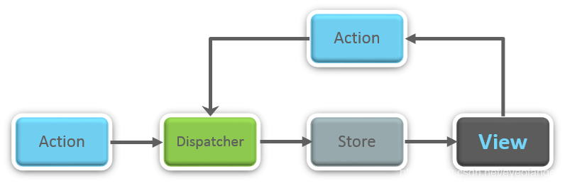
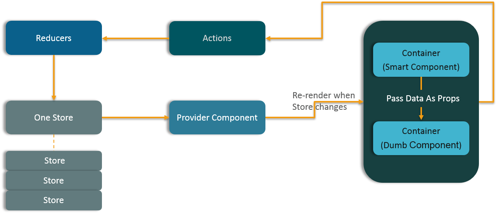

# 框架相关


# Vue

## **1、SPA 单页面理解及优缺点**
SPA（ single-page application ）**仅在 Web 页面初始化时加载**相应的 HTML、JavaScript 和 CSS。一旦页面**加载完成**，SPA **不会**因为用户的操作而进行页面的**重新加载或跳转**；取而代之的是利用路由机制实现 HTML 内容的变换，UI 与用户的交互，**避免页面的重新加载**。
**优点**：

- 用户体验好、快，内容的改变不需要重新加载整个页面，避免了不必要的跳转和重复渲染；
- 基于上面一点，SPA 相对对**服务器压力小**；
- 前后端职责分离，架构清晰，前端进行交互逻辑，后端负责数据处理；

**缺点**：

- **初次加载耗时多**：为实现单页 Web 应用功能及显示效果，需要在加载页面的时候将 JavaScript、CSS 统一加载，部分页面按需加载；
- 前进后退路由管理：由于单页应用在一个页面中显示所有的内容，所以**不能使用浏览器的前进后退功能**，所有的页面切换需要自己建立堆栈管理；
- **SEO 难度较大**：由于所有的内容都在一个页面中动态替换显示，所以在 SEO 上其有着天然的弱势。

## **2、v-show 与 v-if 有什么区别？**
**v-if** 是真正的条件渲染，因为它会确保在切换过程中条件块内的事件监听器和子组件适当地被**销毁和重建**；也是惰性的：如果在初始渲染时条件为假，则什么也不做——直到条件第一次变为真时，才会开始渲染条件块。
**v-show **就简单得多——不管初始条件是什么，元素总是会被渲染，并且只是简单地基于 CSS 的 “**display**” 属性进行切换。
所以，**v-if** 适用于在运行时很少改变条件，**不需要频繁切换条件**的场景；v-show 则适用于需要非常频繁切换条件的场景。

## **3、Class 与 Style 如何动态绑定？**
Class 可以通过对象语法和数组语法进行动态绑定：

- 对象语法：

<div v-bind:class="{ active: isActive, 'text-danger': hasError }"></div> 

- 数组语法：

<div v-bind:class="[isActive ? activeClass : '', errorClass]"></div> 
Style 也可以通过对象语法和数组语法进行动态绑定：

- 对象语法：

<div v-bind:style="{ color: activeColor, fontSize: fontSize + 'px' }"></div> 

- 数组语法：

<div v-bind:style="[styleColor, styleSize]"></div> 

## **4、怎样理解 Vue 的单向数据流？**
所有的 prop 都使得其父子 prop 之间形成了一个单向下行绑定：父级 prop 的更新会向下流动到子组件中，但是反过来则不行。
这样会防止从子组件意外改变父级组件的状态，从而导致你的应用的数据流向难以理解。
额外的，每次父级组件发生更新时，子组件中所有的 prop 都将会刷新为最新的值。这意味着你不应该在一个子组件内部改变 prop。如果你这样做了，Vue 会在浏览器的控制台中发出警告。
子组件想修改时，只能通过 $emit 派发一个自定义事件，父组件接收到后，由父组件修改。
有两种常见的试图改变一个 prop 的情形 :

- 这个 prop 用来传递一个初始值；这个子组件接下来希望将其作为一个本地的 prop 数据来使用。 在这种情况下，最好定义一个本地的 data 属性并将这个 prop 用作其初始值：

props: ['initialCounter'], 

- 这个 prop 以一种原始的值传入且需要进行转换。 在这种情况下，最好使用这个 prop 的值来定义一个计算属性

props: ['size'], 

## **5、computed 和 watch 的区别和运用的场景？**
**computed**： 是计算属性，依赖其它属性值，并且 computed 的值**有缓存**，只有它依赖的属性值发生改变，下一次获取 computed 的值时才会重新计算 computed 的值；
**watch**： 更多的是「观察」的作用，类似于某些数据的**监听回调** ，每当监听的数据变化时都会执行回调进行后续操作；深度监听：[deep](https://blog.csdn.net/xuxingyuan_/article/details/103861379)；
运用场景：

- 当我们需要进行**数值计算**，并且依赖于其它数据时，应该使用 computed，因为可以利用 computed 的缓存特性，避免每次获取值时，都要重新计算；
- 当我们需要在数据变化时执行异步或开销较大的操作时，应该使用 watch，使用 watch 选项允许我们执行异步操作 ( 访问一个 API )，限制我们执行该操作的频率，并在我们得到最终结果前，设置中间状态。这些都是计算属性无法做到的。

使用场景 computed：当一个属性受多个属性影响的时候使用，例：购物车商品结算功能 watch：当一条数据影响多条数据的时候使用，例：搜索数据

## **6、**vue监听不到数据改变的几种
由于 JavaScript 的限制，Vue 不能检测到以下数组的变动：

- 当你利用索引直接设置一个项时，例如：vm.items[indexOfItem] = newValue
- 当你修改数组的长度时，例如：vm.items.length = newLength
- 还是由于 JavaScript 的限制，Vue 不能检测对象属性的添加或删除

解决方法：
为了解决第一个问题，Vue 提供了以下操作方法：
使用 vm.$set 实例方法或者全局 Vue.set全局方法
为了解决第二个问题，Vue 提供了以下操作方法：
Array.prototype.splice 

## **7、谈谈你对 Vue 生命周期的理解？**
**（1）生命周期是什么？**
Vue 实例有一个完整的生命周期，也就是从开始创建、初始化数据、编译模版、挂载 Dom -> 渲染、更新 -> 渲染、卸载等一系列过程，我们称这是 Vue 的生命周期。
**（2）各个生命周期的作用**

| 生命周期 | 描述 |
| --- | --- |
| beforeCreate | 组件实例被创建之初，组件的属性生效之前 |
| created | 组件实例已经完全创建，属性也绑定，但真实 dom 还没有生成，$el 还不可用 |
| beforeMount | 在挂载开始之前被调用：相关的 render 函数首次被调用 |
| mounted | el 被新创建的 vm.$el 替换，并挂载到实例上去之后调用该钩子 |
| beforeUpdate | 组件数据更新之前调用，发生在虚拟 DOM 打补丁之前 |
| update | 组件数据更新之后 |
| activited | keep-alive 专属，组件被激活时调用 |
| deactivated | keep-alive 专属，组件被销毁时调用 |
| beforeDestory | 组件销毁前调用 |
| destoryed | 组件销毁后调用 |

**（3）生命周期示意图**


## **8、父、子组件生命周期执行顺序？**
Vue 的父组件和子组件生命周期钩子函数执行顺序可以归类为以下 4 部分：

- 加载渲染过程父 beforeCreate -> 父 created -> 父 beforeMount -> 子 beforeCreate -> 子 created -> 子 beforeMount -> 子 mounted -> 父 mounted
- 子组件更新过程父 beforeUpdate -> 子 beforeUpdate -> 子 updated -> 父 updated
- 父组件更新过程父 beforeUpdate -> 父 updated
- 销毁过程父 beforeDestroy -> 子 beforeDestroy -> 子 destroyed -> 父 destroyed

## **9、在哪个生命周期内调用异步请求？**
可以在钩子函数 **created、beforeMount、mounte**d 中进行调用，因为在这三个钩子函数中，**data** 已经创建，可以将服务端端返回的数据进行赋值。但是本人推荐在 created 钩子函数中调用异步请求，因为在 created 钩子函数中调用异步请求有以下优点：

- 能更快获取到服务端数据，**减少页面 loading** 时间；
- **ssr 不支持 beforeMount 、mounted **钩子函数，所以放在 created 中有助于一致性；

## **10、在什么阶段才能访问操作DOM？**
在钩子函数 mounted 被调用前，Vue 已经将编译好的模板挂载到页面上，所以在 mounted 中可以访问操作 DOM。vue 具体的生命周期示意图可以参见如下，理解了整个生命周期各个阶段的操作，关于生命周期相关的面试题就难不倒你了。


## **11、父组件可以监听到子组件的生命周期吗？**
比如有父组件 Parent 和子组件 Child，如果父组件监听到子组件挂载 mounted 就做一些逻辑处理，可以通过以下写法实现：
// Parent.vue 
以上需要手动通过 $emit 触发父组件的事件，更简单的方式可以在父组件引用子组件时通过 @hook 来监听即可，如下所示：
//  Parent.vue 
当然 @hook 方法不仅仅是可以监听 mounted，其它的生命周期事件，例如：created，updated 等都可以监听。

## **12、 **[keep-alive](https://www.jianshu.com/p/9523bb439950)
keep-alive是一个抽象组件：它自身不会渲染一个DOM元素，也不会出现在父组件链中；使用keep-alive包裹动态组件时，会缓存不活动的组件实例，而不是销毁它们。
keep-alive 是 **Vue 内置的一个组件**，可以使被包含的组件保留状态，避免重新渲染 ，其有以下特性：

- 一般结合路由和动态组件一起使用，用于**缓存组件**；
- 提供 include 和 exclude 属性，两者都支持字符串或正则表达式， include 表示只有名称匹配的组件会被缓存，exclude 表示任何名称匹配的组件都不会被缓存 ，其中** exclude 的优先级比 include 高**；
- 对应两个钩子函数 **activated 和 deactivated** ，当组件被激活时，触发钩子函数 activated，当组件被移除时，触发钩子函数 deactivated。

## **13、组件中 data 为什么是一个函数？**
为什么组件中的 data 必须是一个函数，然后 return 一个对象，而 new Vue 实例里，data 可以直接是一个对象？
// data 
因为组件是用来复用的，且 JS 里对象是引用关系，如果组件中 data 是一个对象，那么这样**作用域没有隔离**，子组件中的 data 属性值会相互影响，如果组件中 data 选项是一个函数，那么每个实例可以维护一份被返回对象的独立的拷贝，组件实例之间的 data 属性值不会互相影响；而 new Vue 的实例，是不会被复用的，因此不存在引用对象的问题。

## **14、v-model 的原理？**

1. vue中双向绑定是一个指令v-model，可以绑定一个动态值到视图，同时视图中变化能改变该值。v-model是语法糖，默认情况下相于:value和@input。
2. 使用v-model可以减少大量繁琐的事件处理代码，提高开发效率，代码可读性也更好
3. 通常在表单项上使用v-model
4. 原生的表单项可以直接使用v-model，自定义组件上如果要使用它需要在组件内绑定value并处理输入事件
5. 我做过测试，输出包含v-model模板的组件渲染函数，发现它会被转换为value属性的绑定以及一个事件监听，事件回调函数中会做相应变量更新操作，这说明神奇魔法实际上是vue的编译器完成的。

我们在 vue 项目中主要使用 v-model 指令在表单 input、textarea、select 等元素上创建双向数据绑定，我们知道 v-model 本质上不过是语法糖，v-model 在内部为不同的输入元素使用不同的属性并抛出不同的事件：

- text 和 textarea 元素使用 value 属性和 input 事件；
- checkbox 和 radio 使用 checked 属性和 change 事件；
- select 字段将 value 作为 prop 并将 change 作为事件。

以 input 表单元素为例：
<input v-model='something'> 
如果在自定义组件中，v-model 默认会利用名为 value 的 prop 和名为 input 的事件，如下所示：
父组件： 

## **15、Vue 组件间通信有哪几种方式？**
Vue 组件间通信是面试常考的知识点之一，这题有点类似于开放题，你回答出越多方法当然越加分，表明你对 Vue 掌握的越熟练。Vue 组件间通信只要指以下 3 类通信：父子组件通信、隔代组件通信、兄弟组件通信，下面我们分别介绍每种通信方式且会说明此种方法可适用于哪类组件间通信。
**（1）props / $emit 适用 父子组件通信**
这种方法是 Vue 组件的基础，相信大部分同学耳闻能详，所以此处就不举例展开介绍。
**（2）ref 与 ****children 适用 父子组件通信**

- ref：如果在普通的 DOM 元素上使用，引用指向的就是 DOM 元素；如果用在子组件上，引用就指向组件实例
- children：访问父 / 子实例

**（3）EventBus （****on） 适用于 父子、隔代、兄弟组件通信**
这种方法通过一个空的 Vue 实例作为中央事件总线（事件中心），用它来触发事件和监听事件，从而实现任何组件间的通信，包括父子、隔代、兄弟组件。
**（4）****listeners 适用于 隔代组件通信**

- attrs" 传入内部组件。通常配合 inheritAttrs 选项一起使用。
- listeners" 传入内部组件

**（5）provide / inject 适用于 隔代组件通信**
祖先组件中通过 provider 来提供变量，然后在子孙组件中通过 inject 来注入变量。provide / inject API 主要解决了跨级组件间的通信问题，不过它的使用场景，主要是子组件获取上级组件的状态，跨级组件间建立了一种主动提供与依赖注入的关系。
**（6）Vuex 适用于 父子、隔代、兄弟组件通信**
Vuex 是一个专为 Vue.js 应用程序开发的状态管理模式。每一个 Vuex 应用的核心就是 store（仓库）。“store” 基本上就是一个容器，它包含着你的应用中大部分的状态 ( state )。

- Vuex 的状态存储是响应式的。当 Vue 组件从 store 中读取状态的时候，若 store 中的状态发生变化，那么相应的组件也会相应地得到高效更新。
- 改变 store 中的状态的唯一途径就是显式地提交 (commit) mutation。这样使得我们可以方便地跟踪每一个状态的变化。

## **16、你使用过 Vuex 吗？**
Vuex 是一个专为 Vue.js 应用程序开发的状态管理模式。每一个 Vuex 应用的核心就是 store（仓库）。“store” 基本上就是一个容器，它包含着你的应用中大部分的状态 ( state )。
（1）Vuex 的状态存储是响应式的。当 Vue 组件从 store 中读取状态的时候，若 store 中的状态发生变化，那么相应的组件也会相应地得到高效更新。
（2）改变 store 中的状态的唯一途径就是显式地提交 (commit) mutation。这样使得我们可以方便地跟踪每一个状态的变化。
主要包括以下几个模块：

- **State**：定义了应用状态的数据结构，可以在这里设置默认的初始状态。
- **Getter**：允许组件从 Store 中获取数据，mapGetters 辅助函数仅仅是将 store 中的 getter 映射到局部计算属性。
- **Mutation**：是**唯一更改 store 中状态**的方法，且必须是**同步函数**。
- **Action**：用于**提交 mutation**，而不是直接变更状态，可以包含任意**异步**操作。
- **Module**：允许将单一的 Store 拆分为多个 store 且同时保存在单一的状态树中。

## **17、 Vue SSR **
Vue.js 是构建客户端应用程序的框架。默认情况下，可以在浏览器中输出 Vue 组件，进行生成 DOM 和操作 DOM。然而，也可以将同一个组件渲染为服务端的 HTML 字符串，将它们直接发送到浏览器，最后将这些静态标记"激活"为客户端上完全可交互的应用程序。
即：**SSR大致的意思就是vue在客户端将标签渲染成的整个 html 片段的工作在服务端完成，服务端形成的html 片段直接返回给客户端这个过程就叫做服务端渲染。**
服务端渲染 SSR 的优缺点如下：
（1）服务端渲染的优点：

- 更好的 **SEO**：因为 SPA 页面的内容是通过 Ajax 获取，而搜索引擎爬取工具并不会等待 Ajax 异步完成后再抓取页面内容，所以在 SPA 中是抓取不到页面通过 Ajax 获取到的内容；而 SSR 是直接由服务端返回已经渲染好的页面（数据已经包含在页面中），所以搜索引擎爬取工具可以抓取渲染好的页面；
- 更快的内容到达时间（**首屏加载更快**）：SPA 会等待所有 Vue 编译后的 js 文件都下载完成后，才开始进行页面的渲染，文件下载等需要一定的时间等，所以首屏渲染需要一定的时间；SSR 直接由服务端渲染好页面直接返回显示，无需等待下载 js 文件及再去渲染等，所以 SSR 有更快的内容到达时间；

（2) 服务端渲染的缺点：

- 更多的**开发条件限制**：例如服务端渲染**只支持 beforCreate 和 created 两个钩子**函数，这会导致一些外部扩展库需要特殊处理，才能在服务端渲染应用程序中运行；并且与可以部署在任何静态文件服务器上的完全静态单页面应用程序 SPA 不同，服务端渲染应用程序，需要处于 Node.js server 运行环境；
- 更多的**服务器负载**：在 Node.js 中渲染完整的应用程序，显然会比仅仅提供静态文件的 server 更加大量占用CPU 资源 (CPU-intensive - CPU 密集)，因此如果你预料在高流量环境 ( high traffic ) 下使用，请准备相应的服务器负载，并明智地采用缓存策略。

如果没有 SSR 开发经验的同学，可以参考本文作者的另一篇 SSR 的实践文章《Vue SSR 踩坑之旅》，里面 SSR 项目搭建以及附有项目源码。

## **18、vue-router 路由模式有几种？**
vue-router 有 3 种路由模式：hash、history、abstract，对应的源码如下所示：
switch (mode) { 
其中，3 种路由模式的说明如下：

- hash: 使用 URL hash 值来作路由。支持所有浏览器，包括不支持 HTML5 History Api 的浏览器；使用锚点
- history : 依赖 HTML5 History API 和服务器配置。具体可以查看 HTML5 History 模式；利用浏览器的browserHistory原理
- abstract : 支持所有 JavaScript 运行环境，如 Node.js 服务器端。如果发现没有浏览器的 API，路由会自动强制进入这个模式.

## **19、hash 和 history 实现原理**
**（1）hash 模式的实现原理**
早期的前端路由的实现就是基于 location.hash 来实现的。其实现原理很简单，location.hash 的值就是 URL 中 # 后面的内容。比如下面这个网站，它的 location.hash 的值为 '#search'：
https://www.word.com#search 
hash 路由模式的实现主要是基于下面几个特性：

- URL 中 hash 值只是客户端的一种状态，也就是说当向服务器端发出请求时，hash 部分不会被发送；
- hash 值的改变，都会在浏览器的访问历史中增加一个记录。因此我们能通过浏览器的回退、前进按钮控制hash 的切换；
- 可以通过 a 标签，并设置 href 属性，当用户点击这个标签后，URL 的 hash 值会发生改变；或者使用 JavaScript 来对 loaction.hash 进行赋值，改变 URL 的 hash 值；
- 我们可以使用 hashchange 事件来监听 hash 值的变化，从而对页面进行跳转（渲染）。

添加hashchange监听
```
window.addEventListener(
'hashchange',
  function() {
    // hash改变时，进行页面更换
  }
)
//改变hash
window.location.hash = 'aaa';
```
**（2）history 模式的实现原理**
HTML5 提供了 History API 来实现 URL 的变化。其中做最主要的 API 有以下两个：history.pushState() 和 history.repalceState()。这两个 API 可以在不进行刷新的情况下，操作浏览器的历史纪录。唯一不同的是，前者是新增一个历史记录，后者是直接替换当前的历史记录，如下所示：
window.history.pushState(null, null, path); 
history 路由模式的实现主要基于存在下面几个特性：

- pushState 和 repalceState 两个 API 来操作实现 URL 的变化 ；
- 我们可以使用 popstate 事件来监听 url 的变化，从而对页面进行跳转（渲染）；
- history.pushState() 或 history.replaceState() 不会触发 popstate 事件，这时我们需要手动触发页面跳转（渲染）。

添加popstate监听，可以监听到浏览器前进、后退。但不能监听到pushState、replaceState，所以在执行pushState、replaceState的时候进行页面更换。
```
window.addEventListener(
'popstate',
  function() {
    // url改变时，进行页面更换
  }
)
//改变url，pushState、replaceState的具体文档可以去看MDN。
history.pushState({}, '', path);
history.replaceState({}, '', path);
```

## **20、什么是 MVVM？**
Model–View–ViewModel （MVVM） 是一个**软件架构设计模式**，由微软 WPF 和 Silverlight 的架构师 Ken Cooper 和 Ted Peters 开发，是一种简化用户界面的事件驱动编程方式。由 John Gossman（同样也是 WPF 和 Silverlight 的架构师）于2005年在他的博客上发表
MVVM 源自于经典的 Model–View–Controller（MVC）模式 ，MVVM 的出现促进了**前**端开发与**后端**业务逻辑的**分离**，极大地提高了前端开发效率，MVVM 的**核心是 ViewModel 层**，它就像是一个中转站（value converter），负责转换 Model 中的数据对象来让数据变得更容易管理和使用，该层向上与视图层进行双向数据绑定，向下与 Model 层通过接口请求进行数据交互，起呈上启下作用。如下图所示：

**（1）View 层**
View 是**视图层**，也就是用户界面。前端主要由 HTML 和 CSS 来构建 。
**（2）Model 层**
Model 是指**数据模型**，泛指后端进行的各种业务逻辑处理和数据操控，对于前端来说就是后端提供的 api 接口。
**（3）ViewModel 层**
ViewModel 是由前端开发人员组织生成和维护的**视图数据层**。在这一层，前端开发者对从后端获取的 Model 数据进行转换处理，做二次封装，以生成符合 View 层使用预期的视图数据模型。
需要注意的是 ViewModel 所封装出来的数据模型包括视图的**状态**和**行为**两部分，而 Model 层的数据模型是只包含状态的，比如页面的这一块展示什么，而页面加载进来时发生什么，点击这一块发生什么，这一块滚动时发生什么这些都属于视图行为（交互），视图状态和行为都封装在了 ViewModel 里。这样的封装使得 ViewModel 可以完整地去描述 View 层。
MVVM 框架实现了**双向绑定**，这样 ViewModel 的内容会实时展现在 View 层，前端开发者再也不必低效又麻烦地通过操纵 DOM 去更新视图，MVVM 框架已经把最脏最累的一块做好了，我们开发者只需要处理和维护 **ViewModel，更新数据视图就会自动得到相应更新。**
这样 View 层展现的不是 Model 层的数据，而是 ViewModel 的数据，由 ViewModel 负责与 Model 层交互，这就完全解耦了 View 层和 Model 层，这个解耦是至关重要的，它是前后端分离方案实施的重要一环。
我们以下通过一个 Vue 实例来说明 MVVM 的具体实现，有 Vue 开发经验的同学应该一目了然：
**（1）View 层**
<div id="app"> 
**（2）ViewModel 层**
var app = new Vue({ 
（3） Model 层
{ 

## **21、Vue 是如何实现数据双向绑定的？**
Vue 数据双向绑定主要是指：数据变化更新视图，视图变化更新数据，如下图所示：

即：

- 输入框内容变化时，Data 中的数据同步变化。即 View => Data 的变化。
- Data 中的数据变化时，文本节点的内容同步变化。即 Data => View 的变化。

其中，View 变化更新 Data ，可以通过事件监听的方式来实现，所以 Vue 的数据双向绑定的工作主要是如何根据 Data 变化更新 View。
Vue 主要通过以下 4 个步骤来实现数据双向绑定的：

1. 实现一个**监听器** **Observer**：对**数据**对象进行遍历，包括子属性对象的属性，利用 **Object.defineProperty**() 对属性都加上** setter 和 getter**。这样的话，给这个对象的某个值赋值，就会触发 setter，那么就能监听到了数据变化。
2. 实现一个**解析器 Compile**：**解析 Vue 模板指令**，将模板中的变量都替换成数据，然后初始化渲染页面视图，并将每个指令对应的节点绑定更新函数，添加监听数据的订阅者，一旦数据有变动，收到通知，调用更新函数进行数据更新。
3. 实现一个订阅者** Watcher**：Watcher 订阅者是 Observer 和 Compile 之间通信的桥梁 ，主要的任务是订阅 Observer 中的属性值变化的消息，当收到属性值变化的消息时，触发解析器 Compile 中对应的更新函数。
4. 实现一个**订阅器 Dep**：订阅器采用 **发布-订阅** 设计模式，用来收集订阅者 Watcher，对监听器 Observer 和 订阅者 Watcher 进行统一管理。

以上四个步骤的流程图表示如下，如果有同学理解不大清晰的，可以查看作者专门介绍数据双向绑定的文章《0 到 1 掌握：Vue 核心之数据双向绑定》，有进行详细的讲解、以及代码 demo 示例。

> 是由数据劫持结合发布者订阅者实现的。数据劫持是通过Object.defineProperty()来劫持对象数据的setter和getter操作。在数据变动时作你想做的事
> - 原理通过Observer来监听自己的model数据变化，通过Compile来解析编译模板指令，最终利用Watcher搭起Observer和Compile之间的通信桥梁，达到数据变化->视图更新在初始化vue实例时，遍历data这个对象，给每一个键值对利用Object.definedProperty对data的键值对新增get和set方法，利用了事件监听DOM的机制，让视图去改变数据


## **22、Vue 框架怎么实现对象和数组的监听？**
如果被问到 Vue 怎么实现数据双向绑定，大家肯定都会回答 通过 Object.defineProperty() 对数据进行劫持，但是 Object.defineProperty() 只能对属性进行数据劫持，不能对整个对象进行劫持，同理无法对数组进行劫持，但是我们在使用 Vue 框架中都知道，Vue 能检测到对象和数组（部分方法的操作）的变化，那它是怎么实现的呢？我们查看相关代码如下：
```
/**
   * Observe a list of Array items.
   */
  observeArray (items: Array<any>) {
    for (let i = 0, l = items.length; i < l; i++) {
      observe(items[i])  // observe 功能为监测数据的变化
    }
  }

  /**
   * 对属性进行递归遍历
   */
  let childOb = !shallow && observe(val) // observe 功能为监测数据的变化
```
通过以上 Vue 源码部分查看，我们就能知道 Vue 框架是通过**遍历**数组 和递归遍历对象，从而达到利用 Object.defineProperty() 也能对对象和数组（部分方法的操作）**进行监听**。

## **23、Proxy 与 Object.defineProperty 优劣对比**

1. **Object.definedProperty**的作用是**劫持一个对象的属性**，劫持属性的getter和setter方法，在对象的属性发生变化时进行特定的操作。而 **Proxy劫持的是整个对象**。
2. **Proxy**会**返回一个代理对象**，我们只需要操作新对象即可，而Object.defineProperty只能遍历对象属性直接修改。
3. **Object.definedProperty不支持数组**，更准确的说是不支持数组的各种API，因为如果仅仅考虑arry[i] = value 这种情况，是可以劫持的，但是这种劫持意义不大。而**Proxy可以支持数组的各种API**。
4. 尽管Object.**defineProperty**有诸多缺陷，但是其**兼容性要好**于Proxy。

**Proxy 的优势**如下:

- Proxy 可以直接监听对象而非属性；
- Proxy 可以直接监听数组的变化；
- Proxy 有多达 13 种拦截方法,不限于 apply、ownKeys、deleteProperty、has 等等Object.defineProperty 不具备的；
- Proxy 返回的是一个新对象,我们可以只操作新的对象达到目的,而 Object.defineProperty 只能遍历对象属性直接修改；
- Proxy 作为新标准将受到浏览器厂商重点持续的性能优化，也就是传说中的新标准的性能红利；

**Object.defineProperty 的优势**如下:

- 兼容性好，支持 IE9，而 Proxy 的存在浏览器兼容性问题,而且无法用 polyfill 磨平，因此 Vue 的作者才声明需要等到下个大版本( 3.0 )才能用 Proxy 重写。

## **24、Vue 怎么用 vm.$set() 解决对象新增属性不能响应的问题 ？**
受现代 JavaScript 的限制 ，**Vue 无法检测到对象属性的添加或删除**。由于 Vue 会在初始化实例时对属性执行 getter/setter 转化，所以属性必须在 data 对象上存在才能让 Vue 将它转换为响应式的。
但是 Vue 提供了 Vue.set (object, propertyName, value) / vm.$set (object, propertyName, value) 来实现为对象添加响应式属性，那框架本身是如何实现的呢？
我们查看对应的 Vue 源码：vue/src/core/instance/index.js
export function set (target: Array<any> | Object, key: any, val: any): any { 
我们阅读以上源码可知，**vm.$set 的实现原理**是：

- 如果目标是**数组**，直接使用**数组的 splice 方法**触发相应式；
- 如果目标是**对象**，会先判读属性是否存在、对象是否是响应式，最终如果要对属性进行响应式处理，则是通过调用 **defineReactive** 方法进行响应式处理（ defineReactive 方法就是 Vue 在初始化对象时，给对象属性采用 Object.defineProperty 动态添加 getter 和 setter 的功能所调用的方法）

## **25、虚拟 DOM 的优缺点？**
**优点**：

- **保证性能下限**： 框架的虚拟 DOM 需要适配任何上层 API 可能产生的操作，它的一些 DOM 操作的实现必须是普适的，所以它的性能并不是最优的；但是比起粗暴的 DOM 操作性能要好很多，因此框架的虚拟 DOM 至少可以保证在你不需要手动优化的情况下，依然可以提供还不错的性能，即保证性能的下限；
- **无需手动操作 DOM**： 我们不再需要手动去操作 DOM，只需要写好 View-Model 的代码逻辑，框架会根据虚拟 DOM 和 数据双向绑定，帮我们以可预期的方式更新视图，极大**提高**我们的**开发效率**；
- **跨平台**： **虚拟 DOM 本质上是 JavaScript 对象**,而 DOM 与平台强相关，相比之下虚拟 DOM 可以进行更方便地跨平台操作，例如服务器渲染、weex 开发等等。

**缺点**:

- **无法进行极致优化**： 虽然虚拟 DOM + 合理的优化，足以应对绝大部分应用的性能需求，但在一些性能要求极高的应用中虚拟 DOM 无法进行针对性的极致优化。

## **26、虚拟 DOM 实现原理？**
虚拟 DOM 的实现原理主要包括以下 3 部分：

- 用 JavaScript **对象模拟**真实 **DOM 树**，对真实 DOM 进行抽象；
- **diff 算法** — 比较两棵虚拟 DOM 树的差异；
- **pach 算法** — 将两个虚拟 DOM 对象的差异应用到真正的 DOM 树。

如果对以上 3 个部分还不是很了解的同学，可以查看本文作者写的另一篇详解虚拟 DOM 的文章《深入剖析：Vue核心之虚拟DOM》

## **27、Vue 中的 key 有什么作用？**

1. key的作用主要是为了更高效的对比虚拟DOM中每个节点是否是相同节点;
2. Vue在patch过程中判断两个节点是否是相同节点,key是一个必要条件，渲染一组列表时，key往往是唯一标识，所以如果不定义key的话，Vue只能认为比较的两个节点是同一个，哪怕它们实际上不是，这导致了频繁更新元素，使得整个patch过程比较低效，影响性能;
3. 从源码中可以知道，Vue判断两个节点是否相同时主要判断两者的key和元素类型等，因此如果不设置key,它的值就是undefined，则可能永远认为这是两个相同的节点，只能去做更新操作，这造成了大量的dom更新操作，明显是不可取的。

key 是为 Vue 中 **vnode 的唯一标记**，通过这个 key，我们的** diff 操作可以更准确、更快速**。
Vue 的 diff 过程可以概括为：oldCh 和 newCh 各有两个头尾的变量 oldStartIndex、oldEndIndex 和 newStartIndex、newEndIndex，它们会新节点和旧节点会进行两两对比，即一共有4种比较方式：newStartIndex 和oldStartIndex 、newEndIndex 和 oldEndIndex 、newStartIndex 和 oldEndIndex 、newEndIndex 和 oldStartIndex，如果以上 4 种比较都没匹配，如果设置了key，就会用 key 再进行比较，在比较的过程中，遍历会往中间靠，一旦 StartIdx > EndIdx 表明 oldCh 和 newCh 至少有一个已经遍历完了，就会结束比较。具体有无 key 的 diff 过程，可以查看作者写的另一篇详解虚拟 DOM 的文章《深入剖析：Vue核心之虚拟DOM》
所以 Vue 中 key 的作用是：key 是为 Vue 中 vnode 的唯一标记，通过这个 key，我们的 diff 操作可以更准确、更快速
更**准确**：因为带 key 就不是就地复用了，在 **sameNode** 函数 a.key === b.key 对比中可以**避免就地复用**的情况。所以会更加准确。
更**快速**：利用 key 的唯一性生成 map 对象来获取对应节点，比遍历方式更快，源码如下：
function createKeyToOldIdx (children, beginIdx, endIdx) { 

## 28、你怎么理解Vue中的diff算法?
在js中,渲染真实DOM的开销是非常大的,比如我们修改了某个数据,如果直接渲染到真实DOM,会引起整个dom树的重绘和重排。那么有没有可能实现只更新我们修改的那一小块dom而不要更新整个dom呢？此时我们就需要先根据真实dom生成虚拟dom，当虚拟dom某个节点的数据改变后会生成有一个新的**Vnode**,然后新的Vnode和旧的Vnode作**比较**，发现有不一样的地方就直接修改在真实DOM上，然后使旧的Vnode的值为新的Vnode。
**diff的过程就是调用patch函数**，比较新旧节点，一边比较一边给真实的DOM打补丁。在采取diff算法比较新旧节点的时候，比较只会在同层级进行。在patch方法中，首先进行树级别的比较 new Vnode不存在就删除 old Vnode old Vnode 不存在就增加新的Vnode 都存在就执行diff更新当确定需要执行diff算法时，比较两个Vnode，包括三种类型操作：**属性更新，文本更新，子节点更新**新老节点均有子节点，则对子节点进行diff操作，调用updatechidren 如果老节点没有子节点而新节点有子节点，先清空老节点的文本内容，然后为其新增子节点如果新节点没有子节点，而老节点有子节点的时候，则移除该节点的所有子节点老新老节点都没有子节点的时候，进行文本的替换
**updateChildren**将Vnode的子节点Vch和oldVnode的子节点oldCh提取出来。 oldCh和vCh各有两个头尾的变量StartIdx和EndIdx，它们的2个变量相互比较，一共有4种比较方式。如果4种比较都没匹配，如果设置了key，就会用key进行比较，在比较的过程中，变量会往中间靠，一旦StartIdx>EndIdx表明oldCh和vCh至少有一个已经遍历完了，就会结束比较。

## **29、你有对 Vue 项目进行哪些优化？**
还可以使用缓存(客户端缓存、服务端缓存)优化、服务端开启gzip压缩等。
如果没有对 Vue 项目没有进行过优化总结的同学，可以参考本文作者的另一篇文章《 Vue 项目性能优化 — 实践指南 》，文章主要介绍从 3 个大方面，22 个小方面详细讲解如何进行 Vue 项目的优化。

### （1）代码层面的优化

- v-if 和 v-show 区分使用场景
- 尽量减少data中的数据，data中的数据都会增加getter和setter，会收集对应的watcher
- computed 和 watch 区分使用场景
- v-for 遍历必须为 item 添加 key，并保证唯一，且避免同时使用 v-if
- 如果需要使用v-**for**给每项元素绑定事件时使用事件代理
- 长列表滚动到可视区域动态加载
- 事件的销毁
- 图片资源懒加载
- 使用路由懒加载、异步组件
- 第三方插件的按需引入
- 优化无限列表性能
- SEO优化
- 服务端渲染 SSR or 预渲染
- SPA 页面采用keep-alive缓存组件
- 防抖、节流

### （2）Webpack 层面的优化

- Webpack 对图片进行压缩
- 减少 ES6 转为 ES5 的冗余代码
- 提取公共代码
- 模板预编译
- 提取组件的 CSS
- 优化 SourceMap
- 构建结果输出分析
- Vue 项目的编译优化
- 压缩代码
- Tree Shaking/Scope Hoisting
- 多线程打包happypack
- splitChunks抽离公共文件
- sourceMap优化

### （3）基础的 Web 技术的优化

- 开启 gzip 压缩
- 浏览器缓存
- 使用cdn加载第三方模块
- 使用 Chrome Performance 查找性能瓶颈
- 骨架屏


## **30、对于即将到来的 vue3.0 特性你有什么了解的吗？**
Vue 3.0 正走在发布的路上，Vue 3.0 的目标是让 Vue 核心变得更小、更快、更强大，因此 Vue 3.0 增加以下这些新特性：

### （1）监测机制的改变
3.0 将带来**基于代理 Proxy 的 observer 实现**，提供全语言覆盖的反应性跟踪。这消除了 Vue 2 当中基于 Object.defineProperty 的实现所存在的很多限制：

- 只能监测属性，不能监测对象
- 检测属性的添加和删除；
- 检测数组索引和长度的变更；
- 支持 Map、Set、WeakMap 和 WeakSet。

新的 observer 还提供了以下特性：

- 用于创建 observable 的公开 API。这为中小规模场景提供了简单轻量级的跨组件状态管理解决方案。
- 默认采用惰性观察。在 2.x 中，不管反应式数据有多大，都会在启动时被观察到。如果你的数据集很大，这可能会在应用启动时带来明显的开销。在 3.x 中，只观察用于渲染应用程序最初可见部分的数据。
- 更精确的变更通知。在 2.x 中，通过 Vue.set 强制添加新属性将导致依赖于该对象的 watcher 收到变更通知。在 3.x 中，只有依赖于特定属性的 watcher 才会收到通知。
- 不可变的 observable：我们可以创建值的“不可变”版本（即使是嵌套属性），除非系统在内部暂时将其“解禁”。这个机制可用于冻结 prop 传递或 Vuex 状态树以外的变化。
- 更好的调试功能：我们可以使用新的 renderTracked 和 renderTriggered 钩子精确地跟踪组件在什么时候以及为什么重新渲染。

### （2）模板
模板方面没有大的变更，只改了**作用域插槽**，2.x 的机制导致作用域插槽变了，父组件会重新渲染，而 3.0 把作用域插槽改成了函数的方式，这样只会影响子组件的重新渲染，提升了渲染的性能。
同时，对于 render 函数的方面，vue3.0 也会进行一系列更改来方便习惯直接使用 api 来生成 vdom 。

### （3）对象式的组件声明方式
vue2.x 中的组件是通过声明的方式传入一系列 option，和 TypeScript 的结合需要通过一些装饰器的方式来做，虽然能实现功能，但是比较麻烦。
3.0 修改了组件的声明方式，改成了类式的写法，这样使得和 TypeScript 的结合变得很容易。
此外，vue 的源码也改用了 TypeScript 来写。其实当代码的功能复杂之后，必须有一个静态类型系统来做一些辅助管理。
现在 vue3.0 也全面改用 TypeScript 来重写了，更是使得对外暴露的 api 更容易结合 TypeScript。静态类型系统对于复杂代码的维护确实很有必要。

### （4）其它方面的更改
vue3.0 的改变是全面的，上面只涉及到主要的 3 个方面，还有一些其他的更改：

- 支持自定义渲染器，从而使得 weex 可以通过自定义渲染器的方式来扩展，而不是直接 fork 源码来改的方式。
- 支持 Fragment（多个根节点）和 Protal（在 dom 其他部分渲染组建内容）组件，针对一些特殊的场景做了处理。
- 基于 treeshaking 优化，提供了更多的内置功能。

## 31、你知道Vue3有哪些新特性吗？
它们会带来什么影响？

- 性能提升

更小巧、更快速支持自定义渲染器支持摇树优化：一种在打包时去除无用代码的优化手段支持Fragments和跨组件渲染

- **API**变动

模板语法99%保持不变原生支持基于class的组件，并且无需借助任何编译及各种stage阶段的特性在设计时也考虑TypeScript的类型推断特性重写虚拟DOM可以期待更多的编译时提示来减少运行时的开销优化插槽生成可以单独渲染父组件和子组件静态树提升降低渲染成本基于Proxy的观察者机制节省内存开销

- 不兼容**IE11**

检测机制更加全面、精准、高效,更具可调试式的响应跟踪

## 33、Vue2.0与Vue3.0区别总结

### 1.项目目录结构
**vue-cli2.0**与**3.0**在目录结构方面，有明显的不同
**vue-cli3.0**移除了配置文件目录，**config **和** build **文件夹
同时移除了** static **静态文件夹，新增了** public **文件夹，打开层级目录还会发现，** index.html **移动到** public **中

### 2.配置项
**3.0 config**文件已经被移除，但是多了**.env.production**和**env.development**文件，除了文件位置，实际配置起来和**2.0**没什么不同
没了**config**文件，跨域需要配置域名时，从**config/index.js **挪到了**vue.config.js**中，配置方法不变

### 3.渲染
**Vue2.x**使用的**Virtual Dom**实现的渲染
**Vue3.0**不论是原生的**html**标签还是**vue**组件，他们都会通过**h**函数来判断，如果是原生**html**标签，在运行时直接通过**Virtual Dom**来直接渲染，同样如果是组件会直接生成组件代码

### 4.数据监听
**Vue2.x**大家都知道使用的是**es5**的**object.defineproperties**中**getter**和**setter**实现的，而**vue3.0**的版本，是基于**Proxy**进行监听的，其实基于**proxy**监听就是所谓的**lazy by default**，什么意思呢，就是只要你用到了才会监听，可以理解为‘按需监听’，官方给出的诠释是：速度加倍，同时内存占用还减半。

### 5.按需引入
**Vue2.x**中**new**出的实例对象，所有的东西都在这个**vue**对象上，这样其实无论你用到还是没用到，都会跑一变。而**vue3.0**中可以用**ES module imports**按需引入，如：**keep-alive**内置组件、**v-model**指令，等等
[https://www.jianshu.com/p/9088d530aecc](https://www.jianshu.com/p/9088d530aecc)
数据响应式
ref:ref 对我们的值创建了一个响应式引用。使用引用的概念将在整个组合式 API 中经常使用。
在模板中解析会自动解开，直接使用。(<p>{{msg}}<p>);但是在js中必须（msg.value）
reactive: 响应式转换是“深层”的——它影响所有嵌套 property。在基于 ES2015 Proxy 的实现中，返回的代理是不等于原始对象。建议只使用响应式代理，避免依赖原始对象
对对象进行结构赋值会让对对象每一个属性失去响应式，所有在es6解构赋值前，可以通过toRefs方法包装
toRefs: 将对象每个属性有具有响应式属性，并且带有ref特性；访问方式不同。可以解构赋值不影响数据的响应式
readonly：有时我们想跟踪响应式对象(ref 或 reactive)的变化，但我们也希望防止在应用程序的某个位置更改它。例如，当我们有一个被 provide 的响应式对象时，我们不想让它在注入的时候被改变。为此，我们可以基于原始对象创建一个只读的 Proxy 对象
ref/reactive/toRefs 数据区别：

## 34、new Vue后整个的流程

- **initProxy**：作用域代理，拦截组件内访问其它组件的数据。
- initLifecycle：建立父子组件关系，在当前组件实例上添加一些属性和生命周期标识。如[Math Processing Error]parent,parent,refs,$children,_isMounted等。
- initEvents：对父组件传入的事件添加监听，事件是谁创建谁监听，子组件创建事件子组件监听
- initRender：声明[Math Processing Error]slots和slots和createElement()等。
- initInjections：注入数据，初始化inject，一般用于组件更深层次之间的通信。
- initState：重要）数据响应式：初始化状态。很多选项初始化的汇总：data,methods,props,computed和watch。
- initProvide：提供数据注入。

思考：为什么先注入再提供呢？？
答：1、首先来自祖辈的数据要和当前实例的data,等判重，相结合，所以注入数据的initInjections一定要在InitState的上面。2. 从上面注入进来的东西在当前组件中转了一下又提供给后代了，所以注入数据也一定要在上面。
vm.[Math Processing Error]mount(vm.mount(vm.options.el)：挂载实例。

## 35、nextTick的实现

1. nextTick是Vue提供的一个全局API,是在**下次DOM更新循环结束之后**执行延迟回调，在修改数据之后使用$nextTick，则可以在回调中获取更新后的DOM；
2. Vue在**更新DOM时是异步执行**的。只要侦听到数据变化，Vue将开启1个队列，并缓冲在同一事件循环中发生的所有数据变更。如果同一个watcher被多次触发，只会被推入到队列中-次。这种在缓冲时去除重复数据对于避免不必要的计算和DOM操作是非常重要的。nextTick方法会在队列中加入一个回调函数，确保该函数在前面的dom操作完成后才调用；
3. 比如，我在干什么的时候就会使用nextTick，传一个回调函数进去，在里面执行dom操作即可；

我也有简单了解nextTick实现，它会在**callbacks**里面加入我们传入的函数，然后用**timerFunc**异步方式调用它们，首选的异步方式会是**Promise**。这让我明白了为什么可以在nextTick中看到dom操作结果。
在下次 DOM 更新循环结束之后执行延迟回调。在修改数据之后立即使用这个方法，获取更新后的 DOM。
是将回调函数延迟在下一次dom更新数据后调用，简单的理解是：**当数据更新了，在dom中渲染后，自动执行该函数**
什么时候需要用的Vue.nextTick()？？
Vue生命周期的created()钩子函数进行的DOM操作一定要放在Vue.nextTick()的回调函数中
当项目中你想在改变DOM元素的数据后基于新的dom做点什么，对新DOM一系列的js操作都需要放进Vue.nextTick()的回调函数中；通俗的理解是：**更改数据后当你想立即使用js操作新的视图的时候需要使用它**
Vue.nextTick(callback)使用原理：
原因是，Vue是异步执行dom更新的，一旦观察到数据变化，Vue就会开启一个队列，然后把在同一个事件循环(event loop)当中观察到数据变化的 watcher 推送进这个队列。如果这个watcher被触发多次，只会被推送到队列一次。这种缓冲行为可以有效的去掉重复数据造成的不必要的计算和DOm操作。而在下一个事件循环时，Vue会清空队列，并进行必要的DOM更新。
当你设置 vm.someData = 'new value'，DOM 并不会马上更新，而是在异步队列被清除，也就是下一个事件循环开始时执行更新时才会进行必要的DOM更新。如果此时你想要根据更新的 DOM 状态去做某些事情，就会出现问题。。为了在数据变化之后等待 Vue 完成更新 DOM ，可以在数据变化之后立即使用 Vue.nextTick(callback)。这样回调函数在 DOM 更新完成后就会调用。

## 36、[ vue自定义封装指令](https://blog.csdn.net/weixin_45932565/article/details/104478662)

> vue.directive
inserted(el,bind) update(el,bind)


## **说说你使用 Vue 框架踩过最大的坑是什么？怎么解决的？**
本题为开放题目，欢迎大家在评论区畅所欲言，分享自己的踩坑、填坑经历，提供前车之鉴，避免大伙再次踩坑 

# React

## 基本知识

### 1. 区分Real DOM和Virtual DOM
| Real DOM | Virtual DOM |
| --- | --- |
| 1. 更新缓慢。 | 1. 更新更快。 |
| 2. 可以直接更新 HTML。 | 2. 无法直接更新 HTML。 |
| 3. 如果元素更新，则创建新DOM。 | 3. 如果元素更新，则更新 JSX 。 |
| 4. DOM操作代价很高。 | 4. DOM 操作非常简单。 |
| 5. 消耗的内存较多。 | 5. 很少的内存消耗。 |


### 2. 什么是React？

- React 是 Facebook 在 **2011** 年开发的前端 **JavaScript** **库**。
- 它遵循的方法，有助于构建可重用的UI组件。
- 它用于开发复杂和交互式的 Web 和移动 UI。
- 尽管它仅在 2015 年开源，但有一个很大的支持社区。

### 3. React有什么特点？
React的主要功能如下：

1. 它使用****虚拟DOM** **而不是真正的DOM。
2. 它可以用**服务器端渲染**。
3. 它遵循**单向数据流**或数据绑定。

### 4. 列出React的一些主要优点。
React的一些主要优点是：

1. 它**提高**了应用的**性能**
2. 可以方便地在客户端和服务器端使用
3. 由于 JSX，**代码的可读性**很好
4. React 很容易与 Meteor，Angular 等其他框架集成
5. 使用React，编写UI测试用例变得非常容易

### 5. React有哪些限制？
React的限制如下：

1. React 只**是一个库**，而**不是**一个完整的**框架**
2. 它的库非常庞大，需要时间来理解
3. 新手程序员可能很难理解
4. 编码变得复杂，因为它使用内联模板和 JSX

### 6. 什么是JSX？
JSX 是J avaScript XML 的简写。是 React 使用的一种文件，它利用 JavaScript 的表现力和类似 HTML 的模板语法。这使得 HTML 文件非常容易理解。此文件能使应用非常可靠，并能够提高其性能。下面是JSX的一个例子：
```
render(){
    return(        
        <div>
            <h1> Hello World from Edureka!!</h1>
        </div>
    );
 }
```

### 7. 你了解 Virtual DOM 吗？解释一下它的工作原理。
Virtual DOM 是一个**轻量级**的 JavaScript **对象**，它最初只是 real DOM 的副本。它是一个**节点树**，它将元素、它们的属性和内容作为对象及其属性。 React 的渲染函数从 React 组件中创建一个节点树。然后它响应数据模型中的变化来更新该树，该变化是由用户或系统完成的各种动作引起的。
Virtual DOM 工作过程有三个简单的步骤。
1、每当底层**数据发生改变**时，整个 UI 都将在 Virtual DOM 描述中重新渲染。


2、然后**计算**之前 DOM 表示与新表示的之间的**差异**。


3、完成计算后，将**只用实际更改的内容更新** real DOM。


### 8. 为什么浏览器无法读取JSX？
浏览器只能处理 JavaScript 对象，而不能读取常规 JavaScript 对象中的 JSX。所以为了使浏览器能够读取 JSX，首先，需要用像 Babel 这样的 JSX 转换器将 JSX 文件转换为 JavaScript 对象，然后再将其传给浏览器。

### 9. 与 ES5 相比，React 的 ES6 语法有何不同？
以下语法是 ES5 与 ES6 中的区别：
require 与 import
```
// ES5
var React = require('react');
// ES6
import React from 'react';
```
export 与 exports
```
// ES5
module.exports = Component;
// ES6
export default Component;
```
component 和 function
```
// ES5
var MyComponent = React.createClass({
    render: function() {
        return
			<h3>Hello Edureka!</h3>;
    }
});
// ES6
class MyComponent extends React.Component {
    render() {
        return
			<h3>Hello Edureka!</h3>;
    }
}
```
props
```
// ES5
var App = React.createClass({
    propTypes: { name: React.PropTypes.string },
    render: function() {
        return
			<h3>Hello, {this.props.name}!</h3>;
    }
});
// ES6
class App extends React.Component {
    render() {
        return
			<h3>Hello, {this.props.name}!</h3>;
    }
}
```
state
```
// ES5
var App = React.createClass({
    getInitialState: function() {
        return { name: 'world' };
    },
    render: function() {
        return
	        <h3>Hello, {this.state.name}!</h3>;
    }
});
// ES6
class App extends React.Component {
    constructor() {
        super();
        this.state = { name: 'world' };
    }
    render() {
        return
	        <h3>Hello, {this.state.name}!</h3>;
    }
}
```

### 10. React与Angular有何不同？
| 主题 | React | Angular |
| --- | --- | --- |
| 1. 体系结构 | 只有 MVC 中的 View | 完整的 MVC |
| 2. 渲染 | 可以在服务器端渲染 | 客户端渲染 |
| 3. DOM | 使用 virtual DOM | 使用 real DOM |
| 4. 数据绑定 | 单向数据绑定 | 双向数据绑定 |
| 5. 调试 | 编译时调试 | 运行时调试 |
| 6. 作者 | Facebook | Google |


## React 组件

### 11. 你理解“在React中，一切都是组件”这句话。
组件是 React 应用 UI 的构建块。这些组件将整个 UI 分成小的独立并可重用的部分。每个组件彼此独立，而不会影响 UI 的其余部分。

### 12. 解释 React 中 render() 的目的。
每个React组件强制要求必须有一个 render()。它返回一个 React 元素，是原生 DOM 组件的表示。如果需要渲染多个 HTML 元素，则必须将它们组合在一个封闭标记内，例如 <form>、<group>、<div> 等。此函数必须保持纯净，即必须每次调用时都返回相同的结果。

### 13. 如何将两个或多个组件嵌入到一个组件中？
可以通过以下方式将组件嵌入到一个组件中：
```
class MyComponent extends React.Component{
    render(){
        return(          
          <div>
            <h1>Hello</h1>
            <Header/>
           </div>
        );
    }
}
class Header extends React.Component{
    render(){
        return
			<h1>Header Component</h1>   
   };
}
ReactDOM.render(
    <MyComponent/>, document.getElementById('content')
);
```

### 14. 什么是 Props?
Props 是 React 中属性的简写。它们是只读组件，必须保持纯，即不可变。它们总是在整个应用中从父组件传递到子组件。子组件永远不能将 prop 送回父组件。这有助于维护单向数据流，通常用于呈现动态生成的数据。

### 15. React中的状态是什么？它是如何使用的？
状态是 React 组件的**核心**，是**数据的来源**，必须尽可能简单。基本上状态是确定组件呈现和行为的对象。与props 不同，它们是可变的，并创建动态和交互式组件。可以通过 this.state() 访问它们。

### 16. 区分状态和 props
| 条件 | State | Props |
| --- | --- | --- |
| 1. 从父组件中接收初始值 | Yes | Yes |
| 2. 父组件可以改变值 | No | Yes |
| 3. 在组件中设置默认值 | Yes | Yes |
| 4. 在组件的内部变化 | Yes | No |
| 5. 设置子组件的初始值 | Yes | Yes |
| 6. 在子组件的内部更改 | No | Yes |


### 17. 如何更新组件的状态？
可以用 this.setState()更新组件的状态。
```
class MyComponent extends React.Component {
    constructor() {
        super();
        this.state = {
            name: 'Maxx',
            id: '101'
        }
    }
    render()
        {
            setTimeout(()=>{this.setState({name:'Jaeha', id:'222'})},2000)
            return (              
				<div>
                	<h1>Hello {this.state.name}</h1>
					<h2>Your Id is {this.state.id}</h2>
                </div>
            );
        }
    }
ReactDOM.render(
    <MyComponent/>, document.getElementById('content')
);
```

### 18. React 中的箭头函数是什么？怎么用？
箭头函数（=>）是用于编写函数表达式的简短语法。这些函数允许正确绑定组件的上下文，因为在 ES6 中默认下不能使用自动绑定。使用高阶函数时，箭头函数非常有用。
```
//General way
render() {    
    return(
        <MyInput onChange = {this.handleChange.bind(this) } />
    );
}
//With Arrow Function
render() {  
    return(
        <MyInput onChange = { (e)=>this.handleOnChange(e) } />
    );
}
```

### 19. 区分有状态和无状态组件。
| 有状态组件 | 无状态组件 |
| --- | --- |
| 1. 在内存中存储有关组件状态变化的信息 | 1. 计算组件的内部的状态 |
| 2. 有权改变状态 | 2. 无权改变状态 |
| 3. 包含过去、现在和未来可能的状态变化情况 | 3. 不包含过去，现在和未来可能发生的状态变化情况 |
| 4. 接受无状态组件状态变化要求的通知，然后将 props 发送给他们。 | 4.从有状态组件接收 props 并将其视为回调函数。 |


### 20. React组件生命周期的阶段是什么？
React 组件的生命周期有三个不同的阶段：

1. *初始渲染阶段：*这是组件即将开始其生命之旅并进入 DOM 的阶段。
2. *更新阶段：*一旦组件被添加到 DOM，它只有在 prop 或状态发生变化时才可能更新和重新渲染。这些只发生在这个阶段。
3. *卸载阶段：*这是组件生命周期的最后阶段，组件被销毁并从 DOM 中删除。

### 21. 详细解释 React 组件的生命周期方法。
一些最重要的生命周期方法是：

- **componentWillMount****()** – 在渲染之前执行，在客户端和服务器端都会执行。
- **componentDidMount****()** – 仅在第一次渲染后在客户端执行。
- **componentWillReceiveProps****()** – 当从父类接收到 props 并且在调用另一个渲染器之前调用。
- **shouldComponentUpdate****()** – 根据特定条件返回 true 或 false。如果你希望更新组件，请返回true 否则返回 false。默认情况下，它返回 false。
- **componentWillUpdate****()** – 在 DOM 中进行渲染之前调用。
- **componentDidUpdate****()** – 在渲染发生后立即调用。
- **componentWillUnmount****()** – 从 DOM 卸载组件后调用。用于清理内存空间。

### 22. React中的事件是什么？
在 React 中，事件是对鼠标悬停、鼠标单击、按键等特定操作的触发反应。处理这些事件类似于处理 DOM 元素中的事件。但是有一些语法差异，如：

1. 用驼峰命名法对事件命名而不是仅使用小写字母。
2. 事件作为函数而不是字符串传递。

事件参数重包含一组特定于事件的属性。每个事件类型都包含自己的属性和行为，只能通过其事件处理程序访问。

### 23. 如何在React中创建一个事件？
```
class Display extends React.Component({    
    show(evt) {
        // code   
    },   
    render() {      
        // Render the div with an onClick prop (value is a function)        
        return (            
            <div onClick={this.show}>Click Me!</div>
        );    
    }
});
```

### 24. React中的合成事件是什么？
合成事件是围绕浏览器原生事件充当跨浏览器包装器的对象。它们将**不同浏览器的行为合并为一个 API。**这样做是为了确保事件在不同浏览器中显示一致的属性。

### 25. 你对 React 的 refs 有什么了解？
Refs 是 React 中引用的简写。它是一个有助于存储对特定的 React 元素或组件的引用的属性，它将由组件渲染配置函数返回。用于对 render() 返回的特定元素或组件的引用。当需要进行 DOM 测量或向组件添加方法时，它们会派上用场。
```
class ReferenceDemo extends React.Component{
     display() {
         const name = this.inputDemo.value;
         document.getElementById('disp').innerHTML = name;
     }
render() {
    return(        
          <div>
            Name: <input type="text" ref={input => this.inputDemo = input} />
            <button name="Click" onClick={this.display}>Click</button>            
            <h2>Hello <span id="disp"></span> !!!</h2>
          </div>
    );
   }
}
```

### 26. 列出一些应该使用 Refs 的情况。
以下是应该使用 refs 的情况：

- 需要管理焦点、选择文本或媒体播放时
- 触发式动画
- 与第三方 DOM 库集成

### 27. 如何模块化 React 中的代码？
可以使用 export 和 import 属性来模块化代码。它们有助于在不同的文件中单独编写组件。
```
//ChildComponent.jsx
export default class ChildComponent extends React.Component {
    render() {
        return(           
              <div>
              	<h1>This is a child component</h1>
              </div>
        );
    }
}
 
//ParentComponent.jsx
import ChildComponent from './childcomponent.js';
class ParentComponent extends React.Component {    
    render() {        
        return(           
             <div>               
                <App />          
             </div>       
        );  
    }
}
```

### 28. 如何在 React 中创建表单
React 表单类似于 HTML 表单。但是在 React 中，状态包含在组件的 state 属性中，并且只能通过 setState() 更新。因此元素不能直接更新它们的状态，它们的提交是由 JavaScript 函数处理的。此函数可以完全访问用户输入到表单的数据。
```
handleSubmit(event) {
    alert('A name was submitted: ' + this.state.value);
    event.preventDefault();
}
 
render() {
    return (        
        <form onSubmit={this.handleSubmit}>
            <label>
                Name:
                <input type="text" value={this.state.value} onChange={this.handleSubmit} />
            </label>
            <input type="submit" value="Submit" />
        </form>
    );
}
```

### 29. 你对受控组件和非受控组件了解多少？
| 受控组件 | 非受控组件 |
| --- | --- |
| 1. 没有维持自己的状态 | 1. 保持着自己的状态 |
| 2.数据由父组件控制 | 2.数据由 DOM 控制 |
| 3. 通过 props 获取当前值，然后通过回调通知更改 | 	3. Refs 用于获取其当前值 |


### 30. 什么是高阶组件（HOC）？
高阶组件是重用组件逻辑的高级方法，是一种源于 React 的组件模式。 HOC 是自定义组件，在它之内包含另一个组件。它们可以接受子组件提供的任何动态，但不会修改或复制其输入组件中的任何行为。你可以认为 HOC 是“纯（Pure）”组件。

### 31. 你能用HOC做什么？
HOC可用于许多任务，例如：

- 代码重用，逻辑和引导抽象
- 渲染劫持
- 状态抽象和控制
- Props 控制

### 32. 什么是纯组件？
纯（Pure） 组件是可以编写的最简单、最快的组件。它们可以替换任何只有 render() 的组件。这些组件增强了代码的简单性和应用的性能。

### 33. React 中 key 的重要性是什么？
key 用于识别唯一的 Virtual DOM 元素及其驱动 UI 的相应数据。它们通过回收 DOM 中当前所有的元素来帮助 React 优化渲染。这些 key 必须是唯一的数字或字符串，React 只是重新排序元素而不是重新渲染它们。这可以提高应用程序的性能。

## React Redux

### 34. MVC框架的主要问题是什么？
以下是MVC框架的一些主要问题：

- 对 DOM 操作的代价非常高
- 程序运行缓慢且效率低下
- 内存浪费严重
- 由于循环依赖性，组件模型需要围绕 models 和 views 进行创建

### 35. 解释一下 Flux
 
Flux 是一种**强制单向数据流**的架构模式。它控制派生数据，并使用具有所有数据权限的中心 store 实现多个组件之间的通信。整个应用中的数据更新必须只能在此处进行。 Flux 为应用提供稳定性并减少运行时的错误。

### 36. 什么是Redux？
Redux 是当今最热门的前端开发库之一。它是 JavaScript 程序的可预测状态容器，用于整个应用的状态管理。使用 Redux 开发的应用易于测试，可以在不同环境中运行，并显示一致的行为。

### 37. Redux遵循的三个原则是什么？

1. *****单一事实来源**：***整个应用的状态存储在单个 store 中的对象/状态树里。单一状态树可以更容易地跟踪随时间的变化，并调试或检查应用程序。
2. *****状态是只读的**：***改变状态的唯一方法是去触发一个动作。动作是描述变化的普通 JS 对象。就像 state 是数据的最小表示一样，该操作是对数据更改的最小表示。
3. *****使用纯函数进行更改**：***为了指定状态树如何通过操作进行转换，你需要纯函数。纯函数是那些返回值仅取决于其参数值的函数。


### 38. 你对“单一事实来源”有什么理解？
Redux 使用 “Store” 将程序的整个状态存储在同一个地方。因此所有组件的状态都存储在 Store 中，并且它们从 Store 本身接收更新。单一状态树可以更容易地跟踪随时间的变化，并调试或检查程序。

### 39. 列出 Redux 的组件。
Redux 由以下组件组成：

- Action – 这是一个用来描述发生了什么事情的对象。
- Reducer – 这是一个确定状态将如何变化的地方。
- Store – 整个程序的状态/对象树保存在Store中。
- View – 只显示 Store 提供的数据。

### 40. 数据如何通过 Redux 流动？


### 41. 如何在 Redux 中定义 Action？
React 中的 Action 必须具有 type 属性，该属性指示正在执行的 ACTION 的类型。必须将它们定义为字符串常量，并且还可以向其添加更多的属性。在 Redux 中，action 被名为 Action Creators 的函数所创建。以下是 Action 和Action Creator 的示例：
```
function addTodo(text) {
       return {
          type: ADD_TODO,    
           text
    }
}
```

### 42. 解释 Reducer 的作用。
Reducers 是纯函数，它规定应用程序的状态怎样因响应 ACTION 而改变。Reducers 通过接受先前的状态和 action 来工作，然后它返回一个新的状态。它根据操作的类型确定需要执行哪种更新，然后返回新的值。如果不需要完成任务，它会返回原来的状态。

### 43. Store 在 Redux 中的意义是什么？
Store 是一个 JavaScript 对象，它可以保存程序的状态，并提供一些方法来访问状态、调度操作和注册侦听器。应用程序的整个状态/对象树保存在单一存储中。因此，Redux 非常简单且是可预测的。我们可以将中间件传递到 store 来处理数据，并记录改变存储状态的各种操作。所有操作都通过 reducer 返回一个新状态。

### 44. Redux与Flux有何不同？
| Flux | Redux |
| --- | --- |
| 1. Store 包含状态和更改逻辑 | 1. Store 和更改逻辑是分开的 |
| 2. 有多个 Store | 2. 只有一个 Store |
| 3. 所有 Store 都互不影响且是平级的 | 3. 带有分层 reducer 的单一 Store |
| 4. 有单一调度器 | 4. 没有调度器的概念 |
| 5. React 组件订阅 store | 5. 容器组件是有联系的 |
| 6. 状态是可变的 | 6. 状态是不可改变的 |


### 45. Redux 有哪些优点？
Redux 的优点如下：

- 结果的可预测性 - 由于总是存在一个真实来源，即 store ，因此不存在如何将当前状态与动作和应用的其他部分同步的问题。
- 可维护性 - 代码变得更容易维护，具有可预测的结果和严格的结构。
- 服务器端渲染 - 你只需将服务器上创建的 store 传到客户端即可。这对初始渲染非常有用，并且可以优化应用性能，从而提供更好的用户体验。
- 开发人员工具 - 从操作到状态更改，开发人员可以实时跟踪应用中发生的所有事情。
- 社区和生态系统 - Redux 背后有一个巨大的社区，这使得它更加迷人。一个由才华横溢的人组成的大型社区为库的改进做出了贡献，并开发了各种应用。
- 易于测试 - Redux 的代码主要是小巧、纯粹和独立的功能。这使代码可测试且独立。
- 组织 - Redux 准确地说明了代码的组织方式，这使得代码在团队使用时更加一致和简单。

## React 路由

### 46. 什么是React 路由？
React 路由是一个构建在 React 之上的强大的路由库，它有助于向应用程序添加新的屏幕和流。这使 URL 与网页上显示的数据保持同步。它负责维护标准化的结构和行为，并用于开发单页 Web 应用。 React 路由有一个简单的API。

### 47. 为什么React Router v4中使用 switch 关键字 ？
虽然 <div> ** 用于封装 Router 中的多个路由，当你想要仅显示要在多个定义的路线中呈现的单个路线时，可以使用 “switch” 关键字。使用时，<switch>** 标记会按顺序将已定义的 URL 与已定义的路由进行匹配。找到第一个匹配项后，它将渲染指定的路径。从而绕过其它路线。

### 48. 为什么需要 React 中的路由？
Router 用于定义多个路由，当用户定义特定的 URL 时，如果此 URL 与 Router 内定义的任何 “路由” 的路径匹配，则用户将重定向到该特定路由。所以基本上我们需要在自己的应用中添加一个 Router 库，允许创建多个路由，每个路由都会向我们提供一个独特的视图
```
<switch>
    <route exact path=’/’ component={Home}/>
    <route path=’/posts/:id’ component={Newpost}/>
    <route path=’/posts’   component={Post}/>
</switch>
```

### 49. 列出 React Router 的优点。
几个优点是：

1. 就像 React 基于组件一样，在 React Router v4 中，API 是 ‘All About Components’。可以将 Router 可视化为单个根组件（<BrowserRouter>），其中我们将特定的子路由（<route>）包起来。
2. 无需手动设置历史值：在 React Router v4 中，我们要做的就是将路由包装在 <BrowserRouter> 组件中。
3. 包是分开的：共有三个包，分别用于 Web、Native 和 Core。这使我们应用更加紧凑。基于类似的编码风格很容易进行切换。

### 50. React Router与常规路由有何不同？
| 主题 | 常规路由 | React 路由 |
| --- | --- | --- |
| 参与的页面 | 每个视图对应一个新文件 | 只涉及单个HTML页面 |
| URL 更改 | HTTP 请求被发送到服务器并且接收相应的 HTML 页面 | 仅更改历史记录属性 |
| 体验 | 用户实际在每个视图的不同页面切换 | 用户认为自己正在不同的页面间切换 |


# vue和react的区别以及优缺点

## 介绍：

react：
他是facebook创建的javascriptUi框架，react与当时流行的jquery等不同，最大的区别就是虚拟DOM节点，加快渲染速度，并且创造了新的写法jsx，也就是允许在js中编写html；
vue.js:
解决问题跟react一致，但是他提供了另外一种方案，vue.js的模板系统就是普通的html，css，js页面，淡化了jsx写法，这样更直观，对于之前的项目重构也更容易；

## 相同点：

1.都是用于创建ui的js库；
2.都比较轻便；
3.都是组件化思想，组件化开发；、
4.都是虚拟dom，提高渲染速度；
5.都有独立的路由系统，以及独立的状态管理库；
6.都可以放进一个独立的html文件，或者依托于weboack模块；

## 优势：

vue.js：
1.模板和渲染函数的弹性选择；
2.语法简洁，项目创建简洁；
3.渲染速度快，体积更小；
react:
1.更适合超大型项目，更好的可测试性；
2.同时适用于wen端和原生的app；
3.更大的生态圈，维护的群体更大；


> 原文: <https://www.yuque.com/guxinbo/ps8gra/pleidg>