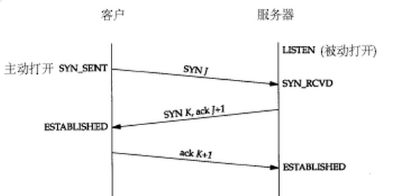
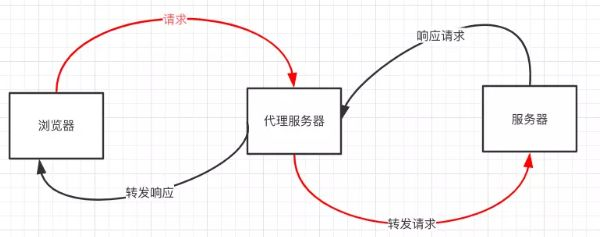
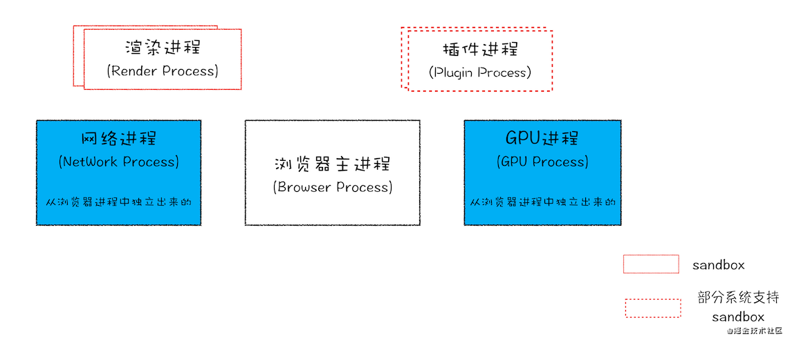
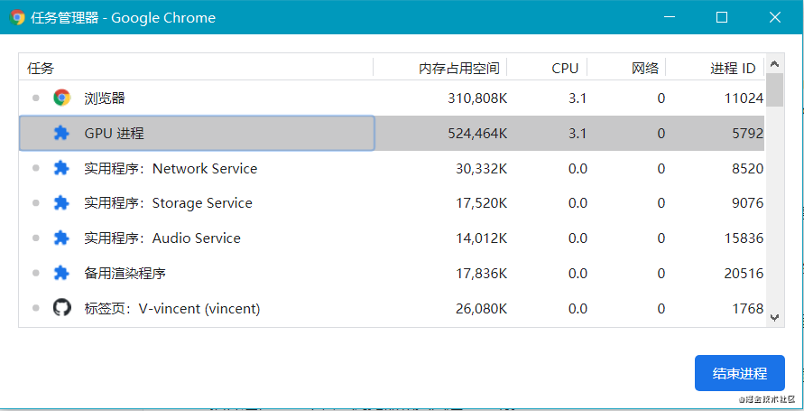
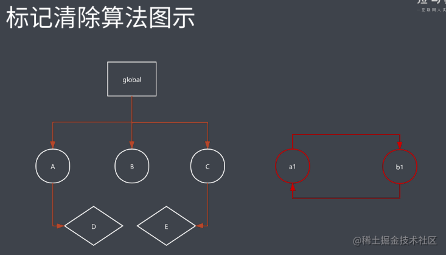
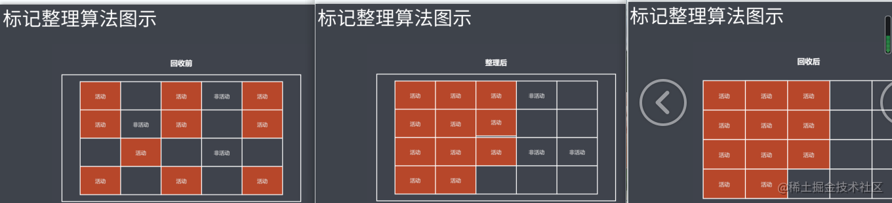
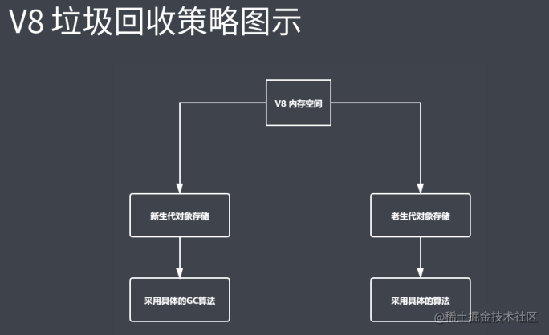
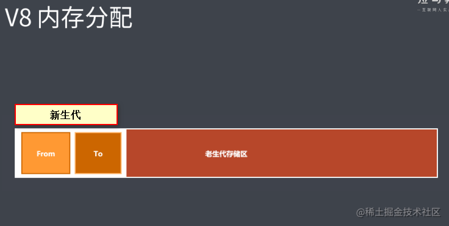
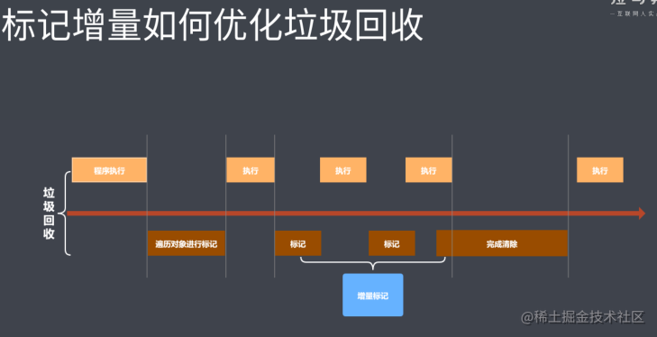

# 浏览器相关


# 原生ajax
**ajax**是一种异步通信的方法,从服务端获取数据,达到局部刷新页面的效果。过程：

1. 创建XMLHttpRequest对象;
2. 调用open方法传入三个参数请求方式(GET/POST)、url、同步异步(true/false);
3. 监听onreadystatechange事件，当readystate等于4时返回responseText;
4. 调用send方法传递参数。

# GET POST区别
1.GET在浏览器回退不会再次请求，POST会再次提交请求
2.GET请求会被浏览器主动缓存，POST不会，要手动设置
3.GET请求参数会被完整保留在浏览器历史记录里，POST中的参数不会
4.GET请求在URL中传送的参数是有长度限制的，而POST没有限制
5.GET参数通过URL传递，POST放在Request body中
6.GET参数暴露在地址栏不安全，POST放在报文内部更安全
7.GET一般用于查询信息，POST一般用于提交某种信息进行某些修改操作
8.GET产生一个TCP数据包；POST产生两个TCP数据包
**安全、方式、长度、缓存、历史、用途**

# 从输入URL到看到页面发生了什么？

## 步骤

1. 浏览器地址栏输入 URL 并回车
2. 浏览器查找当前 URL 是否存在缓存，并比较缓存是否过期
3. DNS 解析 URL 对应的 IP
4. 根据 IP 建立 TCP 连接（三次握手）
5. 发送 http 请求
6. 服务器处理请求，浏览器接受 HTTP 响应
7. 浏览器解析并渲染页面
8. 关闭 TCP 连接（四次握手）

## 具体过程
DNS解析
DNS解析实际上就是寻找你所需要的资源的过程
本地域名服务器—>根域名服务器—>com顶级域名服务器…—>直到找到IP地址，然后把它记录在本地
DNS缓存
浏览器缓存，系统缓存，路由器缓存，IPS服务器缓存，根域名服务器缓存，顶级域名服务器缓存，主域名服务器缓存。

- 在你的chrome浏览器中输入:chrome://dns/，你可以看到chrome浏览器的DNS缓存。
- 系统缓存主要存在/etc/hosts(Linux系统)中

发起TCP链接
TCP提供一种可靠的传输，这个过程涉及到三次握手，四次挥手

# 浏览器缓存
强制缓存优先于协商缓存进行，若强制缓存(Expires和Cache-Control)生效则直接使用缓存，若不生效则进行协商缓存(Last-Modified / If-Modified-Since和Etag / If-None-Match)，协商缓存由服务器决定是否使用缓存，若协商缓存失效，那么代表该请求的缓存失效，重新获取请求结果，再存入浏览器缓存中；生效则返回304，继续使用缓存
在HTTP/1.1中，Cache-Control是最重要的规则，主要用于控制网页缓存，主要取值为：
（1）public：所有内容都将被缓存（客户端和代理服务器都可缓存）
（2）private：所有内容只有客户端可以缓存，Cache-Control的默认取值
（3）no-cache：客户端缓存内容，但是是否使用缓存则需要经过协商缓存来验证决定
（4）no-store：所有内容都不会被缓存，即不使用强制缓存，也不使用协商缓存
（5）max-age=xxx (xxx is numeric)：缓存内容将在xxx秒后失效

## http如何实现缓存

1. 强缓存==>Expires(过期时间)/Cache-Control(no-cache)(优先级高)协商缓存 ==>Last-Modified/Etag(优先级高)Etag适用于经常改变的小文件 Last-Modefied适用于不怎么经常改变的大文件
2. 强缓存策略和协商缓存策略在缓存命中时都会直接使用本地的缓存副本，区别只在于协商缓存会向服务器发送一次请求。它们缓存不命中时，都会向服务器发送请求来获取资源。在实际的缓存机制中，强缓存策略和协商缓存策略是一起合作使用的。浏览器首先会根据请求的信息判断，强缓存是否命中，如果命中则直接使用资源。如果不命中则根据头信息向服务器发起请求，使用协商缓存，如果协商缓存命中的话，则服务器不返回资源，浏览器直接使用本地资源的副本，如果协商缓存不命中，则浏览器返回最新的资源给浏览器。

# 浏览器渲染机制、重绘、重排

## 网页生成过程：

- HTML被HTML解析器解析成DOM 树
- css则被css解析器解析成CSSOM 树
- 结合DOM树和CSSOM树，生成一棵渲染树(Render Tree)
- 生成布局（flow），即将所有渲染树的所有节点进行平面合成
- 将布局绘制（paint）在屏幕上

## 重排(也称回流):
当DOM的变化影响了元素的几何信息(DOM对象的位置和尺寸大小)，浏览器需要重新计算元素的几何属性，将其安放在界面中的正确位置，这个过程叫做重排。触发：

1. 添加或者删除可见的DOM元素
2. 元素尺寸改变——边距、填充、边框、宽度和高度

## 重绘：
当一个元素的外观发生改变，但没有改变布局,重新把元素外观绘制出来的过程，叫做重绘。触发：

- 改变元素的color、background、box-shadow等属性

## 重排优化建议：

1. 分离读写操作
2. 样式集中修改
3. 缓存需要修改的DOM元素
4. 尽量只修改position：absolute或fixed元素，对其他元素影响不大
5. 动画开始GPU加速，translate使用3D变化

transform 不重绘，不回流是因为transform属于合成属性，对合成属性进行transition/animate动画时，将会创建一个合成层。这使得动画元素在一个独立的层中进行渲染。当元素的内容没有发生改变，就没有必要进行重绘。浏览器会通过重新复合来创建动画帧。

# Http协议

## http三次握手

- 第一步：客户端发送SYN报文到服务端发起握手，发送完之后客户端处于SYN_Send状态
- 第二步：服务端收到SYN报文之后回复SYN和ACK报文给客户端
- 第三步：客户端收到SYN和ACK，向服务端发送一个ACK报文,客户端转为established状态，此时服务端收到ACK报文后也处于established状态，此时双方已建立了连接




## http四次挥手
刚开始双方都处于 establised 状态，假如是客户端先发起关闭请求，则：

1. 第一次挥手：客户端发送一个 FIN 报文，报文中会指定一个序列号。此时客户端处于FIN_WAIT1状态。
2. 第二次挥手：服务端收到 FIN 之后，会发送 ACK 报文，且把客户端的序列号值 + 1 作为 ACK 报文的序列号值，表明已经收到客户端的报文了，此时服务端处于 CLOSE_WAIT状态。
3. 第三次挥手：如果服务端也想断开连接了，和客户端的第一次挥手一样，发给 FIN 报文，且指定一个序列号。此时服务端处于 LAST_ACK 的状态。
4. 第四次挥手：客户端收到 FIN 之后，一样发送一个 ACK 报文作为应答，且把服务端的序列号值 + 1 作为自己 ACK 报文的序列号值，此时客户端处于 TIME_WAIT 状态。需要过一阵子以确保服务端收到自己的 ACK 报文之后才会进入 CLOSED 状态
5. 服务端收到 ACK 报文之后，就处于关闭连接了，处于 CLOSED 状态。

## http1.0、http1.1、http2.0的区别

1. 1和1.0相比，1.1可以一次传输多个文件
2. http1.x解析基于文本，http2.0采用二进制格式，新增特性多路复用、header压缩、服务端推送(静态html资源)

## http和https的区别
1.HTTP` 的URL 以http:_// _开头，而_HTTPS _的_URL _以_https:// _开头
2.`HTTP` 是不安全的，而 HTTPS 是安全的
3.`HTTP` 标准端口是80 ，而 HTTPS 的标准端口是443
4.`在OSI` 网络模型中，HTTP工作于应用层，而HTTPS 的安全传输机制工作在传输层
5.`HTTP` 无法加密，而HTTPS 对传输的数据进行加密
6.`HTTP`无需证书，而HTTPS 需要CA机构wosign的颁发的SSL证书

## https实现原理

- 首先客户端向服务端发起一个随机值，以及一个加密算法
- 服务端收到后返回一个协商好的加密算法，以及另一个随机值
- 服务端在发送一个公钥CA
- 客户端收到以后先验证CA是否有效，如果无效则报错弹窗，有过有效则进行下一步操作
- 客户端使用之前的两个随机值和一个预主密钥组成一个会话密钥，在通过服务端传来的公钥加密把会话密钥发送给服务端
- 服务端收到后使用私钥解密，得到两个随机值和预主密钥，然后组装成会话密钥
- 客户端在向服务端发起一条信息，这条信息使用会话秘钥加密，用来验证服务端时候能收到加密的信息
- 服务端收到信息后返回一个会话秘钥加密的信息
- 都收到以后SSL层连接建立成功

## 网络OSI七层模型都有哪些？TCP是哪一层的

### 七层模型

- 应用层
- 表示层
- 会话层
- 传输层
- 网络层
- 数据链路层
- 物理层

### TCP属于传输层

# tcp 和udp有什么区别

## 连接方面
tcp面向连接，udp不需要连接
tcp需要三次握手四次挥手请求连接

## 可靠性
tcp是可靠传输；一旦传输过程中丢包的话会进行重传
udp是不可靠传输，但会最大努力交付

## 工作效率
UDP实时性高，比TCP工作效率高
因为不需要建立连接，更不需要复杂的握手挥手以及复杂的算法，也没有重传机制

## 是否支持多对多
TCP是点对点的
UDP支持一对一，一对多，多对多

## 首部大小
tcp首部占20字节
udp首部占8字节

# 浏览器本地存储
浏览器的本地存储主要分为**Cookie**、WebStorage和IndexDB,其中WebStorage又可以分为**localStorage**和**sessionStorage。**
共同点**:**都是保存在浏览器端、且同源的
不同点：

1. cookie数据始终在同源的http请求中携带（即使不需要），即cookie在浏览器和服务器间来回传递。cookie数据还有路径（path）的概念，可以限制cookie只属于某个路径下sessionStorage和localStorage不会自动把数据发送给服务器，仅在本地保存。
2. 存储大小限制也不同，
- cookie数据不能超过4K，sessionStorage和localStorage可以达到5M
- sessionStorage：仅在当前浏览器窗口关闭之前有效；
- localStorage：始终有效，窗口或浏览器关闭也一直保存，本地存储，因此用作持久数据；
- cookie：只在设置的cookie过期时间之前有效，即使窗口关闭或浏览器关闭
3. 作用域不同
- sessionStorage：不在不同的浏览器窗口中共享，即使是同一个页面；
- localstorage：在所有同源窗口中都是共享的；也就是说只要浏览器不关闭，数据仍然存在
- cookie: 也是在所有同源窗口中都是共享的.也就是说只要浏览器不关闭，数据仍然存在

# XSS，CSRF，DDoS

## XSS(Cross-Site Scripting，跨站脚本攻击)
是一种代码注入攻击。攻击者在目标网站上注入恶意代码，当被攻击者登陆网站时就会执行这些恶意代码，这些脚本可以读取 cookie，session tokens，或者其它敏感的网站信息，对用户进行钓鱼欺诈，甚至发起蠕虫攻击等。

## CSRF（Cross-site request forgery）
跨站请求伪造：攻击者诱导受害者进入第三方网站，在第三方网站中，向被攻击网站发送跨站请求。利用受害者在被攻击网站已经获取的注册凭证，绕过后台的用户验证，达到冒充用户对被攻击的网站执行某项操作的目的。

## DDoS
又叫分布式拒绝服务，全称 Distributed Denial of Service，其原理就是利用大量的请求造成资源过载，导致服务不可用。

## XSS避免方式：

1. url参数使用encodeURIComponent方法转义
2. 尽量不是有InnerHtml插入HTML内容
3. 使用特殊符号、标签转义符。

## CSRF避免方式：

1. 添加验证码
2. 使用token
   - 服务端给用户生成一个token，加密后传递给用户
   - 用户在提交请求时，需要携带这个token
   - 服务端验证token是否正确

## DDos避免方式：

1. 限制单IP请求频率。
2. 防火墙等防护设置禁止ICMP包等
3. 检查特权端口的开放

# 跨域

## 为什么出现跨域
出于浏览器的同源策略限制。同源策略（Sameoriginpolicy）是一种约定，它是浏览器最核心也最基本的安全功能，如果缺少了同源策略，则浏览器的正常功能可能都会受到影响。可以说Web是构建在同源策略基础之上的，浏览器只是针对同源策略的一种实现。同源策略会阻止一个域的javascript脚本和另外一个域的内容进行交互。所谓同源（即指在同一个域）就是两个页面具有相同的协议（protocol），主机（host）和端口号（port）

## 什么是跨域
当一个请求url的**协议、域名、端口**三者之间任意一个与当前页面url不同即为跨域

## 非同源限制

   1. 无法读取非同源网页的 Cookie、LocalStorage 和 IndexedDB
   2. 无法接触非同源网页的 DOM
   3. 无法向非同源地址发送 AJAX 请求

## 跨域解决方法

### 设置document.domain
设置document.domain解决无法读取非同源网页的 Cookie问题
因为浏览器是通过document.domain属性来检查两个页面是否同源，因此只要通过设置相同的document.domain，两个页面就可以共享Cookie（此方案仅限主域相同，子域不同的跨域应用场景。）
```
// 两个页面都设置
document.domain = 'test.com';
```

### 跨文档通信 API：window.postMessage()
调用postMessage方法实现父窗口[http://test1.com](http://test1.com)向子窗口[http://test2.com](http://test2.com)发消息（子窗口同样可以通过该方法发送消息给父窗口）
它可用于解决以下方面的问题：

- 页面和其打开的新窗口的数据传递
- 多窗口之间消息传递
- 页面与嵌套的iframe消息传递
- 上面三个场景的跨域数据传递
```
// 父窗口打开一个子窗口
var openWindow = window.open('http://test2.com', 'title');
// 父窗口向子窗口发消息(第一个参数代表发送的内容，第二个参数代表接收消息窗口的url)
openWindow.postMessage('Nice to meet you!', 'http://test2.com');
```
调用message事件，监听对方发送的消息
```
// 监听 message 消息
window.addEventListener('message', function (e) {
  console.log(e.source); // e.source 发送消息的窗口
  console.log(e.origin); // e.origin 消息发向的网址
  console.log(e.data);   // e.data   发送的消息
},false);
```

### JSONP
JSONP 是服务器与客户端跨源通信的常用方法。最大特点就是简单适用，兼容性好（兼容低版本IE），缺点是只支持get请求，不支持post请求。

核心思想：网页通过添加一个<script>元素，向服务器请求 JSON 数据，服务器收到请求后，将数据放在一个指定名字的回调函数的参数位置传回来。

①原生实现：
```
<script src="http://test.com/data.php?callback=dosomething"></script>
// 向服务器test.com发出请求，该请求的查询字符串有一个callback参数，用来指定回调函数的名字
 
// 处理服务器返回回调函数的数据
<script type="text/javascript">
    function dosomething(res){
        // 处理获得的数据
        console.log(res.data)
    }
</script>
```
② jQuery ajax：
```
$.ajax({
    url: 'http://www.test.com:8080/login',
    type: 'get',
    dataType: 'jsonp',  // 请求方式为jsonp
    jsonpCallback: "handleCallback",    // 自定义回调函数名
    data: {}
});
```
③ Vue.js
```
this.$http.jsonp('http://www.domain2.com:8080/login', {
    params: {},
    jsonp: 'handleCallback'
}).then((res) => {
    console.log(res); 
})
```

### CORS
CORS 是跨域资源分享（Cross-Origin Resource Sharing）的缩写。它是 W3C 标准，属于跨源 AJAX 请求的根本解决方法。
1、普通跨域请求：只需服务器端设置Access-Control-Allow-Origin
2、带cookie跨域请求：前后端都需要进行设置
【前端设置】根据xhr.withCredentials字段判断是否带有cookie
①原生ajax
```
var xhr = new XMLHttpRequest(); // IE8/9需用window.XDomainRequest兼容
 
// 前端设置是否带cookie
xhr.withCredentials = true;
 
xhr.open('post', 'http://www.domain2.com:8080/login', true);
xhr.setRequestHeader('Content-Type', 'application/x-www-form-urlencoded');
xhr.send('user=admin');
 
xhr.onreadystatechange = function() {
    if (xhr.readyState == 4 && xhr.status == 200) {
        alert(xhr.responseText);
    }
};
```
② jQuery ajax 
```
$.ajax({
   url: 'http://www.test.com:8080/login',
   type: 'get',
   data: {},
   xhrFields: {
       withCredentials: true    // 前端设置是否带cookie
   },
   crossDomain: true,   // 会让请求头中包含跨域的额外信息，但不会含cookie
});
```
③vue-resource
```
Vue.http.options.credentials = true
```
④ axios 
```
axios.defaults.withCredentials = true
```
【服务端设置】
服务器端对于CORS的支持，主要是通过设置Access-Control-Allow-Origin来进行的。如果浏览器检测到相应的设置，就可以允许Ajax进行跨域的访问。
① Java后台
```
/*
 * 导入包：import javax.servlet.http.HttpServletResponse;
 * 接口参数中定义：HttpServletResponse response
 */
 
// 允许跨域访问的域名：若有端口需写全（协议+域名+端口），若没有端口末尾不用加'/'
response.setHeader("Access-Control-Allow-Origin", "http://www.domain1.com"); 
 
// 允许前端带认证cookie：启用此项后，上面的域名不能为'*'，必须指定具体的域名，否则浏览器会提示
response.setHeader("Access-Control-Allow-Credentials", "true"); 
 
// 提示OPTIONS预检时，后端需要设置的两个常用自定义头
response.setHeader("Access-Control-Allow-Headers", "Content-Type,X-Requested-With");
```
② Nodejs后台
```
var http = require('http');
var server = http.createServer();
var qs = require('querystring');
 
server.on('request', function(req, res) {
    var postData = '';
 
    // 数据块接收中
    req.addListener('data', function(chunk) {
        postData += chunk;
    });
 
    // 数据接收完毕
    req.addListener('end', function() {
        postData = qs.parse(postData);
 
        // 跨域后台设置
        res.writeHead(200, {
            'Access-Control-Allow-Credentials': 'true',     // 后端允许发送Cookie
            'Access-Control-Allow-Origin': 'http://www.domain1.com',    // 允许访问的域（协议+域名+端口）
            /* 
             * 此处设置的cookie还是domain2的而非domain1，因为后端也不能跨域写cookie(nginx反向代理可以实现)，
             * 但只要domain2中写入一次cookie认证，后面的跨域接口都能从domain2中获取cookie，从而实现所有的接口都能跨域访问
             */
            'Set-Cookie': 'l=a123456;Path=/;Domain=www.domain2.com;HttpOnly'  // HttpOnly的作用是让js无法读取cookie
        });
 
        res.write(JSON.stringify(postData));
        res.end();
    });
});
 
server.listen('8080');
console.log('Server is running at port 8080...');
```
③ PHP后台
```
<?php
 header("Access-Control-Allow-Origin:*");
```
④ Apache需要使用mod_headers模块来激活HTTP头的设置，它默认是激活的。你只需要在Apache配置文件的
<Directory>, <Location>, <Files>或<VirtualHost>的配置里加入以下内容即可
```
Header set Access-Control-Allow-Origin *
```

### webpack本地代理

在webpack.config.js中利用 WebpackDevServer 配置本地代理，详情配置查看devServer

如下简单配置案例，这样 `[http://localhost:8080/api/getUser.php`](http://localhost:8080/api/getUser.php`) 的请求就是后端的接口 `[http://192.168.25.20:8088/getUser.php`](http://192.168.25.20:8088/getUser.php`)
```
devServer: {
  port: 8080,
  proxy: {
      "/api": {
        target: "http://192.168.25.20:8088" // 后端接口
      }
  }
}
```

### websocket
Websocket 是 HTML5 的一个持久化的协议，它实现了浏览器与服务器的全双工通信，同时也是跨域的一种解决方案。WebSocket 和 HTTP 都是应用层协议，都基于 TCP 协议。但是 WebSocket 是一种双向通信协议，在建立连接之后，WebSocket 的 服务器与 客户端都能主动向对方发送或接收数据。同时，WebSocket 在建立连接时需要借助 HTTP 协议，连接建立好了之后 client 与 server 之间的双向通信就与 HTTP 无关了。

### Nginx反向代理
Nginx 实现原理类似于 Node 中间件代理，需要你搭建一个中转 nginx 服务器，用于转发请求。
使用 nginx 反向代理实现跨域，是最简单的跨域方式。只需要修改 nginx 的配置即可解决跨域问题，支持所有浏览器，支持 session，不需要修改任何代码，并且不会影响服务器性能。
我们只需要配置nginx，在一个服务器上配置多个前缀来转发http/https请求到多个真实的服务器即可。这样，这个服务器上所有url都是相同的域 名、协议和端口。因此，对于浏览器来说，这些url都是同源的，没有跨域限制。而实际上，这些url实际上由物理服务器提供服务。这些服务器内的 javascript可以跨域调用所有这些服务器上的url。
先下载nginx，然后将 nginx 目录下的 nginx.conf 修改如下：
```
server {
 
    #nginx监听所有localhost:8080端口收到的请求
	listen       8080;
	server_name  localhost;
 
	# Load configuration files for the default server block.
	include /etc/nginx/default.d/*.conf;
    #localhost:8080 会被转发到这里
	#同时, 后端程序会接收到 "192.168.25.20:8088"这样的请求url
	location / {
		proxy_pass http://192.168.25.20:8088;
	}
	#localhost:8080/api/ 会被转发到这里
    #同时, 后端程序会接收到 "192.168.25.20:9000/api/"这样的请求url
	location /api/ {
		proxy_pass http://192.168.25.20:9000;
	}
	error_page 404 /404.html;
		location = /40x.html {
	}
	error_page 500 502 503 504 /50x.html;
		location = /50x.html {
	}
}
```

## 解决方案总结：

1. jsonp(利用script标签没有跨域限制的漏洞实现。缺点：只支持GET请求)
2. CORS(设置Access-Control-Allow-Origin：指定可访问资源的域名)
3. postMessage(message, targetOrigin,[transfer])(HTML5新增API 用于多窗口消息、页面内嵌iframe消息传递),通过onmessage监听传递过来的数据
4. Websocket是HTML5的一个持久化的协议，它实现了浏览器与服务器的全双工通信，同时也是跨域的一种解决方案。
5. Node中间件代理
6. Nginx反向代理
7. 各种嵌套iframe的方式，不常用。
8. 日常工作中用的最对的跨域方案是CORS和Nginx反向代

# 多进程架构
浏览器有很多功能，比如网络请求、页面渲染、JavaScript 执行和 Web 安全防范等等，而这些功能是分散在浏览器的各个功能组件中的，比较多也比较散，那么通过学习浏览器的多进程架构来把这些知识点串起来是很有必要的。

在学习多进程架构之前先来理解一些概念，比如并行和并发、进程和线程。

并发和并行
并发：分别有任务 A 和 任务 B，在一段时间内通过任务之间的切换来完成这两个任务，这个情况是并发。
并行：还是任务 A 和任务 B，但是 CPU 存在两个核心，可以同时执行这两个任务，这种情况是并行。
就好比我现在在敲代码，面前有一杯可乐，但是我必须先敲完代码才能去喝可乐，这种情况下我既不是并发也不是并行。

还是敲代码和喝可乐，我先敲一段代码，然后再去喝一口可乐之后继续敲代码，通过敲代码和喝可乐之间的切换，我完成了这两个任务，这种情况叫并发。

还是敲代码和喝可乐，我可以一边敲代码一边喝可乐，这两个任务可以同时执行，实在是快乐，这种情况叫并行。

并发的关键是要有处理多个任务的能力，不一定要同时。
并行的关键是要有同时处理多个任务的能力。
关键在于：是否是同时。

进程和线程
进程：一个进程就是一个程序的运行实例。详细解释就是，启动一个程序的时候，操作系统会为该程序创建一块内存，用来存放代码、运行中的数据和一个执行任务的主线程，我们把这样的一个运行环境叫进程。
线程：线程是依附于进程存在，而进程中使用多线程并行处理能提升运算效率。
进程和线程之间的关系有以下特点：

一个进程可以包含有多个线程；
线程之间可以共享进程中的数据；
进程之间的内容相互隔离，不同进程数据不能共享；
进程中的任意一线程执行出错，都会导致整个进程的崩溃；
当一个进程关闭之后，操作系统会回收进程所占用的内存。
一个进程还可以要求操作系统生成另一个进程来执行不同的任务，系统会为新的进程分配独立的内存，两个进程之间可以通过 IPC 机制（Inter Process Communication）来进行通信。很多应用都会采用这样的设计，如果一个工作进程反应迟钝，重启这个进程不会影响应用其它进程的工作。

浏览器的多进程架构
不同的浏览器会采用不同的架构模式，并不存在标准，这里的分析是以 Chrome 浏览器作为例子。

Chrome 浏览器采用多进程架构，其顶层存在一个浏览器主进程（Browser process）用以协调浏览器的其它进程。

最新的 Chrome 浏览器包括：1 个浏览器主进程（Browser Process）、1 个 GPU 进程（GPU Process）、1 个网络进程（NetWork Process）、多个渲染进程（Renderer Process）和多个插件进程（Plugin Process）。

浏览器主进程：主要负责页面显示、用户交互、子进程管理、文件存储等功能。
渲染进程：核心任务是将 HTML、CSS 和 JavaScript 转换为用户可以与之交互的网页。
排版引擎 Blink 和 JavaScript 引擎 V8 都是运行在该进程中，默认情况下，Chrome 会为每个 Tab 标签创建一个渲染进程。
出于安全考虑，渲染进程都是运行在沙箱模式下。
GPU 进程：负责处理 GPU 相关的任务。
网页、Chrome 的 UI 界面都选择采用 GPU 来绘制，使得 GPU 成为浏览器普遍的需求，最后，Chrome 在其多进程架构上也引入了 GPU 进程。
网络进程：主要负责页面的网络资源加载，之前是作为一个模块运行在浏览器进程里面的，之后独立处理成为一个单独的进程。
插件进程：主要负责控制一个网页用到的所有插件。
因为插件容易崩溃，所以需要通过插件进程来隔离，以保证插件进程崩溃不会对浏览器和页面造成影响。
我们可以通过 Chrome 浏览器提供的 任务管理器 功能来查看当前浏览器中运行的所有进程和每个进程所占用的系统资源，右键单击还可以查看更多类别信息。

通过浏览器右上角的三个点->更多工具->任务管理器或者快捷键 Shift + Esc 可以打开任务管理器面板：

浏览器采用多进程的架构模型，通过进程之间的协作来实现网络请求、页面渲染、JavaScript 执行和 Web 安全防范等功能，并且 提升了浏览器的稳定性、流畅性和安全性。

稳定性：进程之间相互隔离，某一个进程出现问题不会影响到其他进程。
例如插件是比较容易出现问题的模块，如果是运行在同一个进程里面，插件的意外崩溃会引起整个浏览器的崩溃。
流畅性：网络请求、页面渲染、JavaScript 执行环境和插件等运行在不同的进程里面，减少了线程阻塞的可能性。
例如 JavaScript 是运行在渲染进程中的，所以即使 JavaScript 阻塞了渲染进程，影响到的也只是当前的渲染页面，而并不会影响浏览器和其他页面，因为其他页面的脚本是运行在它们自己的渲染进程中的。
安全性：浏览器在系统层面上限定了不同进程的权限。
例如渲染进程是运行在安全沙箱里面的，因为渲染进程所有的内容都是通过网络获取的，会存在一些恶意代码利用浏览器漏洞对系统进行攻击，所以运行在渲染进程里面的代码是不被信任的。
不过凡事都有两面性，虽然浏览器的多进程模型提升了浏览器的稳定性、流畅性和安全性，但是也带来了一些其它的问题：例如更高的资源占用和更复杂的体系结构。

对于上面这两个问题，Chrome 团队也一直在寻求一种弹性方案，既可以解决资源占用高的问题，也可以解决复杂的体系架构的问题。

总结
区分并发和并行的关键在于是否是同时处理多个任务。
进程是一个程序运行的实例，线程依附于进程存在，进程中使用多线程并行处理能提升运算效率。
现在的 Chrome 浏览器是多进程架构，由 1 个浏览器主进程、1 个 GPU 进程、1 个网络进程、多个渲染进程和多个插件进程组成。

# 垃圾回收机制

#### 内存管理

- 内存：由可读写单元组成，表示一片可操作空间
- 管理：人为的去操作一片空间的申请，使用和释放
- 内存管理：开发者主动申请空间，使用空间和释放空间
- 管理流程：申请--使用--释放
> //循环引用代码演示 function fn(){     let obj1 = {};     let obj2 = {};     obj1.name = obj2;     obj2.name = obj1; } fn();//obj1和obj2循环引用,引用计数无法回收 


#### javascript中的垃圾回收

- javascript中的垃圾回收
1. javascript中内存管理是自动的；
2. 对象不再被引用时是垃圾
3. 对象不能从根上访问到时是垃圾
- javascript中的可达对象
1. 可以访问到的对象就是可达对象（引用，作用域链）
2. 可达的标准就是从根处方是否能够被找到
3. javascript中的根就可以理解为是全局变量对象

#### GC算法介绍

- GC定义与作用
1. GC就是垃圾回收机制的简写
2. GC可以找到内存中的垃圾，并释放和回收空间
- GC里的垃圾是什么？
1. 程序中不再需要使用的对象
2. 程序中不能再访问到的对象
- GC算法是什么？
1. GC是一种机制，垃圾回收器完成具体的工作
2. 工作的内容就是查找垃圾释放空间，回收空间
3. 算法就是工作时查找和回收所遵循的规则
- 常见GC算法
1. 引用计数
2. 标记清除
3. 标记整理
4. 分代回收

#### 引用计数算法实现原理

- 核心思想：设置引用数，判断当前引用数是否为0；
- 设置引用计数器；
- 当引用关系改变时修改引用数组；
- 引用数字为0时立即回收 引用计数算法的有点：
- 发现垃圾时立即回收
- 最大限度减少程序暂停 引用计数算法确定：
- 无法回收循环引用的对象；
- 时间开销大

#### 标记清除算法实现原理

- 核心思想：分标记和清除两个阶段完成
- 遍历所有对象找标记活动对象
- 遍历所有对象清除没有标记的对象
- 回收相应的空间



- 优点：可以解决引用清除中循环引用的问题
- 确定：会产生空间的碎片化，清理的空间不连续，不能达到空间的最大化使用

#### 标记整理算法实现原理

- 标记整理可以看做是标记清除的增强
- 标记阶段的操作和标记清除一致
- 清除阶段会先执行整理，移动对象位置



#### 认识V8

- V8是一款主流的javascript执行引擎
- V8采用即时编译
- V8内存设限：64位操作系统下是1.5G，32位操作系统下是800M，便于垃圾回收，垃圾回收时间更短，在浏览器环境下内存已经足够使用 V8垃圾回收策略
- 采用分代回收的思想
- 内存分为新生代和老生代
- 针对不同对象采用不同算法

 V8中常用GC算法：

- 分代回收
- 空间复制
- 标记清除
- 标记清理
- 标记增量

#### V8如何回收新生代对象
V8内存分配：

- V8内存空间一分为二
- 小空间用于存储新生代对象，32位操作系统下是16M，64位操作系统下是32M
- 新生代指的是存活时间较短的对象

 新生代对象回收实现：

- 回收过程采用复制算法 + 标记整理
- 新生代内存分为两个等大的空间
- 使用空间为from，空闲空间为to
- 活动对象存储于from空间
- 标记整理后将活动对象拷贝至to
- from和to交互空间完成释放 回收细节说明：
- 拷贝过程中可能出现晋升
- 晋升就是将新生代对象移动至老生代
- 一轮GC后还存活的新生代需要晋升
- to空间的使用率超过25%，就开始回收

#### V8如何回收老生代对象
老生代对象说明：

- 老生代对象存放在右侧老生代区域
- 64操作系统下是1.4G，32为操作系统是700M
- 老生代对象就是指存活时间较长的对象 老生代对象回收实现：
- 主要采用标记清除，标记整理，增量标记算法
- 首先使用标记清除完成垃圾空间的回收
- 采用标记整理进行空间优化
- 采用增量标记进行效率优化 细节对比：
- 新生代区域垃圾回收使用空间换时间
- 老生代区域垃圾回收不适合复制算法



#### V8总结

- V8是一款主流的javascript执行引擎
- V8内存设置上限
- V8采用基于分代回收思想实现垃圾回收
- V8内存分为新生代和老生代

#### 代码优化

- javascript中的内存管理自动完成
- 执行引擎会使用不同的GC算法
- javascript是单线程机制的解释型语言 避免全局变量：
1. 全局变量的特点
- 全局变量挂载在window下
- 全局变量至少存在一个引用计数
- 全局变量存活更久，持续占用内存
1. 为什么要慎用全局变量
- 全局变量定义在全局执行上下文，是所有作用域链的顶端
- 全局执行上下文一直存在于上下文执行栈，直到程序退出
- 如果某一个局部作用域出现了同名变量则会遮蔽或污染全局
1. 避免全局查找
- 目标变量不存在于当前作用域内，同=通过作用域向上查找
- 减少全局查找降低时间消耗
- 减少不必要的全局变量定义
- 全局变量数据局部化
1. 缓存全局变量
- 将使用中无法避免的全局变量缓存到局部；
- 通过原型新增方法，在原型对象上新增实例对象需要的方法 避开闭包陷阱
1. 闭包特点
- 外包作用域可以访问内部的引用
- 在“外”部作用域访问“内”部作用域的数据
1. 关于闭包
- 闭包是一种强大的语法
- 闭包使用不当很容易出现内存泄漏
- 不要为了闭包而闭包 避免属性访问方法的使用
- js不需要属性的访问方法，所有属性都是外部可见的
- 使用属性访问方法只会增加一层重定义，没有访问的控制力 其它优化：
- 采用最优循环方式
- for循环优化，使用变量存储数组长度
- 节点添加优化，节点添加操作必然会有回流和重绘，使用字符串拼接DOM，批量添加，避免多次添加
- 克隆优化节点操作
- 使用字面量替换Object操作


作者：前端兰梓
链接：https://juejin.cn/post/6956833138559582239
来源：稀土掘金
著作权归作者所有。商业转载请联系作者获得授权，非商业转载请注明出处。


> 原文: <https://www.yuque.com/guxinbo/ps8gra/gqgn3c>