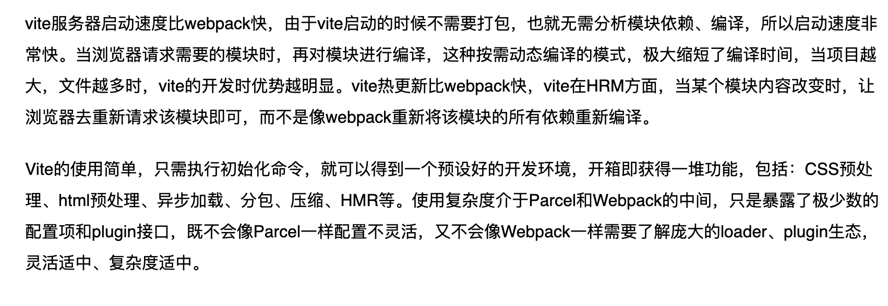

# 项目相关


# 前端工程化
**webpack**配置，**webpack4.0**有哪些优化点
```
module.exports={
	entry: {},
	output: {},
	plugins: [],
	module: [rules:[{}]]
}
```
**webpack**如何实现代码分离

- 入口起点：使用 entry 配置手动地分离代码。
- 防止重复：使用 CommonsChunkPlugin 去重和分离 chunk。
- 动态导入：通过模块的内联函数调用来分离代码。

常见的**Webpack Loader? **如何实现一个**Webpack Loader**(**NO**)
loader: 是一个导出为函数的javascript模块，根据rule匹配文件扩展名，处理文件的转换器。
file-loader：把文件输出到一个文件夹中，在代码中通过相对 URL 去引用输出的文件(处理图片和字体)
url-loader：与file-loader类似，区别是用户可以设置一个阈值，大于阈值会交给file-loader处理，小于阈值时返回文件base64 形式编码(处理图片和字体)
image-loader：加载并且压缩图片文件
babel-loader：把 ES6 转换成 ES5
sass-loader：将SCSS/SASS代码转换成CSS
css-loader：加载 CSS，支持模块化、压缩、文件导入等特性
style-loader：把 CSS 代码注入到 JavaScript 中，通过 DOM 操作去加载 CSS
postcss-loader：扩展 CSS 语法，使用下一代 CSS，可以配合 autoprefixer 插件自动补齐**CSS3 **前缀 eslint-loader：通过 ESLint 检查 JavaScript 代码
常见的**Webpack Plugin? **如何实现一个**Webpack Plugin**(**NO**)
**plugin:**本质是插件，基于事件流框架 Tapable，插件可以扩展 Webpack 的功能，在 Webpack 运行的生命周期中会广播出许多事件，Plugin 可以监听这些事件，在合适的时机通过 Webpack 提供的 API 改变输出结果。
html-webpack-plugin：简化 HTML 文件创建(依赖于 html-loader)
uglifyjs-webpack-plugin：压缩js文件
clean-webpack-plugin：目录清除
mini-css-extract-plugin：分离样式文件，CSS 提取为独立文件，支持按需加载(替代extract-text-webpack-plugin)
**loader**和**plugin**对比？

- Loader 在 module.rules 中配置，作为模块的解析规则，类型为数组。每一项都是一个 Object，内部包含了 test(类型文件)、loader、options (参数)等属性。
- Plugin 在 plugins 中单独配置，类型为数组，每一项是一个Plugin的实例，参数都通过构造函数传入。

# 性能优化方案
- 资源合并与压缩（http、图片、html、js、css）
- 开启 gzip
- 懒加载、预加载
- 避免重绘、回流（dom、css）
- 缓存
开发：组件封装、避免代码冗余
cdn 加载静态资源
埋点统计
1. 浏览器缓存
2. 防抖、节流
3. 资源懒加载、预加载
4.开启Nginx gzip压缩
三个方面来说明前端性能优化
一： webapck优化与开启gzip压缩
1.babel-loader用 include 或 exclude 来帮我们避免不必要的转译，不转译node_moudules中的js文件
其次在缓存当前转译的js文件，设置loader: 'babel-loader?cacheDirectory=true'
2.文件采用按需加载等等
3.具体的做法非常简单，只需要你在你的 request headers 中加上这么一句：
accept-encoding:gzip
4.图片优化，采用svg图片或者字体图标
5.浏览器缓存机制，它又分为强缓存和协商缓存
二：本地存储——从 Cookie 到 Web Storage、IndexedDB
说明一下SessionStorage和localStorage还有cookie的区别和优缺点
三：代码优化
1.事件代理
2.事件的节流和防抖
3.页面的回流和重绘
4.EventLoop事件循环机制
5.代码优化等等
**plugins 和 loader 有什么区别？**⭐⭐⭐⭐⭐
loader 是解析规则，因为 webpack 默认只能解析js，所以需要在 loader 里面配置一些规则
plugin 是插件，是用来扩展 webpack 的功能的，比如压缩代码，提取公共代码

# vite
vite和webpack的区别

封装过哪些组件：
时间选择器、图片素材选择框、


> 原文: <https://www.yuque.com/guxinbo/ps8gra/xh8gz5>